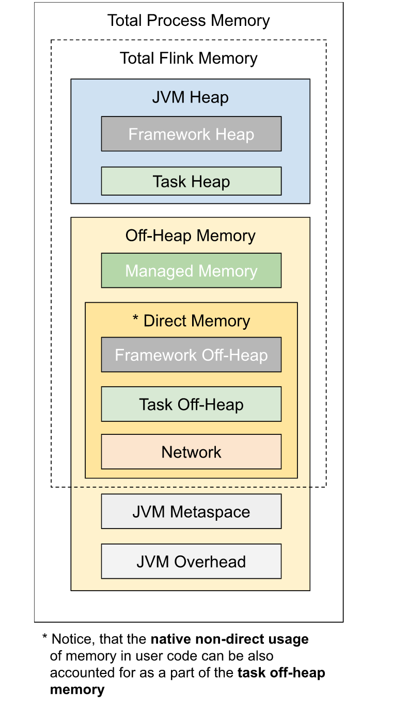

# 概要

本文深入浅出带你理解Flink内存模型。读完这篇文章，你可以合理规划自己的Flink应用程序的内存。




## TaskManager的内存管理

从以下文档我们可以得出一个公式：

### taskmanager.memory.process.size

```
taskmanager.memory.process.size =
	+ taskmanager.memory.flink.size
	+ taskmanager.memory.jvm-metaspace.size
	+ taskmanager.memory.jvm-overhead.min/taskmanager.memory.jvm-overhead.max
```


```java
@Documentation.Section(Documentation.Sections.COMMON_MEMORY)
public static final ConfigOption<MemorySize> TOTAL_PROCESS_MEMORY =
   key("taskmanager.memory.process.size")
      .memoryType()
      .noDefaultValue()
      .withDescription("Total Process Memory size for the TaskExecutors. This includes all the memory that a "
         + "TaskExecutor consumes, consisting of Total Flink Memory, JVM Metaspace, and JVM Overhead. On "
         + "containerized setups, this should be set to the container memory. See also "
         + "'taskmanager.memory.flink.size' for total Flink memory size configuration."
      );
```

### taskmanager.memory.flink.size

从该配置项我们同样可以得出公式：

```java
taskmanager.memory.flink.size =
	+ taskmanager.memory.framework.heap.size
	+	taskmanager.memory.task.heap.size
	+	taskmanager.memory.task.off-heap.size
	+ taskmanager.memory.managed.size
	+ taskmanager.memory.network.max/taskmanager.memory.network.min
```


```java
	public static final ConfigOption<MemorySize> TOTAL_FLINK_MEMORY =
		key("taskmanager.memory.flink.size")
			.memoryType()
			.noDefaultValue()
			.withDescription(String.format("Total Flink Memory size for the TaskExecutors. This includes all the "
					+ "memory that a TaskExecutor consumes, except for JVM Metaspace and JVM Overhead. It consists of "
					+ "Framework Heap Memory, Task Heap Memory, Task Off-Heap Memory, Managed Memory, and Network "
					+ "Memory. See also '%s' for total process memory size configuration.",
				TOTAL_PROCESS_MEMORY.key()));
```

### taskmanager.memory.framework.heap.size

框架堆内存。

### taskmanager.memory.task.heap.size

此配置项主要用于Flink算子和用户代码的执行。

```java
public static final ConfigOption<MemorySize> TASK_HEAP_MEMORY =
   key("taskmanager.memory.task.heap.size")
      .memoryType()
      .noDefaultValue()
      .withDescription("Task Heap Memory size for TaskExecutors. This is the size of JVM heap memory reserved for"
         + " tasks. If not specified, it will be derived as Total Flink Memory minus Framework Heap Memory,"
         + " Task Off-Heap Memory, Managed Memory and Network Memory.");
```


### 管理内存

又名托管内存。由 Flink 管理的用于排序、哈希表、缓存中间结果及 RocksDB State Backend 的本地内存。

```
taskmanager.memory.managed.size
```

### 网络内存

于任务之间数据传输的直接内存（例如网络传输缓冲）

```
taskmanager.memory.network.min
taskmanager.memory.network.max
taskmanager.memory.network.fraction
```

### 开销内存

用于其他 JVM 开销的本地内存，例如栈空间、垃圾回收空间等。该内存部分为基于[进程总内存](https://ci.apache.org/projects/flink/flink-docs-release-1.12/zh/deployment/memory/mem_setup.html#configure-total-memory)的[受限的等比内存部分](https://ci.apache.org/projects/flink/flink-docs-release-1.12/zh/deployment/memory/mem_setup.html#capped-fractionated-components)。

```
taskmanager.memory.jvm-overhead.min
taskmanager.memory.jvm-overhead.max
taskmanager.memory.jvm-overhead.fraction
```

