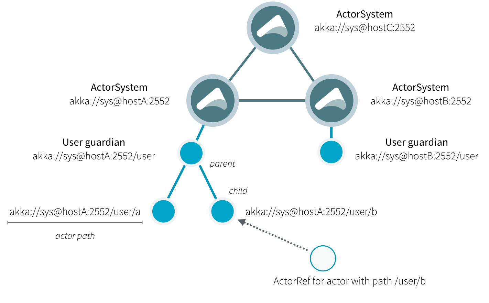

参考文档：


https://www.jianshu.com/p/4d31d6cddc99


# 应用场景

Apache Flink 功能强大，支持开发和运行多种不同种类的应用程序。它的主要特性包括：批流一体化、精密的状态管理、事件时间支持以及精确一次的状态一致性保障等。Flink 不仅可以运行在包括 YARN、 Mesos、Kubernetes 在内的多种资源管理框架上，还支持在裸机集群上独立部署。在启用高可用选项的情况下，它不存在单点失效问题。

总结起来，Flink的主要应用场景有以下几种：

1) 事件驱动型应用

2) 数据分析型应用

3) 数据管道应用

https://flink.apache.org/zh/usecases.html


# 架构


1.Flink 的客户端、JobManager是使用akka rpc消息系统进行任务的管理、状态等消息通信的

2.JobManager会生成对应的jobGraph/executionGraph，使用Scheduler作为任务的管理者，使用checkpointCoordinator作为协调者


### JobManager

*JobManager* 具有许多与协调 Flink 应用程序的分布式执行有关的职责：它决定何时调度下一个 task（或一组 task）、对完成的 task 或执行失败做出反应、协调 checkpoint、并且协调从失败中恢复等等。这个进程由三个不同的组件组成：

- **ResourceManager**

    *ResourceManager* 负责 Flink 集群中的资源提供、回收、分配 - 它管理 **task slots**，这是 Flink 集群中资源调度的单位（请参考[TaskManagers](https://ci.apache.org/projects/flink/flink-docs-release-1.12/zh/concepts/flink-architecture.html#taskmanagers)）。Flink 为不同的环境和资源提供者（例如 YARN、Mesos、Kubernetes 和 standalone 部署）实现了对应的 ResourceManager。在 standalone 设置中，ResourceManager 只能分配可用 TaskManager 的 slots，而不能自行启动新的 TaskManager。

- **Dispatcher**

    *Dispatcher* 提供了一个 REST 接口，用来提交 Flink 应用程序执行，并为每个提交的作业启动一个新的 JobMaster。它还运行 Flink WebUI 用来提供作业执行信息。

- **JobMaster**

    *JobMaster* 负责管理单个[JobGraph](https://ci.apache.org/projects/flink/flink-docs-release-1.12/zh/concepts/glossary.html#logical-graph)的执行。Flink 集群中可以同时运行多个作业，每个作业都有自己的 JobMaster。

始终至少有一个 JobManager。高可用（HA）设置中可能有多个 JobManager，其中一个始终是 *leader*，其他的则是 *standby*（请参考 [高可用（HA）](https://ci.apache.org/projects/flink/flink-docs-release-1.12/zh/deployment/ha/)）。

### TaskManagers

*TaskManager*（也称为 *worker*）执行作业流的 task，并且缓存和交换数据流。

必须始终至少有一个 TaskManager。在 TaskManager 中资源调度的最小单位是 task *slot*。TaskManager 中 task slot 的数量表示并发处理 task 的数量。请注意一个 task slot 中可以执行多个算子（请参考[Tasks 和算子链](https://ci.apache.org/projects/flink/flink-docs-release-1.12/zh/concepts/flink-architecture.html#tasks-and-operator-chains)）。


# 功能与特性


## 高可用


# 状态与容错

## 状态

### 为什么要实现状态管理？

记录状态的意义在于流式作业的特点是7*24小时运行，数据需要做到不重复消费，不重复计算，不丢失，就必须实现状态管理。

### 如何实现？

flink 状态的全局快照生成核心思想源自分布式快照算法（Chandy-Lamport algorithm）。所谓分布式快照，实际上就是特定时间点记录下来的分布式系统的全局状态（global state）。分布式快照的主要用途有故障恢复（即检查点）、死锁检测、垃圾收集等。

flink与分布式算法有些不同点，比如flink的state叫barrier，并且是DAG的。那么此分布式快照算法的好处在哪呢？不需要锁来进行分布式同步，所有算子都是异步进行checkpoint的。

参考文章：https://www.jianshu.com/p/06fff1ffe0a7

## Checkpoint

### barriers and align

屏障和对齐是checkpoint的很重要的概念，屏障将有序的记录分隔成一个个版本的镜像，对齐是当算子有多个上游节点时需要等待所有的barrier到来才能往下走。


### 快照性能优化方案

前面和大家分享了一致性快照的具体流程，这种方式保证了数据的一致性，但有一些潜在的问题：

1. **每次进行Checkpoint前，都需要暂停处理新流入数据**，然后开始执行快照，假如状态比较大，一次快照可能长达几秒甚至几分钟。
2. Checkpoint Barrier对齐时，必须等待所有上游通道都处理完，假如某个上游通道处理很慢，这可能造成整个数据流堵塞。

针对这些问题Flink已经有了一些解决方案，并且还在不断优化。

对于第一个问题，Flink提供了异步快照（Asynchronous Snapshot）的机制。当实际执行快照时，Flink可以立即向下广播Checkpoint Barrier，表示自己已经执行完自己部分的快照。同时，Flink启动一个后台线程，它创建本地状态的一份拷贝，这个线程用来将本地状态的拷贝同步到State Backend上，一旦数据同步完成，再给Checkpoint Coordinator发送确认信息。拷贝一份数据肯定占用更多内存，这时可以利用写入时复制（Copy-on-Write）的优化策略。Copy-on-Write指：如果这份内存数据没有任何修改，那没必要生成一份拷贝，只需要有一个指向这份数据的指针，通过指针将本地数据同步到State Backend上；如果这份内存数据有一些更新，那再去申请额外的内存空间并维护两份数据，一份是快照时的数据，一份是更新后的数据。

对于第二个问题，Flink允许跳过对齐这一步，或者说一个算子子任务不需要等待所有上游通道的Checkpoint Barrier，直接将Checkpoint Barrier广播，执行快照并继续处理后续流入数据。**为了保证数据一致性，Flink必须将那些较慢的数据流中的元素也一起快照，一旦重启，这些元素会被重新处理一遍。**

### checkpoint流程

**Step-注册并启动协调器**

checkpoint注册流程在jobManager侧，创建executionGraph时进行的，构建executionGraph时会生成checkpoint的协调器并注册作业的状态回调，这样在作业状态为running时就会启动协调器，执行checkpoint。

协调器注册流程如下：

SchedulerBase#createAndRestoreExecutionGraph->createExecutionGraph->buildGraph->enableCheckpointing

org.apache.flink.runtime.executiongraph.ExecutionGraph#enableCheckpointing

```java
public void enableCheckpointing(
      CheckpointCoordinatorConfiguration chkConfig,
      List<ExecutionJobVertex> verticesToTrigger,   // 只有source节点才做checkpoint
      List<ExecutionJobVertex> verticesToWaitFor,   // ack的vertex
      List<ExecutionJobVertex> verticesToCommitTo,  // to commit的vertex
      List<MasterTriggerRestoreHook<?>> masterHooks,
      CheckpointIDCounter checkpointIDCounter,      // 计数器
      CompletedCheckpointStore checkpointStore,     // checkpoint仓储类，记录已经完成的checkpoint等信息
      StateBackend checkpointStateBackend,          // checkponit信息的存储后端，比如hdfs,rocketDb
      CheckpointStatsTracker statsTracker) {

   checkState(state == JobStatus.CREATED, "Job must be in CREATED state");
   checkState(checkpointCoordinator == null, "checkpointing already enabled");

   ExecutionVertex[] tasksToTrigger = collectExecutionVertices(verticesToTrigger);
   ExecutionVertex[] tasksToWaitFor = collectExecutionVertices(verticesToWaitFor);
   ExecutionVertex[] tasksToCommitTo = collectExecutionVertices(verticesToCommitTo);

   final Collection<OperatorCoordinatorCheckpointContext> operatorCoordinators = buildOpCoordinatorCheckpointContexts();

   checkpointStatsTracker = checkNotNull(statsTracker, "CheckpointStatsTracker");

   CheckpointFailureManager failureManager = new CheckpointFailureManager(
      chkConfig.getTolerableCheckpointFailureNumber(),
      new CheckpointFailureManager.FailJobCallback() {
         @Override
         public void failJob(Throwable cause) {
            getJobMasterMainThreadExecutor().execute(() -> failGlobal(cause));
         }

         @Override
         public void failJobDueToTaskFailure(Throwable cause, ExecutionAttemptID failingTask) {
            getJobMasterMainThreadExecutor().execute(() -> failGlobalIfExecutionIsStillRunning(cause, failingTask));
         }
      }
   );

   checkState(checkpointCoordinatorTimer == null);

   checkpointCoordinatorTimer = Executors.newSingleThreadScheduledExecutor(
      new DispatcherThreadFactory(
         Thread.currentThread().getThreadGroup(), "Checkpoint Timer"));

   // create the coordinator that triggers and commits checkpoints and holds the state
   checkpointCoordinator = new CheckpointCoordinator(
      jobInformation.getJobId(),
      chkConfig,
      tasksToTrigger,
      tasksToWaitFor,
      tasksToCommitTo,
      operatorCoordinators,
      checkpointIDCounter,
      checkpointStore,
      checkpointStateBackend,
      ioExecutor,
      new ScheduledExecutorServiceAdapter(checkpointCoordinatorTimer),
      SharedStateRegistry.DEFAULT_FACTORY,
      failureManager);

   // register the master hooks on the checkpoint coordinator
   for (MasterTriggerRestoreHook<?> hook : masterHooks) {
      if (!checkpointCoordinator.addMasterHook(hook)) {
         LOG.warn("Trying to register multiple checkpoint hooks with the name: {}", hook.getIdentifier());
      }
   }

   checkpointCoordinator.setCheckpointStatsTracker(checkpointStatsTracker);

   // 注册job的状态回调，在作业状态变更为running是，启动checkpoint
   // interval of max long value indicates disable periodic checkpoint,
   // the CheckpointActivatorDeactivator should be created only if the interval is not max value
   if (chkConfig.getCheckpointInterval() != Long.MAX_VALUE) {
      // the periodic checkpoint scheduler is activated and deactivated as a result of
      // job status changes (running -> on, all other states -> off)
      registerJobStatusListener(checkpointCoordinator.createActivatorDeactivator());
   }

   this.stateBackendName = checkpointStateBackend.getClass().getSimpleName();
}
```

step-回调启动checkpoint协调器**

org.apache.flink.runtime.checkpoint.CheckpointCoordinatorDeActivator#jobStatusChanges

startCheckpointScheduler->scheduleTriggerWithDelay->ScheduledTrigger#run->triggerCheckpoint->startTriggeringCheckpoint

checkpoint流程比较复杂:

// 此接口会在execution进行checkponit时调用到,调用链路如下：
   1) org.apache.flink.runtime.executiongraph.Execution#triggerCheckpoint
   2) org.apache.flink.runtime.taskexecutor.TaskExecutor#triggerCheckpoint
   3) org.apache.flink.runtime.taskmanager.Task#triggerCheckpointBarrier
   4) org.apache.flink.streaming.runtime.tasks.StreamTask#performCheckpoint
   5) org.apache.flink.streaming.runtime.tasks.SubtaskCheckpointCoordinatorImpl#checkpointState
   6) org.apache.flink.streaming.runtime.tasks.SubtaskCheckpointCoordinatorImpl#checkpointStreamOperator
   7) org.apache.flink.streaming.api.operators.AbstractUdfStreamOperator#snapshotState
   8) org.apache.flink.streaming.util.functions.StreamingFunctionUtils#snapshotFunctionState
   9) org.apache.flink.streaming.util.functions.StreamingFunctionUtils#trySnapshotFunctionState。第9步骤会调用到connector中重写的函数snapshotState

**Step-遍历执行计划触发checkpoint**

下面讲述协调器startTriggeringCheckpoint流程：

```java
private void startTriggeringCheckpoint(CheckpointTriggerRequest request) {
		try {
			synchronized (lock) {
				preCheckGlobalState(request.isPeriodic);
			}
			// 获取所有需要触发cp的执行顶点类，此类记录了执行顶点的状态（由于失败等原因，有可能一个执行顶点会执行很多次）
			final Execution[] executions = getTriggerExecutions();
			final Map<ExecutionAttemptID, ExecutionVertex> ackTasks = getAckTasks();

			// we will actually trigger this checkpoint!
			Preconditions.checkState(!isTriggering);
			isTriggering = true;

			final long timestamp = System.currentTimeMillis();
			final CompletableFuture<PendingCheckpoint> pendingCheckpointCompletableFuture =
				// 初始化checkpoint的位置，比如在外部存储创建对应的存储目录
				initializeCheckpoint(request.props, request.externalSavepointLocation)
					.thenApplyAsync(
						// 创建PendingCheckpoint用来记录执行顶点的运行状态
						(checkpointIdAndStorageLocation) -> createPendingCheckpoint(
							timestamp,
							request.props,
							ackTasks,
							request.isPeriodic,
							checkpointIdAndStorageLocation.checkpointId,
							checkpointIdAndStorageLocation.checkpointStorageLocation,
							request.getOnCompletionFuture()),
						timer);

			// 这里像是用户代码可以自定义一个回调，用来在checkpoint触发或者恢复时调用？
			final CompletableFuture<?> masterStatesComplete = pendingCheckpointCompletableFuture
					.thenCompose(this::snapshotMasterState);
			// 这里有做算子协调者的checkpoint，具体作用不明？
			final CompletableFuture<?> coordinatorCheckpointsComplete = pendingCheckpointCompletableFuture
					.thenComposeAsync((pendingCheckpoint) ->
							OperatorCoordinatorCheckpoints.triggerAndAcknowledgeAllCoordinatorCheckpointsWithCompletion(
									coordinatorsToCheckpoint, pendingCheckpoint, timer),
							timer);

			FutureUtils.assertNoException(
				CompletableFuture.allOf(masterStatesComplete, coordinatorCheckpointsComplete)
					.handleAsync(
						(ignored, throwable) -> {
							final PendingCheckpoint checkpoint =
								FutureUtils.getWithoutException(pendingCheckpointCompletableFuture);

							Preconditions.checkState(
								checkpoint != null || throwable != null,
								"Either the pending checkpoint needs to be created or an error must have been occurred.");

							if (throwable != null) {
								// the initialization might not be finished yet
								if (checkpoint == null) {
									onTriggerFailure(request, throwable);
								} else {
									onTriggerFailure(checkpoint, throwable);
								}
							} else {
								if (checkpoint.isDiscarded()) {
									onTriggerFailure(
										checkpoint,
										new CheckpointException(
											CheckpointFailureReason.TRIGGER_CHECKPOINT_FAILURE,
											checkpoint.getFailureCause()));
								} else {
									// no exception, no discarding, everything is OK
									final long checkpointId = checkpoint.getCheckpointId();
									// 开始做taskState镜像，遍历所有需要触发checkpoint的执行计划，并且区分是否异步执行
                  // 如果是异步执行需要单独分配taskslot
									snapshotTaskState(
										timestamp,
										checkpointId,
										checkpoint.getCheckpointStorageLocation(),
										request.props,
										executions,
										request.advanceToEndOfTime);

									coordinatorsToCheckpoint.forEach((ctx) -> ctx.afterSourceBarrierInjection(checkpointId));

									onTriggerSuccess();
								}
							}

							return null;
						},
						timer)
					.exceptionally(error -> {
						if (!isShutdown()) {
							throw new CompletionException(error);
						} else if (error instanceof RejectedExecutionException) {
							LOG.debug("Execution rejected during shutdown");
						} else {
							LOG.warn("Error encountered during shutdown", error);
						}
						return null;
					}));
		} catch (Throwable throwable) {
			onTriggerFailure(request, throwable);
		}
	}
```


**step-发送rpc消息，触发taskManager执行checkpoint**

1) org.apache.flink.runtime.checkpoint.CheckpointCoordinator#snapshotTaskState

2) org.apache.flink.runtime.executiongraph.Execution#triggerSynchronousSavepoint

3) org.apache.flink.runtime.jobmanager.slots.TaskManagerGateway#triggerCheckpoint -- 通过akka代理发送rpc消息触发算子cp


**step-taskManager执行checkpoint**

1) org.apache.flink.runtime.taskmanager.Task#triggerCheckpointBarrier

2) org.apache.flink.streaming.runtime.tasks.StreamTask#triggerCheckpointAsync

3) org.apache.flink.streaming.runtime.tasks.StreamTask#triggerCheckpoint

4) org.apache.flink.streaming.runtime.tasks.StreamTask#performCheckpoint

5) org.apache.flink.streaming.runtime.tasks.SubtaskCheckpointCoordinatorImpl#checkpointState

到checkpointState是task执行checkpoint的核心逻辑：

主要分为四个步骤：

a) 准备checkpoint的镜像，但是多数情况下不用做这一步，可以暂时忽略

b) 发送checkpoint屏障到下游，因为算子记录了其有哪些下游节点：这里发送的CheckpointBarrier事件是taskManager通信使用的事件类型。

```java
operatorChain.broadcastEvent(
   new CheckpointBarrier(metadata.getCheckpointId(), metadata.getTimestamp(), options),
   options.isUnalignedCheckpoint());
```

c) 如果是未对齐的情况，特殊做处理？具体做了哪些处理？

d)  进行snapshot。

遍历执行顶点的所有算子，因为一个executionVertex可能有多个算子；

启动一个后台线程对checkpoint进行汇报。此过程最终会调用到org.apache.flink.runtime.scheduler.SchedulerNG#acknowledgeCheckpoint。

```java
// Step (4): Take the state snapshot. This should be largely asynchronous, to not impact progress of the
// streaming topology

Map<OperatorID, OperatorSnapshotFutures> snapshotFutures = new HashMap<>(operatorChain.getNumberOfOperators());
try {
   if (takeSnapshotSync(snapshotFutures, metadata, metrics, options, operatorChain, isCanceled)) {
      // 这里最终写_metadata
      finishAndReportAsync(snapshotFutures, metadata, metrics, options);
   } else {
      cleanup(snapshotFutures, metadata, metrics, new Exception("Checkpoint declined"));
   }
} catch (Exception ex) {
   cleanup(snapshotFutures, metadata, metrics, ex);
   throw ex;
}
```

 

**step-Connector如何实现checkpoint**

// 此接口会在execution进行checkponit时调用到,调用链路如下：
   1) org.apache.flink.runtime.executiongraph.Execution#triggerCheckpoint
   2) org.apache.flink.runtime.taskexecutor.TaskExecutor#triggerCheckpoint
   3) org.apache.flink.runtime.taskmanager.Task#triggerCheckpointBarrier
   4) org.apache.flink.streaming.runtime.tasks.StreamTask#performCheckpoint
   5) org.apache.flink.streaming.runtime.tasks.SubtaskCheckpointCoordinatorImpl#checkpointState
   6) org.apache.flink.streaming.runtime.tasks.SubtaskCheckpointCoordinatorImpl#checkpointStreamOperator
   7) org.apache.flink.streaming.api.operators.AbstractUdfStreamOperator#snapshotState
   8) org.apache.flink.streaming.util.functions.StreamingFunctionUtils#snapshotFunctionState
   9) org.apache.flink.streaming.util.functions.StreamingFunctionUtils#trySnapshotFunctionState
      第9步骤会调用到connector中重写的函数snapshotState


实现checkpoint Connector时需要实现org.apache.flink.streaming.api.checkpoint.CheckpointedFunction接口，实例如下：

```java
	public final void initializeState(FunctionInitializationContext context) throws Exception {

		OperatorStateStore stateStore = context.getOperatorStateStore();
		// 这里需要state的类型和字段对应的序列化器，用户将需要持久化的数据放到states列表中
		this.unionOffsetStates = stateStore.getUnionListState(new ListStateDescriptor<>(OFFSETS_STATE_NAME,
			createStateSerializer(getRuntimeContext().getExecutionConfig())));

		if (context.isRestored()) {
			restoredState = new TreeMap<>(new KafkaTopicPartition.Comparator());

			// populate actual holder for restored state
			for (Tuple2<KafkaTopicPartition, Long> kafkaOffset : unionOffsetStates.get()) {
				restoredState.put(kafkaOffset.f0, kafkaOffset.f1);
			}

			LOG.info("Consumer subtask {} restored state: {}.", getRuntimeContext().getIndexOfThisSubtask(), restoredState);
		} else {
			LOG.info("Consumer subtask {} has no restore state.", getRuntimeContext().getIndexOfThisSubtask());
		}
	}

// 此接口会在execution进行checkponit时调用到,调用链路如下：
   1) org.apache.flink.runtime.executiongraph.Execution#triggerCheckpoint
   2) org.apache.flink.runtime.taskexecutor.TaskExecutor#triggerCheckpoint
   3) org.apache.flink.runtime.taskmanager.Task#triggerCheckpointBarrier
   4) org.apache.flink.streaming.runtime.tasks.StreamTask#performCheckpoint
   5) org.apache.flink.streaming.runtime.tasks.SubtaskCheckpointCoordinatorImpl#checkpointState
   6) org.apache.flink.streaming.runtime.tasks.SubtaskCheckpointCoordinatorImpl#checkpointStreamOperator
   7) org.apache.flink.streaming.api.operators.AbstractUdfStreamOperator#snapshotState
   8) org.apache.flink.streaming.util.functions.StreamingFunctionUtils#snapshotFunctionState
   9) org.apache.flink.streaming.util.functions.StreamingFunctionUtils#trySnapshotFunctionState
      第9步骤会调用到connector中重写的函数snapshotState
void snapshotState(FunctionSnapshotContext context) throws Exception {
   // 收集checkpoint
   ...
}
```


# Connector


## 参考

### postgres用法

```
[gpadmin@99a4177b64d2 greenplum-db]$ ./bin/psql -U gpadmin smoke
psql (8.2.15)
Type "help" for help.

smoke=# create table tiktok_user (user_id varchar, user_name varchar);NOTICE:  Table doesn't have 'DISTRIBUTED BY' clause -- Using column named 'user_id' as the Greenplum Database data distribution key for this table.
HINT:  The 'DISTRIBUTED BY' clause determines the distribution of data. Make sure column(s) chosen are the optimal data distribution key to minimize skew.
CREATE TABLE
smoke=# insert into userinfo values('fans_001', 'xiaoming');
ERROR:  invalid input syntax for integer: "fans_001"
smoke=# insert into tiktok_user values('fans_001', 'xiaoming');
INSERT 0 1
smoke=# insert into tiktok_user values('fans_002', 'xiaoming002');
INSERT 0 1
smoke=# insert into tiktok_user values('fans_003', 'xiaoming003');
INSERT 0 1
smoke=# 
```

### Kudu用法

```

[cdh.dtwave.sit.local:21000] > create database db_smoke;
Query: create database db_smoke
Fetched 0 row(s) in 0.36s
[cdh.dtwave.sit.local:21000] > use db_smoke;
Query: use db_smoke
[cdh.dtwave.sit.local:21000] > create table tiktok_gift_side (gift_id varchar,gift_price varchar);
Query: create table tiktok_gift_side (gift_id varchar,gift_price varchar)
Fetched 0 row(s) in 0.29s
[cdh.dtwave.sit.local:21000] > 
```

# 源码阅读


## Akka




下面结合Kafka的一个实例来说明flink的执行流程：

```java
public void runStartFromLatestOffsets() throws Exception {
   // 50 records written to each of 3 partitions before launching a latest-starting consuming job
   final int parallelism = 3;
   final int recordsInEachPartition = 50;

   // each partition will be written an extra 200 records
   final int extraRecordsInEachPartition = 200;

   // all already existing data in the topic, before the consuming topology has started, should be ignored
   final String topicName = writeSequence("testStartFromLatestOffsetsTopic", recordsInEachPartition, parallelism, 1);

   // the committed offsets should be ignored
   KafkaTestEnvironment.KafkaOffsetHandler kafkaOffsetHandler = kafkaServer.createOffsetHandler();
   kafkaOffsetHandler.setCommittedOffset(topicName, 0, 23);
   kafkaOffsetHandler.setCommittedOffset(topicName, 1, 31);
   kafkaOffsetHandler.setCommittedOffset(topicName, 2, 43);

   // job names for the topologies for writing and consuming the extra records
   final String consumeExtraRecordsJobName = "Consume Extra Records Job";
   final String writeExtraRecordsJobName = "Write Extra Records Job";

   // serialization / deserialization schemas for writing and consuming the extra records
   final TypeInformation<Tuple2<Integer, Integer>> resultType =
      TypeInformation.of(new TypeHint<Tuple2<Integer, Integer>>() {});

   final SerializationSchema<Tuple2<Integer, Integer>> serSchema =
         new TypeInformationSerializationSchema<>(resultType, new ExecutionConfig());

   final KafkaDeserializationSchema<Tuple2<Integer, Integer>> deserSchema =
      new KafkaDeserializationSchemaWrapper<>(
         new TypeInformationSerializationSchema<>(resultType, new ExecutionConfig()));

   // setup and run the latest-consuming job
   final StreamExecutionEnvironment env = StreamExecutionEnvironment.getExecutionEnvironment();
         env.setParallelism(parallelism);

   final Properties readProps = new Properties();
   readProps.putAll(standardProps);
   readProps.setProperty("auto.offset.reset", "earliest"); // this should be ignored

   FlinkKafkaConsumerBase<Tuple2<Integer, Integer>> latestReadingConsumer =
      kafkaServer.getConsumer(topicName, deserSchema, readProps);
   latestReadingConsumer.setStartFromLatest();

   // 添加DataStream和Transformation
   env
      .addSource(latestReadingConsumer).setParallelism(parallelism)
      .flatMap(new FlatMapFunction<Tuple2<Integer, Integer>, Object>() {
         @Override
         public void flatMap(Tuple2<Integer, Integer> value, Collector<Object> out) throws Exception {
            if (value.f1 - recordsInEachPartition < 0) {
               throw new RuntimeException("test failed; consumed a record that was previously written: " + value);
            }
         }
      }).setParallelism(1)
      .addSink(new DiscardingSink<>());

   // 将StreamGraph转变为JobGraph
   JobGraph jobGraph = StreamingJobGraphGenerator.createJobGraph(env.getStreamGraph());
   final JobID consumeJobId = jobGraph.getJobID();

   final AtomicReference<Throwable> error = new AtomicReference<>();
   Thread consumeThread = new Thread(() -> {
      try {
         ClientUtils.submitJobAndWaitForResult(client, jobGraph, KafkaConsumerTestBase.class.getClassLoader());
      } catch (Throwable t) {
         if (!ExceptionUtils.findThrowable(t, JobCancellationException.class).isPresent()) {
            error.set(t);
         }
      }
   });
   consumeThread.start();

   // wait until the consuming job has started, to be extra safe
   waitUntilJobIsRunning(client);

   // setup the extra records writing job
   final StreamExecutionEnvironment env2 = StreamExecutionEnvironment.getExecutionEnvironment();

   env2.setParallelism(parallelism);

   DataStream<Tuple2<Integer, Integer>> extraRecordsStream = env2
      .addSource(new RichParallelSourceFunction<Tuple2<Integer, Integer>>() {

         private boolean running = true;

         @Override
         public void run(SourceContext<Tuple2<Integer, Integer>> ctx) throws Exception {
            int count = recordsInEachPartition; // the extra records should start from the last written value
            int partition = getRuntimeContext().getIndexOfThisSubtask();

            while (running && count < recordsInEachPartition + extraRecordsInEachPartition) {
               ctx.collect(new Tuple2<>(partition, count));
               count++;
            }
         }

         @Override
         public void cancel() {
            running = false;
         }
      });

   kafkaServer.produceIntoKafka(extraRecordsStream, topicName, serSchema, readProps, null);

   try {
      env2.execute(writeExtraRecordsJobName);
   }
   catch (Exception e) {
      throw new RuntimeException("Writing extra records failed", e);
   }

   // cancel the consume job after all extra records are written
   client.cancel(consumeJobId).get();
   consumeThread.join();

   kafkaOffsetHandler.close();
   deleteTestTopic(topicName);

   // check whether the consuming thread threw any test errors;
   // test will fail here if the consume job had incorrectly read any records other than the extra records
   final Throwable consumerError = error.get();
   if (consumerError != null) {
      throw new Exception("Exception in the consuming thread", consumerError);
   }
}
```

## 任务提交流程

### 提交AppMstr

CliFrontend

flink.sh脚本执行此类，核心流程见下，这里我们分析run-application模式代码。

```java
protected void runApplication(String[] args) throws Exception {
		LOG.info("Running 'run-application' command.");

		final Options commandOptions = CliFrontendParser.getRunCommandOptions();
		final CommandLine commandLine = getCommandLine(commandOptions, args, true);

		if (commandLine.hasOption(HELP_OPTION.getOpt())) {
			CliFrontendParser.printHelpForRun(customCommandLines);
			return;
		}

		final CustomCommandLine activeCommandLine =
				validateAndGetActiveCommandLine(checkNotNull(commandLine));
		// 运行程序的相关参数封装，包括entryPointClass、classpaths、programArgs等
		final ProgramOptions programOptions = new ProgramOptions(commandLine);
		// clusterClientServiceLoader的实现是DefaultClusterClientServiceLoader.java，
  	// 该类的getClusterClientFactory可以根据配置参数动态获取Flink的几种部署模式（k8s、yarn等）的工厂类实现
		final ApplicationDeployer deployer =
				new ApplicationClusterDeployer(clusterClientServiceLoader);

		programOptions.validate();
		final URI uri = PackagedProgramUtils.resolveURI(programOptions.getJarFilePath());
		final Configuration effectiveConfiguration = getEffectiveConfiguration(
				activeCommandLine, commandLine, programOptions, Collections.singletonList(uri.toString()));
		final ApplicationConfiguration applicationConfiguration =
				new ApplicationConfiguration(programOptions.getProgramArgs(), programOptions.getEntryPointClassName());
  	// 部署程序到相应的集群
		deployer.run(effectiveConfiguration, applicationConfiguration);
	}
```

YarnClusterDescriptor.java

deployer.run往下追代码，可以看到这相应的部署流程，这里以yarn为例：

```java
public ClusterClientProvider<ApplicationId> deployApplicationCluster(
      final ClusterSpecification clusterSpecification,
      final ApplicationConfiguration applicationConfiguration) throws ClusterDeploymentException {
   checkNotNull(clusterSpecification);
   checkNotNull(applicationConfiguration);
	 // 部署模式：yarn-per-job/yarn-session/yarn-application
   final YarnDeploymentTarget deploymentTarget = YarnDeploymentTarget.fromConfig(flinkConfiguration);
   if (YarnDeploymentTarget.APPLICATION != deploymentTarget) {
      throw new ClusterDeploymentException(
            "Couldn't deploy Yarn Application Cluster." +
                  " Expected deployment.target=" + YarnDeploymentTarget.APPLICATION.getName() +
                  " but actual one was \"" + deploymentTarget.getName() + "\"");
   }

   applicationConfiguration.applyToConfiguration(flinkConfiguration);

   final List<String> pipelineJars = flinkConfiguration.getOptional(PipelineOptions.JARS).orElse(Collections.emptyList());
   Preconditions.checkArgument(pipelineJars.size() == 1, "Should only have one jar");

   try {
      return deployInternal(
            clusterSpecification,
            "Flink Application Cluster",
            YarnApplicationClusterEntryPoint.class.getName(),
            null,
            false);
   } catch (Exception e) {
      throw new ClusterDeploymentException("Couldn't deploy Yarn Application Cluster", e);
   }
}
```


**startAppMaster**

启动appMaster是提交到yarn的主流程。

这里主要是设置application和容器的相关参数，设置容器的参数时需要上传依赖的资源到hdfs，比如下面所示其将配置文件、自定义jar包和log配置文件上传到了application的目录。

```shell
[deploy@cdh ~]$ hdfs dfs -ls hdfs://nameservice1/user/deploy/.flink/application_1612516048266_0658
Found 3 items
-rw-r--r--   3 deploy supergroup       2105 2021-02-07 16:02 hdfs://nameservice1/user/deploy/.flink/application_1612516048266_0658/application_1612516048266_0658-flink-conf.yaml8327692719117539485.tmp
-rw-r--r--   3 deploy supergroup       2128 2021-02-07 16:02 hdfs://nameservice1/user/deploy/.flink/application_1612516048266_0658/log4j.properties
-rw-r--r--   3 deploy supergroup   81846815 2021-02-07 16:02 hdfs://nameservice1/user/deploy/.flink/application_1612516048266_0658/resource-flinksql1.11-2.0.0-SNAPSHOT-jar-with-dependencies.jar
```


```java
private ApplicationReport startAppMaster(
      Configuration configuration,
      String applicationName,
      String yarnClusterEntrypoint,
      JobGraph jobGraph,
      YarnClient yarnClient,
      YarnClientApplication yarnApplication,
      ClusterSpecification clusterSpecification) throws Exception {

   // ------------------ Initialize the file systems -------------------------

   org.apache.flink.core.fs.FileSystem.initialize(
         configuration,
         PluginUtils.createPluginManagerFromRootFolder(configuration));

   final FileSystem fs = FileSystem.get(yarnConfiguration);

   // hard coded check for the GoogleHDFS client because its not overriding the getScheme() method.
   if (!fs.getClass().getSimpleName().equals("GoogleHadoopFileSystem") &&
         fs.getScheme().startsWith("file")) {
      LOG.warn("The file system scheme is '" + fs.getScheme() + "'. This indicates that the "
            + "specified Hadoop configuration path is wrong and the system is using the default Hadoop configuration values."
            + "The Flink YARN client needs to store its files in a distributed file system");
   }

   ApplicationSubmissionContext appContext = yarnApplication.getApplicationSubmissionContext();
	 // 获取yarn.provided.lib.dirs的hdfs位置
   final List<Path> providedLibDirs = getRemoteSharedPaths(configuration);
   // yarn application文件上传工具，主要用来
   // a)为application上传文件到hdfs的指定位置：比如/user/deploy/.flink/application_1612516048266_0658
   // b)记录相关的依赖和dist信息
   final YarnApplicationFileUploader fileUploader = YarnApplicationFileUploader.from(
      fs,
      fs.getHomeDirectory(),
      providedLibDirs,
      appContext.getApplicationId(),
      getFileReplication());

   // The files need to be shipped and added to classpath.
   Set<File> systemShipFiles = new HashSet<>(shipFiles.size());
   for (File file : shipFiles) {
      systemShipFiles.add(file.getAbsoluteFile());
   }

   final String logConfigFilePath = configuration.getString(YarnConfigOptionsInternal.APPLICATION_LOG_CONFIG_FILE);
   if (logConfigFilePath != null) {
      systemShipFiles.add(new File(logConfigFilePath));
   }

   // Set-up ApplicationSubmissionContext for the application

   final ApplicationId appId = appContext.getApplicationId();

   // ------------------ Add Zookeeper namespace to local flinkConfiguraton ------
   // 如果HA_CLUSTER_ID没有设置，那么将被设置为applicationId
   String zkNamespace = getZookeeperNamespace();
   // no user specified cli argument for namespace?
   if (zkNamespace == null || zkNamespace.isEmpty()) {
      // namespace defined in config? else use applicationId as default.
      zkNamespace = configuration.getString(HighAvailabilityOptions.HA_CLUSTER_ID, String.valueOf(appId));
      setZookeeperNamespace(zkNamespace);
   }

   configuration.setString(HighAvailabilityOptions.HA_CLUSTER_ID, zkNamespace);

   if (HighAvailabilityMode.isHighAvailabilityModeActivated(configuration)) {
      // activate re-execution of failed applications
      appContext.setMaxAppAttempts(
            configuration.getInteger(
                  YarnConfigOptions.APPLICATION_ATTEMPTS.key(),
                  YarnConfiguration.DEFAULT_RM_AM_MAX_ATTEMPTS));

      activateHighAvailabilitySupport(appContext);
   } else {
      // set number of application retries to 1 in the default case
      appContext.setMaxAppAttempts(
            configuration.getInteger(
                  YarnConfigOptions.APPLICATION_ATTEMPTS.key(),
                  1));
   }

   final Set<Path> userJarFiles = new HashSet<>();
   // application模式这里为null
   if (jobGraph != null) {
      userJarFiles.addAll(jobGraph.getUserJars().stream().map(f -> f.toUri()).map(Path::new).collect(Collectors.toSet()));
   }

   final List<URI> jarUrls = ConfigUtils.decodeListFromConfig(configuration, PipelineOptions.JARS, URI::create);
   if (jarUrls != null && YarnApplicationClusterEntryPoint.class.getName().equals(yarnClusterEntrypoint)) {
      userJarFiles.addAll(jarUrls.stream().map(Path::new).collect(Collectors.toSet()));
   }

   // only for per job mode
   if (jobGraph != null) {
      for (Map.Entry<String, DistributedCache.DistributedCacheEntry> entry : jobGraph.getUserArtifacts().entrySet()) {
         // only upload local files
         if (!Utils.isRemotePath(entry.getValue().filePath)) {
            Path localPath = new Path(entry.getValue().filePath);
            Tuple2<Path, Long> remoteFileInfo =
                  fileUploader.uploadLocalFileToRemote(localPath, entry.getKey());
            jobGraph.setUserArtifactRemotePath(entry.getKey(), remoteFileInfo.f0.toString());
         }
      }

      jobGraph.writeUserArtifactEntriesToConfiguration();
   }

   if (providedLibDirs == null || providedLibDirs.isEmpty()) {
      addLibFoldersToShipFiles(systemShipFiles);
   }

   // Register all files in provided lib dirs as local resources with public visibility
   // and upload the remaining dependencies as local resources with APPLICATION visibility.
   // lib.dirs位置存储的所有application依赖的共享库，是提交任务之前先上传好的
   // 对于用户自己定义的jar包会上传到指定位置
   final List<String> systemClassPaths = fileUploader.registerProvidedLocalResources();
   final List<String> uploadedDependencies = fileUploader.registerMultipleLocalResources(
      systemShipFiles.stream().map(e -> new Path(e.toURI())).collect(Collectors.toSet()),
      Path.CUR_DIR);
   systemClassPaths.addAll(uploadedDependencies);

   // upload and register ship-only files
   // Plugin files only need to be shipped and should not be added to classpath.
   if (providedLibDirs == null || providedLibDirs.isEmpty()) {
      Set<File> shipOnlyFiles = new HashSet<>();
      addPluginsFoldersToShipFiles(shipOnlyFiles);
      fileUploader.registerMultipleLocalResources(
            shipOnlyFiles.stream().map(e -> new Path(e.toURI())).collect(Collectors.toSet()),
            Path.CUR_DIR);
   }

   // Upload and register user jars
   final List<String> userClassPaths = fileUploader.registerMultipleLocalResources(
      userJarFiles,
      userJarInclusion == YarnConfigOptions.UserJarInclusion.DISABLED ?
         ConfigConstants.DEFAULT_FLINK_USR_LIB_DIR : Path.CUR_DIR);

   if (userJarInclusion == YarnConfigOptions.UserJarInclusion.ORDER) {
      systemClassPaths.addAll(userClassPaths);
   }

   // normalize classpath by sorting
   Collections.sort(systemClassPaths);
   Collections.sort(userClassPaths);

   // classpath assembler
   StringBuilder classPathBuilder = new StringBuilder();
   if (userJarInclusion == YarnConfigOptions.UserJarInclusion.FIRST) {
      for (String userClassPath : userClassPaths) {
         classPathBuilder.append(userClassPath).append(File.pathSeparator);
      }
   }
   for (String classPath : systemClassPaths) {
      classPathBuilder.append(classPath).append(File.pathSeparator);
   }

   // Setup jar for ApplicationMaster
   final YarnLocalResourceDescriptor localResourceDescFlinkJar = fileUploader.uploadFlinkDist(flinkJarPath);
   classPathBuilder.append(localResourceDescFlinkJar.getResourceKey()).append(File.pathSeparator);

   // write job graph to tmp file and add it to local resource
   // TODO: server use user main method to generate job graph
   if (jobGraph != null) {
      File tmpJobGraphFile = null;
      try {
         tmpJobGraphFile = File.createTempFile(appId.toString(), null);
         try (FileOutputStream output = new FileOutputStream(tmpJobGraphFile);
            ObjectOutputStream obOutput = new ObjectOutputStream(output)) {
            obOutput.writeObject(jobGraph);
         }

         final String jobGraphFilename = "job.graph";
         configuration.setString(JOB_GRAPH_FILE_PATH, jobGraphFilename);

         fileUploader.registerSingleLocalResource(
            jobGraphFilename,
            new Path(tmpJobGraphFile.toURI()),
            "",
            true,
            false);
         classPathBuilder.append(jobGraphFilename).append(File.pathSeparator);
      } catch (Exception e) {
         LOG.warn("Add job graph to local resource fail.");
         throw e;
      } finally {
         if (tmpJobGraphFile != null && !tmpJobGraphFile.delete()) {
            LOG.warn("Fail to delete temporary file {}.", tmpJobGraphFile.toPath());
         }
      }
   }

   // Upload the flink configuration
   // write out configuration file
   File tmpConfigurationFile = null;
   try {
      tmpConfigurationFile = File.createTempFile(appId + "-flink-conf.yaml", null);
      BootstrapTools.writeConfiguration(configuration, tmpConfigurationFile);

      String flinkConfigKey = "flink-conf.yaml";
      fileUploader.registerSingleLocalResource(
         flinkConfigKey,
         new Path(tmpConfigurationFile.getAbsolutePath()),
         "",
         true,
         true);
      classPathBuilder.append("flink-conf.yaml").append(File.pathSeparator);
   } finally {
      if (tmpConfigurationFile != null && !tmpConfigurationFile.delete()) {
         LOG.warn("Fail to delete temporary file {}.", tmpConfigurationFile.toPath());
      }
   }

   if (userJarInclusion == YarnConfigOptions.UserJarInclusion.LAST) {
      for (String userClassPath : userClassPaths) {
         classPathBuilder.append(userClassPath).append(File.pathSeparator);
      }
   }

   //To support Yarn Secure Integration Test Scenario
   //In Integration test setup, the Yarn containers created by YarnMiniCluster does not have the Yarn site XML
   //and KRB5 configuration files. We are adding these files as container local resources for the container
   //applications (JM/TMs) to have proper secure cluster setup
   Path remoteKrb5Path = null;
   Path remoteYarnSiteXmlPath = null;
   boolean hasKrb5 = false;
   if (System.getenv("IN_TESTS") != null) {
      File f = new File(System.getenv("YARN_CONF_DIR"), Utils.YARN_SITE_FILE_NAME);
      LOG.info("Adding Yarn configuration {} to the AM container local resource bucket", f.getAbsolutePath());
      Path yarnSitePath = new Path(f.getAbsolutePath());
      remoteYarnSiteXmlPath = fileUploader.registerSingleLocalResource(
         Utils.YARN_SITE_FILE_NAME,
         yarnSitePath,
         "",
         false,
         false).getPath();

      String krb5Config = System.getProperty("java.security.krb5.conf");
      if (krb5Config != null && krb5Config.length() != 0) {
         File krb5 = new File(krb5Config);
         LOG.info("Adding KRB5 configuration {} to the AM container local resource bucket", krb5.getAbsolutePath());
         Path krb5ConfPath = new Path(krb5.getAbsolutePath());
         remoteKrb5Path = fileUploader.registerSingleLocalResource(
            Utils.KRB5_FILE_NAME,
            krb5ConfPath,
            "",
            false,
            false).getPath();
         hasKrb5 = true;
      }
   }

   Path remotePathKeytab = null;
   String localizedKeytabPath = null;
   String keytab = configuration.getString(SecurityOptions.KERBEROS_LOGIN_KEYTAB);
   if (keytab != null) {
      boolean    localizeKeytab = flinkConfiguration.getBoolean(YarnConfigOptions.SHIP_LOCAL_KEYTAB);
      localizedKeytabPath = flinkConfiguration.getString(YarnConfigOptions.LOCALIZED_KEYTAB_PATH);
      if (localizeKeytab) {
         // Localize the keytab to YARN containers via local resource.
         LOG.info("Adding keytab {} to the AM container local resource bucket", keytab);
         remotePathKeytab = fileUploader.registerSingleLocalResource(
            localizedKeytabPath,
            new Path(keytab),
            "",
            false,
            false).getPath();
      } else {
         // // Assume Keytab is pre-installed in the container.
         localizedKeytabPath = flinkConfiguration.getString(YarnConfigOptions.LOCALIZED_KEYTAB_PATH);
      }
   }

   final JobManagerProcessSpec processSpec = JobManagerProcessUtils.processSpecFromConfigWithNewOptionToInterpretLegacyHeap(
      flinkConfiguration,
      JobManagerOptions.TOTAL_PROCESS_MEMORY);
   // 1.组装运行在容器来需要执行的java命令，将其设置到ContainerLaunchContext的command中
   // a.AppMaster运行后会运行yarnClusterEntrypoint类
   final ContainerLaunchContext amContainer = setupApplicationMasterContainer(
         yarnClusterEntrypoint,
         hasKrb5,
         processSpec);

   // setup security tokens
   if (UserGroupInformation.isSecurityEnabled()) {
      // set HDFS delegation tokens when security is enabled
      LOG.info("Adding delegation token to the AM container.");
      Utils.setTokensFor(amContainer, fileUploader.getRemotePaths(), yarnConfiguration);
   }
   // 2.设置yarn的本地资源
   amContainer.setLocalResources(fileUploader.getRegisteredLocalResources());
   fileUploader.close();
	 // 3.设置appMaster的classpath和环境变量
   // Setup CLASSPATH and environment variables for ApplicationMaster
   final Map<String, String> appMasterEnv = new HashMap<>();
   // set user specified app master environment variables
   appMasterEnv.putAll(
      ConfigurationUtils.getPrefixedKeyValuePairs(ResourceManagerOptions.CONTAINERIZED_MASTER_ENV_PREFIX, configuration));
   // set Flink app class path
   appMasterEnv.put(YarnConfigKeys.ENV_FLINK_CLASSPATH, classPathBuilder.toString());

   // set Flink on YARN internal configuration values
   appMasterEnv.put(YarnConfigKeys.FLINK_DIST_JAR, localResourceDescFlinkJar.toString());
   appMasterEnv.put(YarnConfigKeys.ENV_APP_ID, appId.toString());
   appMasterEnv.put(YarnConfigKeys.ENV_CLIENT_HOME_DIR, fileUploader.getHomeDir().toString());
   appMasterEnv.put(YarnConfigKeys.ENV_CLIENT_SHIP_FILES, encodeYarnLocalResourceDescriptorListToString(fileUploader.getEnvShipResourceList()));
   appMasterEnv.put(YarnConfigKeys.ENV_ZOOKEEPER_NAMESPACE, getZookeeperNamespace());
   appMasterEnv.put(YarnConfigKeys.FLINK_YARN_FILES, fileUploader.getApplicationDir().toUri().toString());

   // https://github.com/apache/hadoop/blob/trunk/hadoop-yarn-project/hadoop-yarn/hadoop-yarn-site/src/site/markdown/YarnApplicationSecurity.md#identity-on-an-insecure-cluster-hadoop_user_name
   appMasterEnv.put(YarnConfigKeys.ENV_HADOOP_USER_NAME, UserGroupInformation.getCurrentUser().getUserName());

   if (localizedKeytabPath != null) {
      appMasterEnv.put(YarnConfigKeys.LOCAL_KEYTAB_PATH, localizedKeytabPath);
      String principal = configuration.getString(SecurityOptions.KERBEROS_LOGIN_PRINCIPAL);
      appMasterEnv.put(YarnConfigKeys.KEYTAB_PRINCIPAL, principal);
      if (remotePathKeytab != null) {
         appMasterEnv.put(YarnConfigKeys.REMOTE_KEYTAB_PATH, remotePathKeytab.toString());
      }
   }

   //To support Yarn Secure Integration Test Scenario
   if (remoteYarnSiteXmlPath != null) {
      appMasterEnv.put(YarnConfigKeys.ENV_YARN_SITE_XML_PATH, remoteYarnSiteXmlPath.toString());
   }
   if (remoteKrb5Path != null) {
      appMasterEnv.put(YarnConfigKeys.ENV_KRB5_PATH, remoteKrb5Path.toString());
   }

   // set classpath from YARN configuration
   Utils.setupYarnClassPath(yarnConfiguration, appMasterEnv);
	
   // 4.将环境变量放到yarn容器上下文类ContainerLaunchContext的environment
   amContainer.setEnvironment(appMasterEnv);

   // Set up resource type requirements for ApplicationMaster
   Resource capability = Records.newRecord(Resource.class);
   capability.setMemory(clusterSpecification.getMasterMemoryMB());
   capability.setVirtualCores(flinkConfiguration.getInteger(YarnConfigOptions.APP_MASTER_VCORES));

   final String customApplicationName = customName != null ? customName : applicationName;
   // 5.设置ApplicationSubmissionContext提交上下文：设置容器参数、设置application相关参数、设置资源
   appContext.setApplicationName(customApplicationName);
   appContext.setApplicationType(applicationType != null ? applicationType : "Apache Flink");
   appContext.setAMContainerSpec(amContainer);
   appContext.setResource(capability);

   // Set priority for application
   int priorityNum = flinkConfiguration.getInteger(YarnConfigOptions.APPLICATION_PRIORITY);
   if (priorityNum >= 0) {
      Priority priority = Priority.newInstance(priorityNum);
      appContext.setPriority(priority);
   }

   if (yarnQueue != null) {
      appContext.setQueue(yarnQueue);
   }

   setApplicationNodeLabel(appContext);

   setApplicationTags(appContext);

   // add a hook to clean up in case deployment fails
   Thread deploymentFailureHook = new DeploymentFailureHook(yarnApplication, fileUploader.getApplicationDir());
   Runtime.getRuntime().addShutdownHook(deploymentFailureHook);
   LOG.info("Submitting application master " + appId);
   // 6.使用yarn客户端提交application
   yarnClient.submitApplication(appContext);

   LOG.info("Waiting for the cluster to be allocated");
   final long startTime = System.currentTimeMillis();
   ApplicationReport report;
   YarnApplicationState lastAppState = YarnApplicationState.NEW;
   // 7.等待yarn applicaton状态
   loop: while (true) {
      try {
         report = yarnClient.getApplicationReport(appId);
      } catch (IOException e) {
         throw new YarnDeploymentException("Failed to deploy the cluster.", e);
      }
      YarnApplicationState appState = report.getYarnApplicationState();
      LOG.debug("Application State: {}", appState);
      switch(appState) {
         case FAILED:
         case KILLED:
            throw new YarnDeploymentException("The YARN application unexpectedly switched to state "
                  + appState + " during deployment. \n" +
                  "Diagnostics from YARN: " + report.getDiagnostics() + "\n" +
                  "If log aggregation is enabled on your cluster, use this command to further investigate the issue:\n" +
                  "yarn logs -applicationId " + appId);
            //break ..
         case RUNNING:
            LOG.info("YARN application has been deployed successfully.");
            break loop;
         case FINISHED:
            LOG.info("YARN application has been finished successfully.");
            break loop;
         default:
            if (appState != lastAppState) {
               LOG.info("Deploying cluster, current state " + appState);
            }
            if (System.currentTimeMillis() - startTime > 60000) {
               LOG.info("Deployment took more than 60 seconds. Please check if the requested resources are available in the YARN cluster");
            }

      }
      lastAppState = appState;
      Thread.sleep(250);
   }

   // since deployment was successful, remove the hook
   ShutdownHookUtil.removeShutdownHook(deploymentFailureHook, getClass().getSimpleName(), LOG);
   return report;
}
```

### 运行AppMstr

这里以提交到yarn上运行分析，启动AppMaster之后Flink代码的执行流程。这里的入口类是org.apache.flink.yarn.entrypoint.YarnApplicationClusterEntryPoint。

这里省略次要流程的说明，执行流程如下：

```
main->runClusterEntrypoint->startCluster->runCluster
```

接下来从runCluster开始分析。

#### runCluster


```java
// 2.1 这里将多个工厂类组装在了一起成为一个组件
// 其中DefaultDispatcherRunnerFactory封装了
protected DispatcherResourceManagerComponentFactory createDispatcherResourceManagerComponentFactory(final Configuration configuration) {
   return new DefaultDispatcherResourceManagerComponentFactory(
         new DefaultDispatcherRunnerFactory(
               ApplicationDispatcherLeaderProcessFactoryFactory
                     .create(configuration, SessionDispatcherFactory.INSTANCE, program)),
         resourceManagerFactory,
         JobRestEndpointFactory.INSTANCE);
}
```


```java
private void runCluster(Configuration configuration, PluginManager pluginManager) throws Exception {
   synchronized (lock) {
      // 1.初始化基础服务
      initializeServices(configuration, pluginManager);

      // write host information into configuration
      configuration.setString(JobManagerOptions.ADDRESS, commonRpcService.getAddress());
      configuration.setInteger(JobManagerOptions.PORT, commonRpcService.getPort());
			// 2.创建调度器、资源管理器、webmonitor服务组件工厂
     	// 注：个人认为这里将几个复杂的工厂模式集中在一起然后又起了一个非常混淆的名字不太好
     	// 2.1 组合多个工厂
      final DispatcherResourceManagerComponentFactory dispatcherResourceManagerComponentFactory = createDispatcherResourceManagerComponentFactory(configuration);
      // 3.创建组件
      clusterComponent = dispatcherResourceManagerComponentFactory.create(
         configuration,
         ioExecutor,
         commonRpcService,
         haServices,
         blobServer,
         heartbeatServices,
         metricRegistry,
         archivedExecutionGraphStore,
         new RpcMetricQueryServiceRetriever(metricRegistry.getMetricQueryServiceRpcService()),
         this);

      clusterComponent.getShutDownFuture().whenComplete(
         (ApplicationStatus applicationStatus, Throwable throwable) -> {
            if (throwable != null) {
               shutDownAsync(
                  ApplicationStatus.UNKNOWN,
                  ExceptionUtils.stringifyException(throwable),
                  false);
            } else {
               // This is the general shutdown path. If a separate more specific shutdown was
               // already triggered, this will do nothing
               shutDownAsync(
                  applicationStatus,
                  null,
                  true);
            }
         });
   }
}
```

runCluster->initializeServices

运行YarnCluster之前需要初始化一堆基础服务。比如akka rpc服务、io服务、ha服务、blob服务。

akka服务是整个flink任务提交调度的基础网络服务，类似netty框架，通过rpc的方式进行消息传递。

```shell
# blob server存储在hdfs上的文件信息
[deploy@cdh ~]$ hdfs dfs -ls /flink/ha/application_1612516048266_0657/blob
Found 1 items
drwxr-xr-x   - deploy supergroup          0 2021-02-07 16:01 /flink/ha/application_1612516048266_0657/blob/job_00000000000000000000000000000000
[deploy@cdh ~]$ hdfs dfs -ls /flink/ha/application_1612516048266_0657/blob/job_00000000000000000000000000000000

# zk上高可用相关信息
[zk: localhost:2181(CONNECTED) 22] ls /flink/dev/application_1612516048266_0657
[jobgraphs, leader, checkpoints, leaderlatch, checkpoint-counter, running_job_registry]
[zk: localhost:2181(CONNECTED) 23] 
```

##### a.initializeServices

```java
protected void initializeServices(Configuration configuration, PluginManager pluginManager) throws Exception {

   LOG.info("Initializing cluster services.");

   synchronized (lock) {
     	// 获取配置创建akka服务
      commonRpcService = AkkaRpcServiceUtils.createRemoteRpcService(
         configuration,
         configuration.getString(JobManagerOptions.ADDRESS),
         getRPCPortRange(configuration),
         configuration.getString(JobManagerOptions.BIND_HOST),
         configuration.getOptional(JobManagerOptions.RPC_BIND_PORT));

      // 更新实际的配置地址和端口到configuration
      configuration.setString(JobManagerOptions.ADDRESS, commonRpcService.getAddress());
      configuration.setInteger(JobManagerOptions.PORT, commonRpcService.getPort());

      ioExecutor = Executors.newFixedThreadPool(
         ClusterEntrypointUtils.getPoolSize(configuration),
         new ExecutorThreadFactory("cluster-io"));
      haServices = createHaServices(configuration, ioExecutor);
      // blob server初始化
      blobServer = new BlobServer(configuration, haServices.createBlobStore());
      blobServer.start();
      heartbeatServices = createHeartbeatServices(configuration);
      metricRegistry = createMetricRegistry(configuration, pluginManager);

      final RpcService metricQueryServiceRpcService = MetricUtils.startRemoteMetricsRpcService(configuration, commonRpcService.getAddress());
      metricRegistry.startQueryService(metricQueryServiceRpcService, null);

      final String hostname = RpcUtils.getHostname(commonRpcService);

      processMetricGroup = MetricUtils.instantiateProcessMetricGroup(
         metricRegistry,
         hostname,
         ConfigurationUtils.getSystemResourceMetricsProbingInterval(configuration));
			// application模式Graphstore是一个内存存储的
      archivedExecutionGraphStore = createSerializableExecutionGraphStore(configuration, commonRpcService.getScheduledExecutor());
   }
}
```


##### **b.创建组件**

org.apache.flink.runtime.entrypoint.component.DefaultDispatcherResourceManagerComponentFactory#create

主要流程如下：

1.启动webMonitor

2.启动调度器（dispatcher）。

2.1 dispatcher的调用流程

```shell
生成nodeChanged回调实例。
1) nodeChanged事件产生后，dispatcherGatewayRetriever会使用akka连接gateway(也就是leader节点)
2）flink使用了动态代理技术，对DispatcherGateway的实现类动态生成并监听akka的onStart方法
3) 调用dispacher的onstart方法执行dispatcherBootstrap流程，之后利用java返回调用用户jar包里的main方法。注：A {@link DispatcherBootstrap} used for running the user's {@code main()} in "Application Mode"
4) 执行用户自定义jar包程序，执行时进入下面方法执行
   调用org.apache.flink.api.java.ExecutionEnvironment#executeAsync(java.lang.String)方法
5) 调用EmbeddedExecutor.submitJob(...)方法进行任务的提交，注意在appMaster侧使用的是该类配合dispatcher进行jobManager的    创建及任务的下发。
6) 生成JobGraph
7) 执行persistAndRunJob。持久化jobGraph到zk,运行任务
8）创建JobManagerRunner并运行startJobManagerRunner。
  # zk上job_manager_lock锁
  [zk: localhost:2181(CONNECTED) 23] stat /flink/dev/application_1612516048266_0657/leaderlatch/00000000000000000000000000000000/job_manager_lock/_c_7046d139-5e55-4c8a-9219-60bb4be97720-latch-0000000000
  cZxid = 0x300046ebee
  ctime = Sun Feb 07 16:01:39 CST 2021
  mZxid = 0x300046ebee
  mtime = Sun Feb 07 16:01:39 CST 2021
  pZxid = 0x300046ebee
  cversion = 0
  dataVersion = 0
  aclVersion = 0
  ephemeralOwner = 0x17748d9e15e784d
  dataLength = 0
  numChildren = 0
  [zk: localhost:2181(CONNECTED) 24]  
  
  jobManagerRunner作为此闭锁的竞争者会监听此节点的状态，并在回调服务里调用isLeader等方法。
  
  isLeader流程如下：
  @Override
	public void isLeader() {
		synchronized (lock) {
			if (running) {
				issuedLeaderSessionID = UUID.randomUUID();
				clearConfirmedLeaderInformation();

				if (LOG.isDebugEnabled()) {
					LOG.debug(
						"Grant leadership to contender {} with session ID {}.",
						leaderContender.getDescription(),
						issuedLeaderSessionID);
				}
        // 调用taskRunner的grantLeadship方法
				leaderContender.grantLeadership(issuedLeaderSessionID);
			} else {
				LOG.debug("Ignoring the grant leadership notification since the service has " +
					"already been stopped.");
			}
		}
	}
9) 调用taskRunner方法，启动jobManager。
		public void grantLeadership(final UUID leaderSessionID) {
		synchronized (lock) {
			if (shutdown) {
				log.debug("JobManagerRunner cannot be granted leadership because it is already shut down.");
				return;
			}

			leadershipOperation = leadershipOperation.thenCompose(
				(ignored) -> {
					synchronized (lock) {
					  // 启动jobMaster
						return verifyJobSchedulingStatusAndStartJobManager(leaderSessionID);
					}
				});

			handleException(leadershipOperation, "Could not start the job manager.");
		}
	}
10) 启动jobMaster。主要是启动jobMaster服务。
	  a.启动rpc服务
    b.调用org.apache.flink.runtime.jobmaster.JobMaster#startJobExecution，主体代码流程如下：
      private Acknowledge startJobExecution(JobMasterId newJobMasterId) throws Exception {

        validateRunsInMainThread();

        checkNotNull(newJobMasterId, "The new JobMasterId must not be null.");

        if (Objects.equals(getFencingToken(), newJobMasterId)) {
          log.info("Already started the job execution with JobMasterId {}.", newJobMasterId);

          return Acknowledge.get();
        }

        setNewFencingToken(newJobMasterId);
				// 启动jobMaster服务
        startJobMasterServices();

        log.info("Starting execution of job {} ({}) under job master id {}.", jobGraph.getName(), jobGraph.getJobID(), newJobMasterId);
				// 启动调度器，开始调度，具体建步骤11）
        resetAndStartScheduler();

        return Acknowledge.get();
      }
      // 启动jobMaster服务
      private void startJobMasterServices() throws Exception {
      	// 启动心跳服务，包括jobManager和resourceManager
        startHeartbeatServices();

				// 启动slot pool服务，jobMaster负责维护所有taskManager的slot位图信息维护及状态的检查。
        // start the slot pool make sure the slot pool now accepts messages for this leader
        slotPool.start(getFencingToken(), getAddress(), getMainThreadExecutor());
        scheduler.start(getMainThreadExecutor());

        //TODO: Remove once the ZooKeeperLeaderRetrieval returns the stored address upon start
        // try to reconnect to previously known leader
        reconnectToResourceManager(new FlinkException("Starting JobMaster component."));

        // job is ready to go, try to establish connection with resource manager
        //   - activate leader retrieval for the resource manager
        //   - on notification of the leader, the connection will be established and
        //     the slot pool will start requesting slots
        resourceManagerLeaderRetriever.start(new ResourceManagerLeaderListener());
      }
	
11) 开始调度。resetAndStartScheduler->startScheduling->startScheduling

	public final void startScheduling() {
		mainThreadExecutor.assertRunningInMainThread();
		registerJobMetrics();
		// 启动各种协调器，奇怪的是这里并没有看到checkpoint的相关实现？
		startAllOperatorCoordinators();
		startSchedulingInternal();
	}
	
	protected void startSchedulingInternal() {
		log.info("Starting scheduling with scheduling strategy [{}]", schedulingStrategy.getClass().getName());
		// 这里会将任务设置为RUNNING状态，底层调用到notifyJobStatusChange时会触发checkpoint的执行。
		prepareExecutionGraphForNgScheduling();
		schedulingStrategy.startScheduling();
	}

12) 等待分配槽位并调度。org.apache.flink.runtime.scheduler.DefaultScheduler#allocateSlotsAndDeploy
13) 部署。org.apache.flink.runtime.executiongraph.Execution#deploy
14）调用taskManagerGateway提交任务。注意这里提交任务时使用了动态代理技术，通过akka发消息的方式提交到taskManager。

  taskManagerGateway.submitTask(deployment, rpcTimeout), executor)
```
关于zk节点的nodeChanged事件下面结合实例具体分析下：

从下面的日志和zk上的信息可以看出资源管理器的leader正式JobManager的leader节点连接zk的sessionId，同理dispatcher_lock也是一样的。也就是说获取到相应锁的时候就会触发nodeChanged事件。

```shell
# jobManager连接zk的sessionId
2021-02-07 16:01:34,179 INFO  org.apache.flink.shaded.zookeeper3.org.apache.zookeeper.ClientCnxn [] - Session establishment complete on server cdh.dtwave.sit.local/192.168.90.71:2181, sessionid = 0x17748d9e15e784d, negotiated timeout = 60000
# zookeeper上resource_manager_lock的临时拥有者
[zk: localhost:2181(CONNECTED) 8] stat /flink/dev/application_1612516048266_0657/leader/resource_manager_lock
cZxid = 0x300046ebe3
ctime = Sun Feb 07 16:01:35 CST 2021
mZxid = 0x300046ebe3
mtime = Sun Feb 07 16:01:35 CST 2021
pZxid = 0x300046ebe3
cversion = 0
dataVersion = 0
aclVersion = 0
ephemeralOwner = 0x17748d9e15e784d
dataLength = 150
numChildren = 0
# zookeeper上dispatcher_lock的临时拥有者
[zk: localhost:2181(CONNECTED) 9] stat /flink/dev/application_1612516048266_0657/leader/dispatcher_lock
cZxid = 0x300046ebdf
ctime = Sun Feb 07 16:01:35 CST 2021
mZxid = 0x300046ebdf
mtime = Sun Feb 07 16:01:35 CST 2021
pZxid = 0x300046ebdf
cversion = 0
dataVersion = 0
aclVersion = 0
ephemeralOwner = 0x17748d9e15e784d
dataLength = 145
numChildren = 0
```

3.启动资源管理器

```java
public DispatcherResourceManagerComponent create(
      Configuration configuration,
      Executor ioExecutor,
      RpcService rpcService,
      HighAvailabilityServices highAvailabilityServices,
      BlobServer blobServer,
      HeartbeatServices heartbeatServices,
      MetricRegistry metricRegistry,
      ArchivedExecutionGraphStore archivedExecutionGraphStore,
      MetricQueryServiceRetriever metricQueryServiceRetriever,
      FatalErrorHandler fatalErrorHandler) throws Exception {

   LeaderRetrievalService dispatcherLeaderRetrievalService = null;
   LeaderRetrievalService resourceManagerRetrievalService = null;
   WebMonitorEndpoint<?> webMonitorEndpoint = null;
   ResourceManager<?> resourceManager = null;
   DispatcherRunner dispatcherRunner = null;

   try {
      // 以zk为例，监听/dispatcher_lock节点，在NodeCacheListener的nodeChanged里进行方法回调
      dispatcherLeaderRetrievalService = highAvailabilityServices.getDispatcherLeaderRetriever();
			// 以zk为例，监听/resource_manager_lock节点，在NodeCacheListener的nodeChanged里进行方法回调
      resourceManagerRetrievalService = highAvailabilityServices.getResourceManagerLeaderRetriever();
			// 生成nodeChanged回调实例。
      // 1) nodeChanged事件产生后，dispatcherGatewayRetriever会使用akka连接gateway(也就是leader节点)
      // 2）flink使用了动态代理技术，对DispatcherGateway的实现类动态生成并监听akka的onStart方法
     	// 3) 调用dispacher的onstart方法执行dispatcherBootstrap流程，之后利用java返回调用用户jar包里的main方法
      // 注：A {@link DispatcherBootstrap} used for running the user's {@code main()} in "Application Mode"
      final LeaderGatewayRetriever<DispatcherGateway> dispatcherGatewayRetriever = new RpcGatewayRetriever<>(
         rpcService,
         DispatcherGateway.class,
         DispatcherId::fromUuid,
         10,
         Time.milliseconds(50L));

      final LeaderGatewayRetriever<ResourceManagerGateway> resourceManagerGatewayRetriever = new RpcGatewayRetriever<>(
         rpcService,
         ResourceManagerGateway.class,
         ResourceManagerId::fromUuid,
         10,
         Time.milliseconds(50L));

      final ScheduledExecutorService executor = WebMonitorEndpoint.createExecutorService(
         configuration.getInteger(RestOptions.SERVER_NUM_THREADS),
         configuration.getInteger(RestOptions.SERVER_THREAD_PRIORITY),
         "DispatcherRestEndpoint");

      final long updateInterval = configuration.getLong(MetricOptions.METRIC_FETCHER_UPDATE_INTERVAL);
      final MetricFetcher metricFetcher = updateInterval == 0
         ? VoidMetricFetcher.INSTANCE
         : MetricFetcherImpl.fromConfiguration(
            configuration,
            metricQueryServiceRetriever,
            dispatcherGatewayRetriever,
            executor);

      webMonitorEndpoint = restEndpointFactory.createRestEndpoint(
         configuration,
         dispatcherGatewayRetriever,
         resourceManagerGatewayRetriever,
         blobServer,
         executor,
         metricFetcher,
         highAvailabilityServices.getClusterRestEndpointLeaderElectionService(),
         fatalErrorHandler);

      log.debug("Starting Dispatcher REST endpoint.");
      webMonitorEndpoint.start();

      final String hostname = RpcUtils.getHostname(rpcService);

      resourceManager = resourceManagerFactory.createResourceManager(
         configuration,
         ResourceID.generate(),
         rpcService,
         highAvailabilityServices,
         heartbeatServices,
         fatalErrorHandler,
         new ClusterInformation(hostname, blobServer.getPort()),
         webMonitorEndpoint.getRestBaseUrl(),
         metricRegistry,
         hostname);

      final HistoryServerArchivist historyServerArchivist = HistoryServerArchivist.createHistoryServerArchivist(configuration, webMonitorEndpoint, ioExecutor);

      final PartialDispatcherServices partialDispatcherServices = new PartialDispatcherServices(
         configuration,
         highAvailabilityServices,
         resourceManagerGatewayRetriever,
         blobServer,
         heartbeatServices,
         () -> MetricUtils.instantiateJobManagerMetricGroup(metricRegistry, hostname),
         archivedExecutionGraphStore,
         fatalErrorHandler,
         historyServerArchivist,
         metricRegistry.getMetricQueryServiceGatewayRpcAddress());

      log.debug("Starting Dispatcher.");
      dispatcherRunner = dispatcherRunnerFactory.createDispatcherRunner(
         highAvailabilityServices.getDispatcherLeaderElectionService(),
         fatalErrorHandler,
         new HaServicesJobGraphStoreFactory(highAvailabilityServices),
         ioExecutor,
         rpcService,
         partialDispatcherServices);

      log.debug("Starting ResourceManager.");
      resourceManager.start();

      resourceManagerRetrievalService.start(resourceManagerGatewayRetriever);
      dispatcherLeaderRetrievalService.start(dispatcherGatewayRetriever);

      return new DispatcherResourceManagerComponent(
         dispatcherRunner,
         resourceManager,
         dispatcherLeaderRetrievalService,
         resourceManagerRetrievalService,
         webMonitorEndpoint);

   } catch (Exception exception) {
      // clean up all started components
      if (dispatcherLeaderRetrievalService != null) {
         try {
            dispatcherLeaderRetrievalService.stop();
         } catch (Exception e) {
            exception = ExceptionUtils.firstOrSuppressed(e, exception);
         }
      }

      if (resourceManagerRetrievalService != null) {
         try {
            resourceManagerRetrievalService.stop();
         } catch (Exception e) {
            exception = ExceptionUtils.firstOrSuppressed(e, exception);
         }
      }

      final Collection<CompletableFuture<Void>> terminationFutures = new ArrayList<>(3);

      if (webMonitorEndpoint != null) {
         terminationFutures.add(webMonitorEndpoint.closeAsync());
      }

      if (resourceManager != null) {
         terminationFutures.add(resourceManager.closeAsync());
      }

      if (dispatcherRunner != null) {
         terminationFutures.add(dispatcherRunner.closeAsync());
      }

      final FutureUtils.ConjunctFuture<Void> terminationFuture = FutureUtils.completeAll(terminationFutures);

      try {
         terminationFuture.get();
      } catch (Exception e) {
         exception = ExceptionUtils.firstOrSuppressed(e, exception);
      }

      throw new FlinkException("Could not create the DispatcherResourceManagerComponent.", exception);
   }
}
```


## 任务执行流程

JobManager提交任务到TaskManager是通过akka代理发送rpc消息实现的，因此TaskExecutor#submitTask的方法是在TaskManager侧执行的。

### TaskExecutor

#### submitTask


### Task


#### doRun


## 基础类

### TypeInformation

source算子，在初始化的时候会初始化一个LegacySourceTransformation转换规则作为它的transformation，这个规则会作为下游节点的input。

```java
public DataStreamSource(
      StreamExecutionEnvironment environment,
      TypeInformation<T> outTypeInfo,
      StreamSource<T, ?> operator,
      boolean isParallel,
      String sourceName) {
   super(environment, new LegacySourceTransformation<>(sourceName, operator, outTypeInfo, environment.getParallelism()));

   this.isParallel = isParallel;
   if (!isParallel) {
      setParallelism(1);
   }
}
```

## StreamGraph

### StreamingJobGraphGenerator

```java
// * The StreamingJobGraphGenerator converts a {@link StreamGraph} into a {@link JobGraph}.
```

**第1步：**

添加transformation到environment

新建transformation，new时会指定算子工厂模式，此工厂模式封装了算子的核心逻辑，也就是Function接口的相关实现。

```java
public LegacySourceTransformation(
      String name,
      StreamSource<T, ?> operator,
      TypeInformation<T> outputType,
      int parallelism) {
   this(name, SimpleOperatorFactory.of(operator), outputType, parallelism);
}
```

**第2步：**

将StreamExecutionEnvironment中的transformations转变为StreamGraph。

```java
public StreamGraph generate() {
   streamGraph = new StreamGraph(executionConfig, checkpointConfig, savepointRestoreSettings);
   streamGraph.setStateBackend(stateBackend);
   streamGraph.setChaining(chaining);
   streamGraph.setScheduleMode(scheduleMode);
   streamGraph.setUserArtifacts(userArtifacts);
   streamGraph.setTimeCharacteristic(timeCharacteristic);
   streamGraph.setJobName(jobName);
   streamGraph.setGlobalDataExchangeMode(globalDataExchangeMode);

   alreadyTransformed = new HashMap<>();

   for (Transformation<?> transformation: transformations) {
      transform(transformation);
   }

   final StreamGraph builtStreamGraph = streamGraph;

   alreadyTransformed.clear();
   alreadyTransformed = null;
   streamGraph = null;

   return builtStreamGraph;
}
```

转变核心流程：

transform的入参是一个转变规则，改转变规则可以有前驱和后继规则，也就是这个是一个拓扑，因此会递归调用

这里会根据不同类型的Transformation类型来进行相应的转换，这里以OneInputTransformation为例进行说明：

```java
private Collection<Integer> transform(Transformation<?> transform) {

   if (alreadyTransformed.containsKey(transform)) {
      return alreadyTransformed.get(transform);
   }

   LOG.debug("Transforming " + transform);

   if (transform.getMaxParallelism() <= 0) {

      // if the max parallelism hasn't been set, then first use the job wide max parallelism
      // from the ExecutionConfig.
      int globalMaxParallelismFromConfig = executionConfig.getMaxParallelism();
      if (globalMaxParallelismFromConfig > 0) {
         transform.setMaxParallelism(globalMaxParallelismFromConfig);
      }
   }

   // call at least once to trigger exceptions about MissingTypeInfo
   transform.getOutputType();

   Collection<Integer> transformedIds;
   if (transform instanceof OneInputTransformation<?, ?>) {
      transformedIds = transformOneInputTransform((OneInputTransformation<?, ?>) transform);
   } else if (transform instanceof TwoInputTransformation<?, ?, ?>) {
      transformedIds = transformTwoInputTransform((TwoInputTransformation<?, ?, ?>) transform);
   } else if (transform instanceof AbstractMultipleInputTransformation<?>) {
      transformedIds = transformMultipleInputTransform((AbstractMultipleInputTransformation<?>) transform);
   } else if (transform instanceof SourceTransformation) {
      transformedIds = transformSource((SourceTransformation<?>) transform);
   } else if (transform instanceof LegacySourceTransformation<?>) {
      transformedIds = transformLegacySource((LegacySourceTransformation<?>) transform);
   } else if (transform instanceof SinkTransformation<?>) {
      transformedIds = transformSink((SinkTransformation<?>) transform);
   } else if (transform instanceof UnionTransformation<?>) {
      transformedIds = transformUnion((UnionTransformation<?>) transform);
   } else if (transform instanceof SplitTransformation<?>) {
      transformedIds = transformSplit((SplitTransformation<?>) transform);
   } else if (transform instanceof SelectTransformation<?>) {
      transformedIds = transformSelect((SelectTransformation<?>) transform);
   } else if (transform instanceof FeedbackTransformation<?>) {
      transformedIds = transformFeedback((FeedbackTransformation<?>) transform);
   } else if (transform instanceof CoFeedbackTransformation<?>) {
      transformedIds = transformCoFeedback((CoFeedbackTransformation<?>) transform);
   } else if (transform instanceof PartitionTransformation<?>) {
      transformedIds = transformPartition((PartitionTransformation<?>) transform);
   } else if (transform instanceof SideOutputTransformation<?>) {
      transformedIds = transformSideOutput((SideOutputTransformation<?>) transform);
   } else {
      throw new IllegalStateException("Unknown transformation: " + transform);
   }

   // need this check because the iterate transformation adds itself before
   // transforming the feedback edges
   if (!alreadyTransformed.containsKey(transform)) {
      alreadyTransformed.put(transform, transformedIds);
   }

   if (transform.getBufferTimeout() >= 0) {
      streamGraph.setBufferTimeout(transform.getId(), transform.getBufferTimeout());
   } else {
      streamGraph.setBufferTimeout(transform.getId(), defaultBufferTimeout);
   }

   if (transform.getUid() != null) {
      streamGraph.setTransformationUID(transform.getId(), transform.getUid());
   }
   if (transform.getUserProvidedNodeHash() != null) {
      streamGraph.setTransformationUserHash(transform.getId(), transform.getUserProvidedNodeHash());
   }

   if (!streamGraph.getExecutionConfig().hasAutoGeneratedUIDsEnabled()) {
      if (transform instanceof PhysicalTransformation &&
            transform.getUserProvidedNodeHash() == null &&
            transform.getUid() == null) {
         throw new IllegalStateException("Auto generated UIDs have been disabled " +
            "but no UID or hash has been assigned to operator " + transform.getName());
      }
   }

   if (transform.getMinResources() != null && transform.getPreferredResources() != null) {
      streamGraph.setResources(transform.getId(), transform.getMinResources(), transform.getPreferredResources());
   }

   streamGraph.setManagedMemoryWeight(transform.getId(), transform.getManagedMemoryWeight());

   return transformedIds;
}
```

OneInputTransformation

```java
	/**
 * Transforms a {@code OneInputTransformation}.
 *
 * <p>This recursively transforms the inputs, creates a new {@code StreamNode} in the graph and
 * wired the inputs to this new node.
 */
private <IN, OUT> Collection<Integer> transformOneInputTransform(OneInputTransformation<IN, OUT> transform) {

   Collection<Integer> inputIds = transform(transform.getInput());

   // the recursive call might have already transformed this
   if (alreadyTransformed.containsKey(transform)) {
      return alreadyTransformed.get(transform);
   }

   String slotSharingGroup = determineSlotSharingGroup(transform.getSlotSharingGroup(), inputIds);
	 // 将transformation转变为新算子添加到streamgraph中的streamNodes字段（也就是顶点Mapper）中
   streamGraph.addOperator(transform.getId(),
         slotSharingGroup,
         transform.getCoLocationGroupKey(),
         transform.getOperatorFactory(),
         transform.getInputType(),
         transform.getOutputType(),
         transform.getName());

   if (transform.getStateKeySelector() != null) {
      TypeSerializer<?> keySerializer = transform.getStateKeyType().createSerializer(executionConfig);
      streamGraph.setOneInputStateKey(transform.getId(), transform.getStateKeySelector(), keySerializer);
   }

   int parallelism = transform.getParallelism() != ExecutionConfig.PARALLELISM_DEFAULT ?
      transform.getParallelism() : executionConfig.getParallelism();
   streamGraph.setParallelism(transform.getId(), parallelism);
   streamGraph.setMaxParallelism(transform.getId(), transform.getMaxParallelism());

   for (Integer inputId: inputIds) {
      // 添加边，第一个参数表示上游规则Id，第二个参数表示下游节点id
      streamGraph.addEdge(inputId, transform.getId(), 0);
   }

   return Collections.singleton(transform.getId());
}
```

第3步：从streamGraph转为jobGraph

```java
private JobGraph createJobGraph() {
   preValidate();

   // make sure that all vertices start immediately
   jobGraph.setScheduleMode(streamGraph.getScheduleMode());

   // Generate deterministic hashes for the nodes in order to identify them across
   // submission iff they didn't change.
   Map<Integer, byte[]> hashes = defaultStreamGraphHasher.traverseStreamGraphAndGenerateHashes(streamGraph);

   // Generate legacy version hashes for backwards compatibility
   List<Map<Integer, byte[]>> legacyHashes = new ArrayList<>(legacyStreamGraphHashers.size());
   for (StreamGraphHasher hasher : legacyStreamGraphHashers) {
      legacyHashes.add(hasher.traverseStreamGraphAndGenerateHashes(streamGraph));
   }
   // 设置JobGraph
   setChaining(hashes, legacyHashes);

   setPhysicalEdges();

   setSlotSharingAndCoLocation();

   setManagedMemoryFraction(
      Collections.unmodifiableMap(jobVertices),
      Collections.unmodifiableMap(vertexConfigs),
      Collections.unmodifiableMap(chainedConfigs),
      id -> streamGraph.getStreamNode(id).getMinResources(),
      id -> streamGraph.getStreamNode(id).getManagedMemoryWeight());

   configureCheckpointing();

   jobGraph.setSavepointRestoreSettings(streamGraph.getSavepointRestoreSettings());

   JobGraphUtils.addUserArtifactEntries(streamGraph.getUserArtifacts(), jobGraph);

   // set the ExecutionConfig last when it has been finalized
   try {
      jobGraph.setExecutionConfig(streamGraph.getExecutionConfig());
   }
   catch (IOException e) {
      throw new IllegalConfigurationException("Could not serialize the ExecutionConfig." +
            "This indicates that non-serializable types (like custom serializers) were registered");
   }

   return jobGraph;
}
```


## JobGraph


### JobManager

JobMaster是JobManager的具体实现。

org.apache.flink.runtime.jobmaster.JobMaster


### JobGraph

JobGraph.java类的说明如下：

```java
/**
 * The JobGraph represents a Flink dataflow program, at the low level that the JobManager accepts.
 * All programs from higher level APIs are transformed into JobGraphs.
 *
 * <p>The JobGraph is a graph of vertices and intermediate results that are connected together to
 * form a DAG. Note that iterations (feedback edges) are currently not encoded inside the JobGraph
 * but inside certain special vertices that establish the feedback channel amongst themselves.
 *
 * <p>The JobGraph defines the job-wide configuration settings, while each vertex and intermediate result
 * define the characteristics of the concrete operation and intermediate data.
 */
```

JobGraph是提交给JobManager的，所以JobGraph里存储的是调度相关的信息。重要的字段有：


## ExecutionGraph


```java
public SchedulerBase(
   final Logger log,
   final JobGraph jobGraph,
   final BackPressureStatsTracker backPressureStatsTracker,
   final Executor ioExecutor,
   final Configuration jobMasterConfiguration,
   final SlotProvider slotProvider,
   final ScheduledExecutorService futureExecutor,
   final ClassLoader userCodeLoader,
   final CheckpointRecoveryFactory checkpointRecoveryFactory,
   final Time rpcTimeout,
   final RestartStrategyFactory restartStrategyFactory,
   final BlobWriter blobWriter,
   final JobManagerJobMetricGroup jobManagerJobMetricGroup,
   final Time slotRequestTimeout,
   final ShuffleMaster<?> shuffleMaster,
   final JobMasterPartitionTracker partitionTracker,
   final ExecutionVertexVersioner executionVertexVersioner,
   final boolean legacyScheduling) throws Exception {

   this.log = checkNotNull(log);
   this.jobGraph = checkNotNull(jobGraph);
   this.backPressureStatsTracker = checkNotNull(backPressureStatsTracker);
   this.ioExecutor = checkNotNull(ioExecutor);
   this.jobMasterConfiguration = checkNotNull(jobMasterConfiguration);
   this.slotProvider = checkNotNull(slotProvider);
   this.futureExecutor = checkNotNull(futureExecutor);
   this.userCodeLoader = checkNotNull(userCodeLoader);
   this.checkpointRecoveryFactory = checkNotNull(checkpointRecoveryFactory);
   this.rpcTimeout = checkNotNull(rpcTimeout);

   final RestartStrategies.RestartStrategyConfiguration restartStrategyConfiguration =
      jobGraph.getSerializedExecutionConfig()
         .deserializeValue(userCodeLoader)
         .getRestartStrategy();

   this.restartStrategy = RestartStrategyResolving.resolve(restartStrategyConfiguration,
      restartStrategyFactory,
      jobGraph.isCheckpointingEnabled());

   if (legacyScheduling) {
      log.info("Using restart strategy {} for {} ({}).", this.restartStrategy, jobGraph.getName(), jobGraph.getJobID());
   }

   this.blobWriter = checkNotNull(blobWriter);
   this.jobManagerJobMetricGroup = checkNotNull(jobManagerJobMetricGroup);
   this.slotRequestTimeout = checkNotNull(slotRequestTimeout);
   this.executionVertexVersioner = checkNotNull(executionVertexVersioner);
   this.legacyScheduling = legacyScheduling;
   // 创建执行计划：jobGraph转executionGraph
   this.executionGraph = createAndRestoreExecutionGraph(jobManagerJobMetricGroup, checkNotNull(shuffleMaster), checkNotNull(partitionTracker));
   this.schedulingTopology = executionGraph.getSchedulingTopology();

   this.inputsLocationsRetriever = new ExecutionGraphToInputsLocationsRetrieverAdapter(executionGraph);

   this.coordinatorMap = createCoordinatorMap();
}
```


org.apache.flink.runtime.executiongraph.ExecutionGraphBuilder

buildGraph

```java
public static ExecutionGraph buildGraph(
   @Nullable ExecutionGraph prior,
   JobGraph jobGraph,
   Configuration jobManagerConfig,
   ScheduledExecutorService futureExecutor,
   Executor ioExecutor,
   SlotProvider slotProvider,
   ClassLoader classLoader,
   CheckpointRecoveryFactory recoveryFactory,
   Time rpcTimeout,
   RestartStrategy restartStrategy,
   MetricGroup metrics,
   BlobWriter blobWriter,
   Time allocationTimeout,
   Logger log,
   ShuffleMaster<?> shuffleMaster,
   JobMasterPartitionTracker partitionTracker,
   FailoverStrategy.Factory failoverStrategyFactory) throws JobExecutionException, JobException {

   checkNotNull(jobGraph, "job graph cannot be null");

   final String jobName = jobGraph.getName();
   final JobID jobId = jobGraph.getJobID();

   final JobInformation jobInformation = new JobInformation(
      jobId,
      jobName,
      jobGraph.getSerializedExecutionConfig(),
      jobGraph.getJobConfiguration(),
      jobGraph.getUserJarBlobKeys(),
      jobGraph.getClasspaths());

   final int maxPriorAttemptsHistoryLength =
         jobManagerConfig.getInteger(JobManagerOptions.MAX_ATTEMPTS_HISTORY_SIZE);

   final PartitionReleaseStrategy.Factory partitionReleaseStrategyFactory =
      PartitionReleaseStrategyFactoryLoader.loadPartitionReleaseStrategyFactory(jobManagerConfig);

   // create a new execution graph, if none exists so far
   final ExecutionGraph executionGraph;
   try {
      executionGraph = (prior != null) ? prior :
         new ExecutionGraph(
            jobInformation,
            futureExecutor,
            ioExecutor,
            rpcTimeout,
            restartStrategy,
            maxPriorAttemptsHistoryLength,
            failoverStrategyFactory,
            slotProvider,
            classLoader,
            blobWriter,
            allocationTimeout,
            partitionReleaseStrategyFactory,
            shuffleMaster,
            partitionTracker,
            jobGraph.getScheduleMode());
   } catch (IOException e) {
      throw new JobException("Could not create the ExecutionGraph.", e);
   }

   // set the basic properties

   try {
      executionGraph.setJsonPlan(JsonPlanGenerator.generatePlan(jobGraph));
   }
   catch (Throwable t) {
      log.warn("Cannot create JSON plan for job", t);
      // give the graph an empty plan
      executionGraph.setJsonPlan("{}");
   }

   // initialize the vertices that have a master initialization hook
   // file output formats create directories here, input formats create splits

   final long initMasterStart = System.nanoTime();
   log.info("Running initialization on master for job {} ({}).", jobName, jobId);

   for (JobVertex vertex : jobGraph.getVertices()) {
      String executableClass = vertex.getInvokableClassName();
      if (executableClass == null || executableClass.isEmpty()) {
         throw new JobSubmissionException(jobId,
               "The vertex " + vertex.getID() + " (" + vertex.getName() + ") has no invokable class.");
      }

      try {
         vertex.initializeOnMaster(classLoader);
      }
      catch (Throwable t) {
            throw new JobExecutionException(jobId,
                  "Cannot initialize task '" + vertex.getName() + "': " + t.getMessage(), t);
      }
   }

   log.info("Successfully ran initialization on master in {} ms.",
         (System.nanoTime() - initMasterStart) / 1_000_000);

   // topologically sort the job vertices and attach the graph to the existing one
   List<JobVertex> sortedTopology = jobGraph.getVerticesSortedTopologicallyFromSources();
   if (log.isDebugEnabled()) {
      log.debug("Adding {} vertices from job graph {} ({}).", sortedTopology.size(), jobName, jobId);
   }
   executionGraph.attachJobGraph(sortedTopology);

   if (log.isDebugEnabled()) {
      log.debug("Successfully created execution graph from job graph {} ({}).", jobName, jobId);
   }

   // configure the state checkpointing
   JobCheckpointingSettings snapshotSettings = jobGraph.getCheckpointingSettings();
   if (snapshotSettings != null) {
      List<ExecutionJobVertex> triggerVertices =
            idToVertex(snapshotSettings.getVerticesToTrigger(), executionGraph);

      List<ExecutionJobVertex> ackVertices =
            idToVertex(snapshotSettings.getVerticesToAcknowledge(), executionGraph);

      List<ExecutionJobVertex> confirmVertices =
            idToVertex(snapshotSettings.getVerticesToConfirm(), executionGraph);

      CompletedCheckpointStore completedCheckpoints;
      CheckpointIDCounter checkpointIdCounter;
      try {
         int maxNumberOfCheckpointsToRetain = jobManagerConfig.getInteger(
               CheckpointingOptions.MAX_RETAINED_CHECKPOINTS);

         if (maxNumberOfCheckpointsToRetain <= 0) {
            // warning and use 1 as the default value if the setting in
            // state.checkpoints.max-retained-checkpoints is not greater than 0.
            log.warn("The setting for '{} : {}' is invalid. Using default value of {}",
                  CheckpointingOptions.MAX_RETAINED_CHECKPOINTS.key(),
                  maxNumberOfCheckpointsToRetain,
                  CheckpointingOptions.MAX_RETAINED_CHECKPOINTS.defaultValue());

            maxNumberOfCheckpointsToRetain = CheckpointingOptions.MAX_RETAINED_CHECKPOINTS.defaultValue();
         }

         completedCheckpoints = recoveryFactory.createCheckpointStore(jobId, maxNumberOfCheckpointsToRetain, classLoader);
         checkpointIdCounter = recoveryFactory.createCheckpointIDCounter(jobId);
      }
      catch (Exception e) {
         throw new JobExecutionException(jobId, "Failed to initialize high-availability checkpoint handler", e);
      }

      // Maximum number of remembered checkpoints
      int historySize = jobManagerConfig.getInteger(WebOptions.CHECKPOINTS_HISTORY_SIZE);

      CheckpointStatsTracker checkpointStatsTracker = new CheckpointStatsTracker(
            historySize,
            ackVertices,
            snapshotSettings.getCheckpointCoordinatorConfiguration(),
            metrics);

      // load the state backend from the application settings
      final StateBackend applicationConfiguredBackend;
      final SerializedValue<StateBackend> serializedAppConfigured = snapshotSettings.getDefaultStateBackend();

      if (serializedAppConfigured == null) {
         applicationConfiguredBackend = null;
      }
      else {
         try {
            applicationConfiguredBackend = serializedAppConfigured.deserializeValue(classLoader);
         } catch (IOException | ClassNotFoundException e) {
            throw new JobExecutionException(jobId,
                  "Could not deserialize application-defined state backend.", e);
         }
      }

      final StateBackend rootBackend;
      try {
         rootBackend = StateBackendLoader.fromApplicationOrConfigOrDefault(
               applicationConfiguredBackend, jobManagerConfig, classLoader, log);
      }
      catch (IllegalConfigurationException | IOException | DynamicCodeLoadingException e) {
         throw new JobExecutionException(jobId, "Could not instantiate configured state backend", e);
      }

      // instantiate the user-defined checkpoint hooks

      final SerializedValue<MasterTriggerRestoreHook.Factory[]> serializedHooks = snapshotSettings.getMasterHooks();
      final List<MasterTriggerRestoreHook<?>> hooks;

      if (serializedHooks == null) {
         hooks = Collections.emptyList();
      }
      else {
         final MasterTriggerRestoreHook.Factory[] hookFactories;
         try {
            hookFactories = serializedHooks.deserializeValue(classLoader);
         }
         catch (IOException | ClassNotFoundException e) {
            throw new JobExecutionException(jobId, "Could not instantiate user-defined checkpoint hooks", e);
         }

         final Thread thread = Thread.currentThread();
         final ClassLoader originalClassLoader = thread.getContextClassLoader();
         thread.setContextClassLoader(classLoader);

         try {
            hooks = new ArrayList<>(hookFactories.length);
            for (MasterTriggerRestoreHook.Factory factory : hookFactories) {
               hooks.add(MasterHooks.wrapHook(factory.create(), classLoader));
            }
         }
         finally {
            thread.setContextClassLoader(originalClassLoader);
         }
      }

      final CheckpointCoordinatorConfiguration chkConfig = snapshotSettings.getCheckpointCoordinatorConfiguration();

      executionGraph.enableCheckpointing(
         chkConfig,
         triggerVertices,
         ackVertices,
         confirmVertices,
         hooks,
         checkpointIdCounter,
         completedCheckpoints,
         rootBackend,
         checkpointStatsTracker);
   }

   // create all the metrics for the Execution Graph

   metrics.gauge(RestartTimeGauge.METRIC_NAME, new RestartTimeGauge(executionGraph));
   metrics.gauge(DownTimeGauge.METRIC_NAME, new DownTimeGauge(executionGraph));
   metrics.gauge(UpTimeGauge.METRIC_NAME, new UpTimeGauge(executionGraph));

   executionGraph.getFailoverStrategy().registerMetrics(metrics);

   return executionGraph;
}
```


## 物理执行图


# Flink任务实例

## 抖音排行数据


```sql
use catalog default_catalog;
set 'table.sql-dialect'='default';

-- 抖音直播
DROP table if exists ticktok_live;
CREATE TABLE ticktok_live (
    `live_id` STRING,  -- 直播Id
    `blogger_id` STRING,  -- 博主Id
    `live_time` TIMESTAMP(3),  -- 直播时间
     WATERMARK FOR live_time AS live_time - INTERVAL '5' SECOND,
    ts as PROCTIME()
) WITH (
    'connector' = 'kafka-0.11',
    'topic' = 'ticktok_live',
    'properties.bootstrap.servers' = '192.168.90.71:9092,192.168.90.119:9092,192.168.90.120:9092',
    'properties.group.id' = 'flink11',
    'format' = 'json',
    'scan.startup.mode' = 'latest-offset'
);

-- 抖音直播打赏
DROP table if exists ticktok_reword;
CREATE TABLE ticktok_reword (
    `live_id` STRING,  -- 直播Id
    `fans_id` STRING,  -- 粉丝Id
    `reward_gift_id` STRING, -- 礼物类型
    `reward_gift_num` INTEGER,  -- 礼物数量
    `reward_time` TIMESTAMP(3),  -- 直播时间
    ts as PROCTIME()
) WITH (
    'connector' = 'kafka-0.11',
    'topic' = 'ticktok_reword',   
    'properties.bootstrap.servers' = '192.168.90.71:9092,192.168.90.119:9092,192.168.90.120:9092',
    'properties.group.id' = 'flink11',
    'format' = 'json',
    'scan.startup.mode' = 'latest-offset'
);

-- 抖音礼物详情，存放于redis   
DROP table if exists ticktok_gift_side;
CREATE TABLE ticktok_gift_side (
    `gift_id` STRING,  -- 礼物id
    `gift_price` STRING -- 礼物价格信息
) WITH (
    'connector.type' = 'redis',
    'redis-mode' = 'standalone',
    'redis.ip' = '192.168.90.40',
    'redis.port' = '6379',
    'command' = 'SET'
);

-- 抖音用户详情，存放于hbase
DROP table if exists ticktok_user;
CREATE TABLE ticktok_user(
     `user_id` string,
     `user` ROW<`name` string>,
      PRIMARY KEY(user_id) NOT ENFORCED 
    )WITH(
        'connector'='hbase-1.4',
         'zookeeper.quorum' = 'cdh.dtwave.sit.local,cdh-dev-node-119,cdh-dev-node-120',
         'zookeeper.znode.parent' = '/hbase',
         'table-name' = 'ticktok_user' 
);

-- sink 抖音博主收入排名
create CATALOG hive_catalog with (
    'type' = 'hive',
    'hive-conf-dir' = '/etc/hadoop/conf',
    'default-database' = 'redis_connector'
);
use CATALOG hive_catalog;
set 'table.sql-dialect' = 'hive';
DROP TABLE IF EXISTS redis_connector.ticktok_live_income_top_sink;
CREATE TABLE redis_connector.ticktok_live_income_top_sink (
    `blogger_id` string,
    `blogger_name` string,
    `live_id` string,
    `live_income` BIGINT,
    `calc_time` TIMESTAMP,
    `fans_num` BIGINT 
    ) 
    STORED AS PARQUET 
    TBLPROPERTIES (
        'parquet.compression'='SNAPPY',
        'sink.partition-commit.policy.kind' = 'metastore,success-file',
        'sink.partition-commit.success-file.name' = '_SUCCESS'
);

use catalog default_catalog;
set 'table.sql-dialect'='default';

insert into
    hive_catalog.redis_connector.ticktok_live_income_top_sink
SELECT
    t4.user_id,
    t4.`user`.`name`,
    t1.live_id,
    sum(t2.reward_gift_num * 10) as total_income, -- 总收入
    CURRENT_TIMESTAMP,    -- 统计时间
    cast(RAND_INTEGER(10, 100)  as BIGINT) -- mock粉丝数
FROM
    ticktok_live as t1
inner join ticktok_reword t2 on t1.live_id = t2.live_id
inner join ticktok_gift_side for system_time as of t1.ts as t3 
	on t2.reward_gift_id = t3.gift_id
inner join ticktok_user for system_time as of t1.ts as t4 
    on t1.blogger_id = t4.user_id
group by HOP (t1.ts, INTERVAL '5' SECOND, INTERVAL '1' MINUTE), t4.user_id, t4.`user`.`name`, t1.live_id;
    
```


