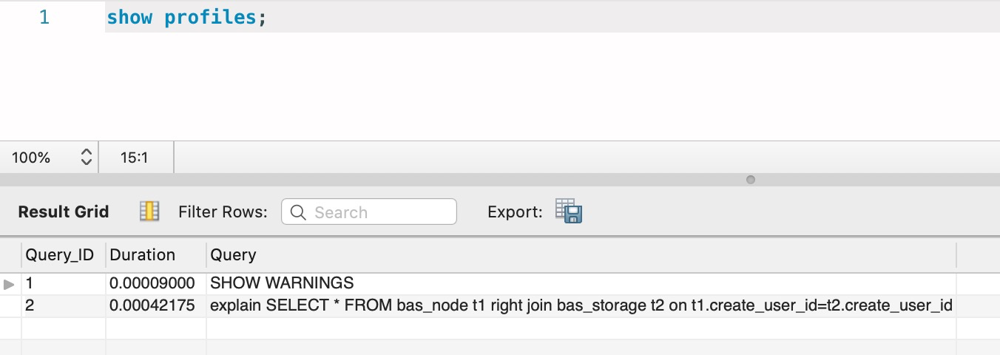

# MySQL修炼手册

## 存储引擎

### Innodb存储引擎

[InnoDB存储引擎]: InnoDB存储引擎.md

## 索引优化


### 索引分类

常见的索引类型有：聚集（主键）索引、二级索引。所有非聚集索引之外的索引都被成为二级索引。

二级索引常见的包括：


#### 聚集索引

聚集索引选择的三种情况：

- When you define a `PRIMARY KEY` on your table, `InnoDB` uses it as the clustered index. Define a primary key for each table that you create. If there is no logical unique and non-null column or set of columns, add a new [auto-increment](https://dev.mysql.com/doc/refman/5.7/en/glossary.html#glos_auto_increment) column, whose values are filled in automatically.
- If you do not define a `PRIMARY KEY` for your table, MySQL locates the first `UNIQUE` index where all the key columns are `NOT NULL` and `InnoDB` uses it as the clustered index.
- If the table has no `PRIMARY KEY` or suitable `UNIQUE` index, `InnoDB` internally generates a hidden clustered index named `GEN_CLUST_INDEX` on a synthetic column containing row ID values. The rows are ordered by the ID that `InnoDB` assigns to the rows in such a table. The row ID is a 6-byte field that increases monotonically as new rows are inserted. Thus, the rows ordered by the row ID are physically in insertion order.

#### 二级索引

二级索引创建了表的字段子集，适合：比如你只需要表中的某个或者某几个字段，否则在更复杂的查询时需要进行回表操作


### 索引优化

#### 索引常用命令

#### explain

##### explain 命令可以查询sql语句的执行计划。查找性能瓶颈


##### 参考

https://dev.mysql.com/doc/refman/8.0/en/explain-output.html

https://blog.csdn.net/weixin_41558728/article/details/81704916

#### 查询耗时时间

```shell
show variables like '%profiling%';
# 开启审计
set profiling=ON;
show variables;

# 查询诊断信息
show profiles;

```




#### 查询索引空间大小

```
SELECT TABLE_NAME AS '表名',
CONCAT(ROUND(TABLE_ROWS/10000, 2), ' 万行') AS '行数',
CONCAT(ROUND(DATA_LENGTH/(1024*1024*1024), 2), ' GB') AS '表空间',
CONCAT(ROUND(INDEX_LENGTH/(1024*1024*1024), 2), ' GB') AS '索引空间',
CONCAT(ROUND((DATA_LENGTH+INDEX_LENGTH)/(1024*1024*1024),2),' GB') AS'总空间'
FROM information_schema.TABLES 
```

#### 查看缓存信息

```
# 是否打开缓存
show variables like 'have_query_cache'
# 使用此语句可以查看缓存的开关、大小等信息
show variables like 'query';　

# 当前缓存的情况
show status like '%Qcache%';

# 清理缓存
 flush query cache;
 reset query cache
```


### 索引测试


## 参考资料

Explain:	

https://dev.mysql.com/doc/refman/5.7/en/explain-output.html

MySQL执行计划

https://www.cnblogs.com/sunjingwu/p/10755823.html

## 数据库命令


### mysqldump

   ·   --no-create-info, -t

       Do not write CREATE TABLE statements that create each dumped table.
    
           Note
           This option does not exclude statements creating log file groups or tablespaces from mysqldump output; however, you can use the
           --no-tablespaces option for this purpose.
       
    ·   --no-data, -d
    
       Do not write any table row information (that is, do not dump table contents). This is useful if you want to dump only the CREATE
       TABLE statement for the table (for example, to create an empty copy of the table by loading the dump file).


​    
​    ·   --tables
​    
​       Override the --databases or -B option.  mysqldump regards all name arguments following the option as table names.
​    
​    When you selectively enable or disable the effect of a group option, order is important because options are processed first to last. For
​    example, --disable-keys --lock-tables --skip-opt would not have the intended effect; it is the same as --skip-opt by itself.
​    Examples.PP To make a backup of an entire database:
​    
​       shell> mysqldump db_name > backup-file.sql
​    
    To load the dump file back into the server:
    
       shell> mysql db_name < backup-file.sql
    
    Another way to reload the dump file:
    
       shell> mysql -e "source /path-to-backup/backup-file.sql" db_name
    
    mysqldump is also very useful for populating databases by copying data from one MySQL server to another:
    
       shell> mysqldump --opt db_name | mysql --host=remote_host -C db_name
    
    You can dump several databases with one command:
    
       shell> mysqldump --databases db_name1 [db_name2 ...] > my_databases.sql
    
    To dump all databases, use the --all-databases option:
    
       shell> mysqldump --all-databases > all_databases.sql
    
    For InnoDB tables, mysqldump provides a way of making an online backup:
    
       shell> mysqldump --all-databases --master-data --single-transaction > all_databases.sql

dump数据库的所有表级库的结构信息，不包含数据
mysqldump -d db_name -uuser -ppassword > minder.sql

dump数据库的所有表级库的结构信息，包含数据
mysqldump -t db_name -uuser -ppassword > minder.sql

## SQL语句

### 函数

#### 窗口函数


| Name                                                         | Description                                                  |
| ------------------------------------------------------------ | ------------------------------------------------------------ |
| [`CUME_DIST()`](https://dev.mysql.com/doc/refman/8.0/en/window-function-descriptions.html#function_cume-dist) | Cumulative distribution value                                |
| [`DENSE_RANK()`](https://dev.mysql.com/doc/refman/8.0/en/window-function-descriptions.html#function_dense-rank) | Rank of current row within its partition, without gaps       |
| [`FIRST_VALUE()`](https://dev.mysql.com/doc/refman/8.0/en/window-function-descriptions.html#function_first-value) | Value of argument from first row of window frame             |
| [`LAG()`](https://dev.mysql.com/doc/refman/8.0/en/window-function-descriptions.html#function_lag) | Value of argument from row lagging current row within partition |
| [`LAST_VALUE()`](https://dev.mysql.com/doc/refman/8.0/en/window-function-descriptions.html#function_last-value) | Value of argument from last row of window frame              |
| [`LEAD()`](https://dev.mysql.com/doc/refman/8.0/en/window-function-descriptions.html#function_lead) | Value of argument from row leading current row within partition |
| [`NTH_VALUE()`](https://dev.mysql.com/doc/refman/8.0/en/window-function-descriptions.html#function_nth-value) | Value of argument from N-th row of window frame              |
| [`NTILE()`](https://dev.mysql.com/doc/refman/8.0/en/window-function-descriptions.html#function_ntile) | Bucket number of current row within its partition.           |
| [`PERCENT_RANK()`](https://dev.mysql.com/doc/refman/8.0/en/window-function-descriptions.html#function_percent-rank) | Percentage rank value                                        |
| [`RANK()`](https://dev.mysql.com/doc/refman/8.0/en/window-function-descriptions.html#function_rank) | Rank of current row within its partition, with gaps          |
| [`ROW_NUMBER()`](https://dev.mysql.com/doc/refman/8.0/en/window-function-descriptions.html#function_row-number) | Number of current row within its partition                   |


参考手册：

https://www.jianshu.com/p/aabd8bf6b51c

#### 聚合函数


### 存储过程


```
DROP PROCEDURE IF EXISTS proc_initData;

DELIMITER $

CREATE PROCEDURE proc_initData()

BEGIN

DECLARE i INT DEFAULT 1;

WHILE i<=1000 DO

INSERT INTO consumer(username,password,email) VALUES(concat('liuyiyi@', i), '123456', concat(i, '@qq.com'));

SET i = i+1;

END WHILE;

END $

CALL proc_initData();
```


### DDL操作

#### 修改列


```
alter table consumer change column id id BIGINT(20)
```


#### 增加列

```

```


#### 添加外键

```
ALTER TABLE `lab`.`order` 
ADD CONSTRAINT `order_good`
  FOREIGN KEY (`id`)
  REFERENCES `lab`.`goods` (`id`)
  ON DELETE NO ACTION
  ON UPDATE CASCADE;
```

### DML操作

#### 查询-select


#### 更新-update


####  插入-insert

#### 如果不存在则插入

```sql
INSERT INTO goods (gname,price,descr) select 'aa',10,'desc' from dual where not exists (select * from goods where gname = 'aa')
```

注意 insert 多个值得时候后面是以括号分隔的。

```sql
INSERT INTO t1 (c1,c2) VALUES (1,'a'), (NULL,'b'), (5,'c'), (NULL,'d');
```

### DCL操作

Data Control Language

