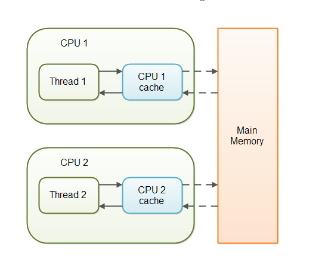

[toc]


# Java FAQ

- HashMap结构，什么对象能做key?

hashmap是数组+单链表/红黑树的形式，key可以为空

具体实现原理参考数据结构章节

- StringBuilder和StringBuffer?

StringBuffer是线程安全的，因为其方法添加了synchronized类。

```java
@Override
public synchronized StringBuffer append(String str) {
    toStringCache = null;
    super.append(str);
    return this;
}
```

- synchronized实现原理

偏向锁、轻量级锁、重量级锁是如何过渡的？

监视器是什么？监视器和对象头的关系？监视器实现原理是什么？


- 对象的深拷贝与浅拷贝？

**浅拷贝**：创建一个新对象，然后将当前对象的非静态字段复制到该对象，如果字段类型是值类型（基本类型）的，那么对该字段进行复制；如果字段是引用类型的，则只复制该字段的引用而不复制引用指向的对象。此时新对象里面的引用类型字段相当于是原始对象里面引用类型字段的一个副本，原始对象与新对象里面的引用字段指向的是同一个对象。

**深拷贝**
了解了浅拷贝，那么深拷贝是什么也就很清楚了。即将引用类型的属性内容也拷贝一份新的。

那么，**实现深拷贝我这里收集到两种方式：**

第一种是给需要拷贝的引用类型也实现Cloneable接口并覆写clone方法；

第二种则是利用序列化。

- countdownlatch await方法是线程安全的吗？

是。内部使用了volatile和cas机制保证了原子性和可见性。但是可能会出现其他线程没有countdown导致线程

一直等待的情形，所以最好调用带超时时间的接口

```java
public boolean await(long timeout, TimeUnit unit)	throws InterruptedException
```

- Unsafe用途？


参考文档：

https://www.jianshu.com/p/db8dce09232d


# 数据结构

## 队列

### 同步队列

#### 基本原理

SynchronousQueue是一个很有意思的队列，号称实现无锁同步，内部不存储任何元素，仅仅借助节点的状态和cas操作实现同步。

下图是我示例程序head的一个镜像信息，从这里可以看出同步队里并不是不存信息，而是放到了栈中或者队列（单链表）中。

```java
import java.util.Arrays;
import java.util.List;
import java.util.concurrent.ExecutorService;
import java.util.concurrent.Executors;
import java.util.concurrent.SynchronousQueue;

/**
 * @author: yujingzhi
 * Version: 1.0
 */
public class TaskExecutor {
    private SynchronousQueue<String> queue = new SynchronousQueue();
    private static ExecutorService executorService = Executors.newFixedThreadPool(2);
    private List<String> data = Arrays.asList("a", "b");

    public void doAction() {
        for (int i =0; i<2; i++) {
            executorService.submit(new TaskEntry(i));
        }
    }

    class TaskEntry implements Runnable {
        private int loop;
        TaskEntry (int i) {
            loop = i;
        }
        public void run() {
            try {
                queue.put(data.get(loop));
            } catch (InterruptedException e) {
                e.printStackTrace();
            }
        }
    }
}
```


#### 实现原理

同步队列的take和put的操作区别在于传入对数据，一个是null一个是真实的数据e，transfer方法根据其来决定是REQUEST模式或者DATA模式。

tansferer有两种实现。一种TransferStack(LIFO)，一种是TransferQueue(FIFO)

```java
// take
public E take() throws InterruptedException {
 	// 传入的item为空，timed为false,超时时间为0
  E e = transferer.transfer(null, false, 0);
  if (e != null)
    return e;
  Thread.interrupted();
  throw new InterruptedException();
}
// put 阻塞操作
public void put(E e) throws InterruptedException {
    if (e == null) throw new NullPointerException();
    if (transferer.transfer(e, false, 0) == null) {
        Thread.interrupted();
        throw new InterruptedException();
    }
}

// offer 非阻塞操作返回值为空，offer这里的返回值表示是否加入到队列中去
public boolean offer(E e) {
  if (e == null) throw new NullPointerException();
  return transferer.transfer(e, true, 0) != null;
}
```

下面以TransferStack的实现来进行分析，TransferQueue原理类似。

transfer代码的分析，需要理解FULFILLING的概念，当栈中有数据，当前的put操作则为fullfiling，之前的take则awaitFulfill，反之亦然。

也就是说生产数据和消费数据的线程在同步队列中互为顾客，都有需求和满足需求的角色。

栈/队列中node的三种角色。

```java
// 请求数据，当数据为null，即task
static final int REQUEST    = 0;
/** Node represents an unfulfilled producer */
static final int DATA       = 1;
/** Node is fulfilling another unfulfilled DATA or REQUEST */
static final int FULFILLING = 2;
```

核心代码逻辑transfer实现流程分析：

```java
/**
 * Puts or takes an item.
 */
@SuppressWarnings("unchecked")
E transfer(E e, boolean timed, long nanos) {
   
    SNode s = null; // constructed/reused as needed
  	// 如果是take则mode为request,put则为data
    int mode = (e == null) ? REQUEST : DATA;

    for (;;) {
        SNode h = head;
      	// 1.如果栈中为空或者栈顶都为DATA模式或者request模式：此情形适用于连续take或者put的场景。
      	// 2.步骤1条件不成立时，说明之前的请求模式必然和自己的不同，也就是说上一个请求必然是'顾客'
        if (h == null || h.mode == mode) {  // empty or same-mode
          	// 这里对于poll和offer操作而言，没有就返回空并不会把数据放到队列中，这也是符合阻塞接口定义的
            if (timed && nanos <= 0) {      // can't wait:offer or poll
                if (h != null && h.isCancelled())
                    casHead(h, h.next);     // pop cancelled node
                else
                    return null;
            // 对于阻塞接口，比如take和put会走此流程，加入到队列中
            } else if (casHead(h, s = snode(s, e, h, mode))) {
                SNode m = awaitFulfill(s, timed, nanos);
                if (m == s) {               // wait was cancelled
                    clean(s);
                    return null;
                }
                if ((h = head) != null && h.next == s)
                    casHead(h, s.next);     // help s's fulfiller
                return (E) ((mode == REQUEST) ? m.item : s.item);
            }
         
        } // 此步骤的主要作用是设置当前节点为 FULFILLING，不过需要首选判断下当前head是否已经是fulfill状态（考虑并发情况，如果是则先帮其设置matcher）
      	else if (!isFulfilling(h.mode)) { // try to fulfill
            if (h.isCancelled())            // already cancelled
                casHead(h, h.next);         // pop and retry
          	// 入栈，并设置mode为FULFILLING，使‘顾客’在awaitFulfill时得到满足
            else if (casHead(h, s=snode(s, e, h, FULFILLING|mode))) {
              	// 这里在take时会出现非公平竞争，所以stack是非公平的
                for (;;) { // loop until matched or waiters disappear
                  	// 因此s已经被设置为head，那么next就是它需要消费的节点
                    SNode m = s.next;       // m is s's match
                    if (m == null) {        // all waiters are gone
                        casHead(s, null);   // pop fulfill node
                        s = null;           // use new node next time
                        break;              // restart main loop
                    }
                    SNode mn = m.next;
                  	// 设置'生产者'去提供消费者需要的数据
                  	// 设置s的match为m的数据，唤醒生产者
                    if (m.tryMatch(s)) {
                      	// 将匹配到的生产者m和消费者s出栈
                        casHead(s, mn);     // pop both s and m
                        return (E) ((mode == REQUEST) ? m.item : s.item);
                    } else                  // lost match
                        s.casNext(m, mn);   // help unlink
                }
            }
        } else {                            // help a fulfiller
            SNode m = h.next;               // m is h's match
            if (m == null)                  // waiter is gone
                casHead(h, null);           // pop fulfilling node
            else {
                SNode mn = m.next;
                if (m.tryMatch(h))          // help match
                    casHead(h, mn);         // pop both h and m
                else                        // lost match
                    h.casNext(m, mn);       // help unlink
            }
        }
    }
}
```

tryMatch

```java
boolean tryMatch(SNode s) {
    if (match == null &&
        UNSAFE.compareAndSwapObject(this, matchOffset, null, s)) {
        Thread w = waiter;
        if (w != null) {    // waiters need at most one unpark
            waiter = null;
            LockSupport.unpark(w);
        }
        return true;
    }
    return match == s;
}
```

等待满足的生成者出现，返回数据，自旋一定时间后睡眠。

```java

SNode awaitFulfill(SNode s, boolean timed, long nanos) {
    final long deadline = timed ? System.nanoTime() + nanos : 0L;
    Thread w = Thread.currentThread();
    int spins = (shouldSpin(s) ?
                 (timed ? maxTimedSpins : maxUntimedSpins) : 0);
    for (;;) {
        if (w.isInterrupted())
            s.tryCancel();
      	// 有匹配到的matcher则返回
        SNode m = s.match;
        if (m != null)
            return m;
        if (timed) {
            nanos = deadline - System.nanoTime();
            if (nanos <= 0L) {
                s.tryCancel();
                continue;
            }
        }
      	// 先自旋，自旋一定次数后park
        if (spins > 0)
            spins = shouldSpin(s) ? (spins-1) : 0;
        else if (s.waiter == null)
            s.waiter = w; // establish waiter so can park next iter
        else if (!timed)
            LockSupport.park(this);
        else if (nanos > spinForTimeoutThreshold)
            LockSupport.parkNanos(this, nanos);
  }
```

### 阻塞队列

想要了解什么是阻塞队列，其实现了什么功能？最好了解下其实现的接口定义：

| 方法                                                         | 是否阻塞 | 说明                                                         |
| ------------------------------------------------------------ | -------- | ------------------------------------------------------------ |
| boolean add(E e)                                             | N        | 违反空间大小时会报错                                         |
| boolean offer(E e)                                           | N        | 只是尝试去加，不会阻塞；与put不同                            |
| boolean offer(E e, long timeout, TimeUnit unit)<br/>        throws InterruptedException | N        | 超时机制                                                     |
| void put(E e) throws InterruptedException                    | Y        | 添加队列元素，阻塞接口                                       |
| E take() throws InterruptedException                         | Y        | 获取队列元素，阻塞接口                                       |
| E poll(long timeout, TimeUnit unit)<br/>        throws InterruptedException | N        | 尝试去获取，支持轮询，不一定要获取到；与task不一样，take是会一直获取，会阻塞 |


```
public interface BlockingQueue<E> extends Queue<E> {

    boolean add(E e);

    boolean offer(E e);

    /** 添加时阻塞
     * Inserts the specified element into this queue, waiting if necessary
     * for space to become available.
     *
     * @param e the element to add
     * @throws InterruptedException if interrupted while waiting
     * @throws ClassCastException if the class of the specified element
     *         prevents it from being added to this queue
     * @throws NullPointerException if the specified element is null
     * @throws IllegalArgumentException if some property of the specified
     *         element prevents it from being added to this queue
     */
    void put(E e) throws InterruptedException;

    /**
    	添加，支持超时机制
     * Inserts the specified element into this queue, waiting up to the
     * specified wait time if necessary for space to become available.
     *
     * @param e the element to add
     * @param timeout how long to wait before giving up, in units of
     *        {@code unit}
     * @param unit a {@code TimeUnit} determining how to interpret the
     *        {@code timeout} parameter
     * @return {@code true} if successful, or {@code false} if
     *         the specified waiting time elapses before space is available
     * @throws InterruptedException if interrupted while waiting
     * @throws ClassCastException if the class of the specified element
     *         prevents it from being added to this queue
     * @throws NullPointerException if the specified element is null
     * @throws IllegalArgumentException if some property of the specified
     *         element prevents it from being added to this queue
     */
    boolean offer(E e, long timeout, TimeUnit unit)
        throws InterruptedException;

    /** 阻塞获取
     * Retrieves and removes the head of this queue, waiting if necessary
     * until an element becomes available.
     *
     * @return the head of this queue
     * @throws InterruptedException if interrupted while waiting
     */
    E take() throws InterruptedException;

    /** 超时获取
     * Retrieves and removes the head of this queue, waiting up to the
     * specified wait time if necessary for an element to become available.
     *
     * @param timeout how long to wait before giving up, in units of
     *        {@code unit}
     * @param unit a {@code TimeUnit} determining how to interpret the
     *        {@code timeout} parameter
     * @return the head of this queue, or {@code null} if the
     *         specified waiting time elapses before an element is available
     * @throws InterruptedException if interrupted while waiting
     */
    E poll(long timeout, TimeUnit unit)
        throws InterruptedException;

    /**
     * Returns the number of additional elements that this queue can ideally
     * (in the absence of memory or resource constraints) accept without
     * blocking, or {@code Integer.MAX_VALUE} if there is no intrinsic
     * limit.
     *
     * <p>Note that you <em>cannot</em> always tell if an attempt to insert
     * an element will succeed by inspecting {@code remainingCapacity}
     * because it may be the case that another thread is about to
     * insert or remove an element.
     *
     * @return the remaining capacity
     */
    int remainingCapacity();

    /**
     * Removes a single instance of the specified element from this queue,
     * if it is present.  More formally, removes an element {@code e} such
     * that {@code o.equals(e)}, if this queue contains one or more such
     * elements.
     * Returns {@code true} if this queue contained the specified element
     * (or equivalently, if this queue changed as a result of the call).
     *
     * @param o element to be removed from this queue, if present
     * @return {@code true} if this queue changed as a result of the call
     * @throws ClassCastException if the class of the specified element
     *         is incompatible with this queue
     *         (<a href="../Collection.html#optional-restrictions">optional</a>)
     * @throws NullPointerException if the specified element is null
     *         (<a href="../Collection.html#optional-restrictions">optional</a>)
     */
    boolean remove(Object o);

    /**
     * Returns {@code true} if this queue contains the specified element.
     * More formally, returns {@code true} if and only if this queue contains
     * at least one element {@code e} such that {@code o.equals(e)}.
     *
     * @param o object to be checked for containment in this queue
     * @return {@code true} if this queue contains the specified element
     * @throws ClassCastException if the class of the specified element
     *         is incompatible with this queue
     *         (<a href="../Collection.html#optional-restrictions">optional</a>)
     * @throws NullPointerException if the specified element is null
     *         (<a href="../Collection.html#optional-restrictions">optional</a>)
     */
    public boolean contains(Object o);
		...
}
```

#### ArrayBlockingQueue 


#### LinkedBlockingQueue 


结构体，LinkedBlockingQueue最大值为整数的最大值，其底层数据结构为链表实现，当然这并不是说其容量是没有限制的，

可以指定capacity，当数组中元素到达此阈值时需要等待条件锁notFull的通知。

知识点：

LinkedBlockingQueue使用了两个条件锁和两个可重入锁，take和put操作持有不同的重入锁，这样做的目的是支持不同线程同时进行读写操作。

```java
public LinkedBlockingQueue() {
    this(Integer.MAX_VALUE);
}

public LinkedBlockingQueue(int capacity) {
  if (capacity <= 0) throw new IllegalArgumentException();
  this.capacity = capacity;
  last = head = new Node<E>(null);
}
```


put流程

```java
public void put(E e) throws InterruptedException {
    if (e == null) throw new NullPointerException();
    // Note: convention in all put/take/etc is to preset local var
    // holding count negative to indicate failure unless set.
    int c = -1;
    Node<E> node = new Node<E>(e);
    final ReentrantLock putLock = this.putLock;
    final AtomicInteger count = this.count;
    putLock.lockInterruptibly();
    try {
        /*
         * Note that count is used in wait guard even though it is
         * not protected by lock. This works because count can
         * only decrease at this point (all other puts are shut
         * out by lock), and we (or some other waiting put) are
         * signalled if it ever changes from capacity. Similarly
         * for all other uses of count in other wait guards.
         */
        while (count.get() == capacity) {
            notFull.await();
        }
        enqueue(node);
        c = count.getAndIncrement();
        if (c + 1 < capacity)
            notFull.signal();
    } finally {
        putLock.unlock();
    }
    if (c == 0)
        signalNotEmpty();
}

// linkedblockingqueue为尾部插入
private void enqueue(Node<E> node) {
  // assert putLock.isHeldByCurrentThread();
  // assert last.next == null;
  last = last.next = node;
}
```


#### LinkedBlockingDeque

[ dek ]

此队列初始化和linkedBlockingQueue差不多，但是支持队列元素的双端操作，实现了BlockingDeque接口。

包括addFirst、offerFirst、removeFirst等操作。


#### DelayQueue

应用场景：

　1. 淘宝订单业务:下单之后如果三十分钟之内没有付款就自动取消订单。 
　2. 饿了吗订餐通知:下单成功后60s之后给用户发送短信通知。

　3.关闭空闲连接。服务器中，有很多客户端的连接，空闲一段时间之后需要关闭之。

　4.缓存。缓存中的对象，超过了空闲时间，需要从缓存中移出。

　5.任务超时处理。在网络协议滑动窗口请求应答式交互时，处理超时未响应的请求等。

前提：

使用延时队列必须实现延时接口，定义延时时间

```java
public interface Delayed extends Comparable<Delayed> {

    /**
     * Returns the remaining delay associated with this object, in the
     * given time unit.
     *
     * @param unit the time unit
     * @return the remaining delay; zero or negative values indicate
     * that the delay has already elapsed
     */
    long getDelay(TimeUnit unit);
}
```

put->offer

```java
public boolean offer(E e) {
    final ReentrantLock lock = this.lock;
    lock.lock();
    try {
      	// 直接插入元素
        q.offer(e);
      	// 对于take比put早的场景，需要通知等待线程，数据可得
        if (q.peek() == e) {
            leader = null;
          	// 如果AQS的条件队列中有等待者会将所有的等待者加入到CLH队列中去
            available.signal();
        }
        return true;
    } finally {
        lock.unlock();
    }
}
```


take操作


```java
public E take() throws InterruptedException {
    final ReentrantLock lock = this.lock;
    lock.lockInterruptibly();
    try {
        for (;;) {
            E first = q.peek();
          	// 如果队列中没有数据则等待
            if (first == null)
                available.await();
            else {
              	// 获取延时时间
                long delay = first.getDelay(NANOSECONDS);
                if (delay <= 0)
                    return q.poll();
                first = null; // don't retain ref while waiting
                if (leader != null)
                    available.await();
                else {
                    Thread thisThread = Thread.currentThread();
                    leader = thisThread;
                    try {
                      	// 条件队列等待指定时间
                        // await操作，将其加入到条件队列中去，如果此节点还没有在CLH队列中则park
                  			// 注意此过程会释放锁，并在被唤醒时重新获取队列
                        available.awaitNanos(delay);
                    } finally {
                        if (leader == thisThread)
                            leader = null;
                    }
                }
            }
        }
    } finally {
        if (leader == null && q.peek() != null)
            available.signal();
        lock.unlock();
    }
}
```


#### LinkedTransferQueue


#### SynchronousQueue

见上。

#### LinkedTransferQueue


#### PriorityBlockingQueue

优先级队列必须实现Comparable接口或者指定Comparable接口，否则会抛出cast错误。

初始化，带优先级的阻塞队列可以指定comparator实现来实现优先级排序。带有阻塞的队列都会有条件锁，来实现非空和非满条件的同步。

```java
public PriorityBlockingQueue(int initialCapacity,
                             Comparator<? super E> comparator) {
    if (initialCapacity < 1)
        throw new IllegalArgumentException();
    this.lock = new ReentrantLock();
    this.notEmpty = lock.newCondition();
    this.comparator = comparator;
    this.queue = new Object[initialCapacity];
}
```

offer实现

offer	

```java
public boolean offer(E e) {
    if (e == null)
        throw new NullPointerException();
    final ReentrantLock lock = this.lock;
  	// 先获取可重入锁，避免在tryGrow时发生数据不一致的情况
    lock.lock();
    int n, cap;
    Object[] array;
    while ((n = size) >= (cap = (array = queue).length))
        tryGrow(array, cap);
    try {
        Comparator<? super E> cmp = comparator;
      	// 如果没有自定义比较器，则使用元素E的默认comparable实现；
        if (cmp == null)
            siftUpComparable(n, e, array);
        else
            siftUpUsingComparator(n, e, array, cmp);
        size = n + 1;
        notEmpty.signal();
    } finally {
        lock.unlock();
    }
    return true;
}
```

小于0的情况下会将插入的元素交换到堆的顶部。

在取出或者插入元素时注意优先级的队列不管排序，只管上浮或者下降不管排序

```java
private static <T> void siftUpUsingComparator(int k, T x, Object[] array,
                                   Comparator<? super T> cmp) {
    while (k > 0) {
        int parent = (k - 1) >>> 1;
        Object e = array[parent];
        if (cmp.compare(x, (T) e) >= 0)
            break;
        array[k] = e;
        k = parent;
    }
    array[k] = x;
}
```


实例：

```java
public class Msg implements Comparable {
	int priority;
	String data;

	public int getPriority() {
		return priority;
	}

	public void setPriority(int priority) {
		this.priority = priority;
	}

	public String getData() {
		return data;
	}

	public void setData(String data) {
		this.data = data;
	}


	@Override
	public int compareTo(Object o) {
		if (o instanceof Msg) {
			return this.priority - ((Msg) o).priority;
		}

		return -1;
	}
}


public class Producer {

   PriorityBlockingQueue<Msg> priorityQueue = new PriorityBlockingQueue<>(128);


   public void sendMsg() {
      for (int i =10; i > 0; i--) {
         Msg msg = new Msg();
         msg.setPriority(i);
         msg.setData(String.valueOf(System.currentTimeMillis()));
         priorityQueue.put(msg);
      }


      priorityQueue.toArray();
   }


}
```

### 非阻塞队列

#### ConcurrentLinkedQueue

#### ConcurrentLinkedDeque

#### PriorityQueue

优先级队列，通过Comparator

```java
public PriorityQueue(int initialCapacity,
                     Comparator<? super E> comparator) {
    // Note: This restriction of at least one is not actually needed,
    // but continues for 1.5 compatibility
    if (initialCapacity < 1)
        throw new IllegalArgumentException();
    this.queue = new Object[initialCapacity];
    this.comparator = comparator;
}
```


### 双端队列

双端队列，主要指实现了双端操作的队列模式，使得数据的操作更加灵活。

#### Deque

#### BlockingDeque

## Map

### TreeMap

treeMap可以根据key必须实现Comparator接口，否则在初始化时会报错。

treeMap的key不能为空；

treeMap默认是小顶堆实现，由comparator接口实现是小顶堆还是大顶堆。

如果key为Integer则升序，String 则为字母表

```java
public class TreeMap<K,V>
    extends AbstractMap<K,V>
    implements NavigableMap<K,V>, Cloneable, java.io.Serializable
{
  ...
}
public V put(K key, V value) {
    Entry<K,V> t = root;
    if (t == null) {
        compare(key, key); // type (and possibly null) check

        root = new Entry<>(key, value, null);
        size = 1;
        modCount++;
        return null;
    }
    int cmp;
    Entry<K,V> parent;
    // split comparator and comparable paths
    Comparator<? super K> cpr = comparator;
    if (cpr != null) {
        do {
            parent = t;
            cmp = cpr.compare(key, t.key);
            if (cmp < 0)
                t = t.left;
            else if (cmp > 0)
                t = t.right;
            else
                return t.setValue(value);
        } while (t != null);
    }
    else {
        if (key == null)
            throw new NullPointerException();
        @SuppressWarnings("unchecked")
            Comparable<? super K> k = (Comparable<? super K>) key;
        do {
            parent = t;
            cmp = k.compareTo(t.key);
            if (cmp < 0)
                t = t.left;
            else if (cmp > 0)
                t = t.right;
            else
                return t.setValue(value);
        } while (t != null);
    }
    Entry<K,V> e = new Entry<>(key, value, parent);
    if (cmp < 0)
        parent.left = e;
    else
        parent.right = e;
    fixAfterInsertion(e);
    size++;
    modCount++;
    return null;
}
```


### HashMap

hashmap是数组+单链表/红黑树的形式

map节点数据结构：

```java
static class Node<K,V> implements Map.Entry<K,V> {
    final int hash;
    final K key;
    V value;
    Node<K,V> next;
  Node(int hash, K key, V value, Node<K,V> next) {
    this.hash = hash;
    this.key = key;
    this.value = value;
    this.next = next;
  }
  ...
}  
  
```

红黑树节点数据结构

```java
static final class TreeNode<K,V> extends LinkedHashMap.Entry<K,V> {
    TreeNode<K,V> parent;  // red-black tree links
    TreeNode<K,V> left;
    TreeNode<K,V> right;
    TreeNode<K,V> prev;    // needed to unlink next upon deletion
    boolean red;
    TreeNode(int hash, K key, V val, Node<K,V> next) {
        super(hash, key, val, next);
    }
  ...
}    
```

#### put/putVal

```java
public V put(K key, V value) {
  
	return putVal(hash(key), key, value, false, true);
}

final V putVal(int hash, K key, V value, boolean onlyIfAbsent,
               boolean evict) {
    Node<K,V>[] tab;  // 当前map数组
  	Node<K,V> p; 			// 当前key所在的槽位
  	int n, i;
  	// map为空进行第一次拓容
    if ((tab = table) == null || (n = tab.length) == 0)
        n = (tab = resize()).length;
  	// 取模后如果为空则生成一个新的节点
    if ((p = tab[i = (n - 1) & hash]) == null)
        tab[i] = newNode(hash, key, value, null);
    else {
        Node<K,V> e; K k;
      	// 如果hash并且key相同则覆盖
        if (p.hash == hash &&
            ((k = p.key) == key || (key != null && key.equals(k))))
            e = p;
      	// 如果是红黑树则往树中插入子节点
        else if (p instanceof TreeNode)
            e = ((TreeNode<K,V>)p).putTreeVal(this, tab, hash, key, value);
        else {
          	// 当前hash槽小于7时进行链表操作，大于等于7时进行红黑树化
            for (int binCount = 0; ; ++binCount) {
                if ((e = p.next) == null) {
                    p.next = newNode(hash, key, value, null);
                  	// 槽位节点数大于等于7时进行红黑树化
                    if (binCount >= TREEIFY_THRESHOLD - 1) // -1 for 1st
                        treeifyBin(tab, hash);
                    break;
                }
                if (e.hash == hash &&
                    ((k = e.key) == key || (key != null && key.equals(k))))
                    break;
                p = e;
            }
        }
        if (e != null) { // existing mapping for key
            V oldValue = e.value;
            if (!onlyIfAbsent || oldValue == null)
                e.value = value;
            afterNodeAccess(e);
            return oldValue;
        }
    }
  	// 修改次数
    ++modCount;
    // 当map的大小大于指定阈值则进行拓容；map拓容以指数的形式拓展
    if (++size > threshold)
        resize();
    afterNodeInsertion(evict);
    return null;
}
```


#### resize

拓容分以下几种情况：

1.初始化拓容

2.node容量达到阈值需要拓容

```java
final Node<K,V>[] resize() {
    Node<K,V>[] oldTab = table;
    int oldCap = (oldTab == null) ? 0 : oldTab.length;
    int oldThr = threshold;
    int newCap, newThr = 0;
  	/*
  	 * a.如果老的数组大小大于0则进行2*oldCap指数拓容
  	 * b.否则存在oldThr大于0则新的数据大小设为oldThr
  	 * c.最后取初始化大小16，阈值为16*0.75
  	 *
  	**/
    if (oldCap > 0) {
        if (oldCap >= MAXIMUM_CAPACITY) {
            threshold = Integer.MAX_VALUE;
            return oldTab;
        }
        else if ((newCap = oldCap << 1) < MAXIMUM_CAPACITY &&
                 oldCap >= DEFAULT_INITIAL_CAPACITY)
            newThr = oldThr << 1; // double threshold
    }
    else if (oldThr > 0) // initial capacity was placed in threshold
        newCap = oldThr;
    else {               // zero initial threshold signifies using defaults
        newCap = DEFAULT_INITIAL_CAPACITY;
        newThr = (int)(DEFAULT_LOAD_FACTOR * DEFAULT_INITIAL_CAPACITY);
    }
  
    if (newThr == 0) {
        float ft = (float)newCap * loadFactor;
        newThr = (newCap < MAXIMUM_CAPACITY && ft < (float)MAXIMUM_CAPACITY ?
                  (int)ft : Integer.MAX_VALUE);
    }
    threshold = newThr;
    @SuppressWarnings({"rawtypes","unchecked"})
  	// 生成新的数组
    Node<K,V>[] newTab = (Node<K,V>[])new Node[newCap];
    table = newTab;
    if (oldTab != null) {
      	// 遍历老数组进行取新的数组大小进行重hash
        for (int j = 0; j < oldCap; ++j) {
            Node<K,V> e;
            if ((e = oldTab[j]) != null) {
                oldTab[j] = null;
                if (e.next == null)
                    newTab[e.hash & (newCap - 1)] = e;
                else if (e instanceof TreeNode)
                    ((TreeNode<K,V>)e).split(this, newTab, j, oldCap);
                else { // preserve order
                    Node<K,V> loHead = null, loTail = null;
                    Node<K,V> hiHead = null, hiTail = null;
                    Node<K,V> next;
                    do {
                        next = e.next;
                        if ((e.hash & oldCap) == 0) {
                            if (loTail == null)
                                loHead = e;
                            else
                                loTail.next = e;
                            loTail = e;
                        }
                        else {
                            if (hiTail == null)
                                hiHead = e;
                            else
                                hiTail.next = e;
                            hiTail = e;
                        }
                    } while ((e = next) != null);
                    if (loTail != null) {
                        loTail.next = null;
                        newTab[j] = loHead;
                    }
                    if (hiTail != null) {
                        hiTail.next = null;
                        newTab[j + oldCap] = hiHead;
                    }
                }
            }
        }
    }
    return newTab;
}
```

### LinkedHashMap

#### 原理

Linked相对于HashMap实现了访问有序和插入访问有序。

其主要设计思想有两个方便：

一、在于内部封装了node结构体，使其可以成为双链形式，以便达到访问时有序。

```java
static class Entry<K,V> extends HashMap.Node<K,V> {
    Entry<K,V> before, after;
    Entry(int hash, K key, V value, Node<K,V> next) {
        super(hash, key, value, next);
    }
}
```


二、继承hashmap在生成新节点时，覆盖了newNode方法，使其可以生成有序链表

比如：

put -> putVal -> newNode

```java
Node<K,V> newNode(int hash, K key, V value, Node<K,V> e) {
    LinkedHashMap.Entry<K,V> p =
        new LinkedHashMap.Entry<K,V>(hash, key, value, e);
    linkNodeLast(p);
    return p;
}
```

此外linkedhashmap还实现了以下接口用于做LRU使用

```java
// Callbacks to allow LinkedHashMap post-actions
// 会将节点移到队列尾部
void afterNodeAccess(Node<K,V> p) { }
// 如果想要实现LRU可以重载removeEldestEntry方法进入驱逐条件
void afterNodeInsertion(boolean evict) { }
void afterNodeRemoval(Node<K,V> p) { }
```

#### LRU算法

这里我们借用kafka的一个LRU的实例模型：

```java
public class LRUCache<K, V> implements Cache<K, V> {
    private final LinkedHashMap<K, V> cache;

    public LRUCache(final int maxSize) {
        this.cache = new LinkedHashMap<K, V>(16, 0.75F, true) {
            protected boolean removeEldestEntry(Entry<K, V> eldest) {
                return this.size() > maxSize;
            }
        };
    }

    public V get(K key) {
        return this.cache.get(key);
    }

    public void put(K key, V value) {
        this.cache.put(key, value);
    }

    public boolean remove(K key) {
        return this.cache.remove(key) != null;
    }

    public long size() {
        return (long)this.cache.size();
    }
}
```


### **ConcurrentSkipListMap**


### ConcurrentHashMap


#### 数据结构模型

JDK1.8已经抛弃了分段锁的机制，利用CAS+Synchronized的机制实现来保证并发更新的安全。数据结构采用数组、链表/红黑树的形式。

那么它是如何实现更高效的并发的呢？

是强一致性的吗？

不是

#### 源码分析

##### put流程

```java
final V putVal(K key, V value, boolean onlyIfAbsent) {
    if (key == null || value == null) throw new NullPointerException();
  	// 计算Key的hash值
    int hash = spread(key.hashCode());
    int binCount = 0;
    for (Node<K,V>[] tab = table;;) {
        Node<K,V> f; int n, i, fh;
      	// a.如果表未初始化先初始化，否则进行步骤b
      	// b.查看数组中元素是否为空，为空则插入一个新的元素，否则进行步骤c
      	// c.先判断是否处于拓容过程，是则进行拓容流程，否则进行步骤d
      	// d.使用synchronized加锁
        if (tab == null || (n = tab.length) == 0)
            tab = initTable();
        else if ((f = tabAt(tab, i = (n - 1) & hash)) == null) {
            if (casTabAt(tab, i, null,
                         new Node<K,V>(hash, key, value, null)))
                break;                   // no lock when adding to empty bin
        }
        else if ((fh = f.hash) == MOVED)
            tab = helpTransfer(tab, f);
        else {
            V oldVal = null;
          	// 加锁，变成了synchronized;如果是并发量少的情况，为了提高响应速度使用synchronized，多了
          	// 之后由于红黑树的自平衡可能时间比较久使用重量级锁也是可以的，而且内置锁也是一种不公平锁，能够
          	// 较好提升响应速度
            synchronized (f) {
                if (tabAt(tab, i) == f) {
                    if (fh >= 0) {
                        binCount = 1;
                        for (Node<K,V> e = f;; ++binCount) {
                            K ek;
                            if (e.hash == hash &&
                                ((ek = e.key) == key ||
                                 (ek != null && key.equals(ek)))) {
                                oldVal = e.val;
                                if (!onlyIfAbsent)
                                    e.val = value;
                                break;
                            }
                            Node<K,V> pred = e;
                            if ((e = e.next) == null) {
                                pred.next = new Node<K,V>(hash, key,
                                                          value, null);
                                break;
                            }
                        }
                    }
                    else if (f instanceof TreeBin) {
                        Node<K,V> p;
                        binCount = 2;
                        if ((p = ((TreeBin<K,V>)f).putTreeVal(hash, key,
                                                       value)) != null) {
                            oldVal = p.val;
                            if (!onlyIfAbsent)
                                p.val = value;
                        }
                    }
                }
            }
            if (binCount != 0) {
                if (binCount >= TREEIFY_THRESHOLD)
                    treeifyBin(tab, i);
                if (oldVal != null)
                    return oldVal;
                break;
            }
        }
    }
  	// 计算map个数
    addCount(1L, binCount);
    return null;
}
```

初始化表：

```java
private final Node<K,V>[] initTable() {
    Node<K,V>[] tab; int sc;
  	
    while ((tab = table) == null || tab.length == 0) {
      	// a.sizeCtl初始化为0，当不指定map容量的时候，同时put操作会出现竞争
      	// b.设置sizeCtl为-1加锁
        if ((sc = sizeCtl) < 0)
            Thread.yield(); // lost initialization race; just spin
        else if (U.compareAndSwapInt(this, SIZECTL, sc, -1)) {
            try {
              	// 再次判断表是否为空？
                if ((tab = table) == null || tab.length == 0) {
                    int n = (sc > 0) ? sc : DEFAULT_CAPACITY;
                    @SuppressWarnings("unchecked")
                    Node<K,V>[] nt = (Node<K,V>[])new Node<?,?>[n];
                  	// 初始化表大小为n
                    table = tab = nt;
                    sc = n - (n >>> 2);
                }
            } finally {
              	// 设置拓容阈值
                sizeCtl = sc;
            }
            break;
        }
    }
    return tab;
}
```

这里是添加链表元素

```java
static final <K,V> boolean casTabAt(Node<K,V>[] tab, int i,
                                    Node<K,V> c, Node<K,V> v) {
    return U.compareAndSwapObject(tab, ((long)i << ASHIFT) + ABASE, c, v);
}
```

addCount

```java
private final void addCount(long x, int check) {
    CounterCell[] as; long b, s;
  	// couterCell为空或者有冲突时c才启用countCell，否则直接读BASECOUNT计数即可
    if ((as = counterCells) != null ||
        !U.compareAndSwapLong(this, BASECOUNT, b = baseCount, s = b + x)) {
        CounterCell a; long v; int m;
        boolean uncontended = true;
        if (as == null || (m = as.length - 1) < 0 ||
            (a = as[ThreadLocalRandom.getProbe() & m]) == null ||
            !(uncontended =
              U.compareAndSwapLong(a, CELLVALUE, v = a.value, v + x))) {
            fullAddCount(x, uncontended);
            return;
        }
        if (check <= 1)
            return;
        s = sumCount();
    }
  	// check表示hash冲突的entry个数
    if (check >= 0) {
        Node<K,V>[] tab, nt; int n, sc;
      	// 当达到拓容条件进行并且小于最大容量时拓容
        while (s >= (long)(sc = sizeCtl) && (tab = table) != null &&
               (n = tab.length) < MAXIMUM_CAPACITY) {
            int rs = resizeStamp(n);
          	// 出现拓容并发
            if (sc < 0) {
              	// 无符号右移
                if ((sc >>> RESIZE_STAMP_SHIFT) != rs || sc == rs + 1 ||
                    sc == rs + MAX_RESIZERS || (nt = nextTable) == null ||
                    transferIndex <= 0)
                    break;
                if (U.compareAndSwapInt(this, SIZECTL, sc, sc + 1))
                    transfer(tab, nt);
            }
          	// 拓容：rs左移16位这样最高位为1，当有竞争线程也进行拓容逻辑时会走上面的流程
            else if (U.compareAndSwapInt(this, SIZECTL, sc,
                                         (rs << RESIZE_STAMP_SHIFT) + 2))
                transfer(tab, null);
            s = sumCount();
        }
    }
}
```

transfer

数组迁移流程

```java
private final void transfer(Node<K,V>[] tab, Node<K,V>[] nextTab) {
    int n = tab.length, stride;
    if ((stride = (NCPU > 1) ? (n >>> 3) / NCPU : n) < MIN_TRANSFER_STRIDE)
        stride = MIN_TRANSFER_STRIDE; // subdivide range
    if (nextTab == null) {            // initiating
        try {
            @SuppressWarnings("unchecked")
            Node<K,V>[] nt = (Node<K,V>[])new Node<?,?>[n << 1];
            nextTab = nt;
        } catch (Throwable ex) {      // try to cope with OOME
            sizeCtl = Integer.MAX_VALUE;
            return;
        }
        nextTable = nextTab;
        transferIndex = n;
    }
    int nextn = nextTab.length;
    ForwardingNode<K,V> fwd = new ForwardingNode<K,V>(nextTab);
    boolean advance = true;
    boolean finishing = false; // to ensure sweep before committing nextTab
    for (int i = 0, bound = 0;;) {
        Node<K,V> f; int fh;
        while (advance) {
            int nextIndex, nextBound;
            if (--i >= bound || finishing)
                advance = false;
            else if ((nextIndex = transferIndex) <= 0) {
                i = -1;
                advance = false;
            }
            else if (U.compareAndSwapInt
                     (this, TRANSFERINDEX, nextIndex,
                      nextBound = (nextIndex > stride ?
                                   nextIndex - stride : 0))) {
                bound = nextBound;
                i = nextIndex - 1;
                advance = false;
            }
        }
        if (i < 0 || i >= n || i + n >= nextn) {
            int sc;
            if (finishing) {
                nextTable = null;
                table = nextTab;
                sizeCtl = (n << 1) - (n >>> 1);
                return;
            }
            if (U.compareAndSwapInt(this, SIZECTL, sc = sizeCtl, sc - 1)) {
                if ((sc - 2) != resizeStamp(n) << RESIZE_STAMP_SHIFT)
                    return;
                finishing = advance = true;
                i = n; // recheck before commit
            }
        }
        else if ((f = tabAt(tab, i)) == null)
            advance = casTabAt(tab, i, null, fwd);
        else if ((fh = f.hash) == MOVED)
            advance = true; // already processed
        else {
            synchronized (f) {
              	// 核心代码思想：将第i位的哈希槽一分为二重新hash到i和i+n的位置
                if (tabAt(tab, i) == f) {
                    Node<K,V> ln, hn;
                    if (fh >= 0) {
                      	// n为2的n次方，所以会有大概一般的元素为1，一半为0，便于后面重hash
                        int runBit = fh & n;
                        Node<K,V> lastRun = f;
                        // 遍历链表找到当前hash冲突的最后一个为1的node
                        for (Node<K,V> p = f.next; p != null; p = p.next) {
                            int b = p.hash & n;
                            if (b != runBit) {
                                runBit = b;
                                lastRun = p;
                            }
                        }
                      	
                        if (runBit == 0) {
                            ln = lastRun;
                            hn = null;
                        }
                        else {
                            hn = lastRun;
                            ln = null;
                        }
                      
                      	// lastRun之前的一个元素必然与ln不同，所以这里会将ln和hn当中的设为非空
                        for (Node<K,V> p = f; p != lastRun; p = p.next) {
                            int ph = p.hash; K pk = p.key; V pv = p.val;
                            if ((ph & n) == 0)
                                ln = new Node<K,V>(ph, pk, pv, ln);
                            else
                                hn = new Node<K,V>(ph, pk, pv, hn);
                        }
                      
                        setTabAt(nextTab, i, ln);
                        setTabAt(nextTab, i + n, hn);
                        setTabAt(tab, i, fwd);
                        advance = true;
                    }
                    else if (f instanceof TreeBin) {
                        TreeBin<K,V> t = (TreeBin<K,V>)f;
                        TreeNode<K,V> lo = null, loTail = null;
                        TreeNode<K,V> hi = null, hiTail = null;
                        int lc = 0, hc = 0;
                        for (Node<K,V> e = t.first; e != null; e = e.next) {
                            int h = e.hash;
                            TreeNode<K,V> p = new TreeNode<K,V>
                                (h, e.key, e.val, null, null);
                            if ((h & n) == 0) {
                                if ((p.prev = loTail) == null)
                                    lo = p;
                                else
                                    loTail.next = p;
                                loTail = p;
                                ++lc;
                            }
                            else {
                                if ((p.prev = hiTail) == null)
                                    hi = p;
                                else
                                    hiTail.next = p;
                                hiTail = p;
                                ++hc;
                            }
                        }
                        ln = (lc <= UNTREEIFY_THRESHOLD) ? untreeify(lo) :
                            (hc != 0) ? new TreeBin<K,V>(lo) : t;
                        hn = (hc <= UNTREEIFY_THRESHOLD) ? untreeify(hi) :
                            (lc != 0) ? new TreeBin<K,V>(hi) : t;
                        setTabAt(nextTab, i, ln);
                        setTabAt(nextTab, i + n, hn);
                        setTabAt(tab, i, fwd);
                        advance = true;
                    }
                }
            }
        }
    }
}
```

fullAddCount

核心思路：CHM的计数方法，可以根据冲突情况生成多了CounterCell，put完kv后addCount时会生成

一个hash值随机取数组中的一个元素进行cas操作

```java
private final void fullAddCount(long x, boolean wasUncontended) {
    int h;
    if ((h = ThreadLocalRandom.getProbe()) == 0) {
        ThreadLocalRandom.localInit();      // force initialization
        h = ThreadLocalRandom.getProbe();
        wasUncontended = true;
    }
    boolean collide = false;                // True if last slot nonempty
    for (;;) {
        CounterCell[] as; CounterCell a; int n; long v;
        if ((as = counterCells) != null && (n = as.length) > 0) {
            if ((a = as[(n - 1) & h]) == null) {
                if (cellsBusy == 0) {            // Try to attach new Cell
                    CounterCell r = new CounterCell(x); // Optimistic create
                    if (cellsBusy == 0 &&
                        U.compareAndSwapInt(this, CELLSBUSY, 0, 1)) {
                        boolean created = false;
                        try {               // Recheck under lock
                            CounterCell[] rs; int m, j;
                            if ((rs = counterCells) != null &&
                                (m = rs.length) > 0 &&
                                rs[j = (m - 1) & h] == null) {
                                rs[j] = r;
                                created = true;
                            }
                        } finally {
                            cellsBusy = 0;
                        }
                        if (created)
                            break;
                        continue;           // Slot is now non-empty
                    }
                }
                collide = false;
            }
            else if (!wasUncontended)       // CAS already known to fail
                wasUncontended = true;      // Continue after rehash
            else if (U.compareAndSwapLong(a, CELLVALUE, v = a.value, v + x))
                break;
            else if (counterCells != as || n >= NCPU)
                collide = false;            // At max size or stale
            else if (!collide)
                collide = true;
            else if (cellsBusy == 0 &&
                     U.compareAndSwapInt(this, CELLSBUSY, 0, 1)) {
                try {
                    if (counterCells == as) {// Expand table unless stale
                        CounterCell[] rs = new CounterCell[n << 1];
                        for (int i = 0; i < n; ++i)
                            rs[i] = as[i];
                        counterCells = rs;
                    }
                } finally {
                    cellsBusy = 0;
                }
                collide = false;
                continue;                   // Retry with expanded table
            }
            h = ThreadLocalRandom.advanceProbe(h);
        }
        else if (cellsBusy == 0 && counterCells == as &&
                 U.compareAndSwapInt(this, CELLSBUSY, 0, 1)) {
            boolean init = false;
            try {                           // Initialize table
                if (counterCells == as) {
                    CounterCell[] rs = new CounterCell[2];
                    rs[h & 1] = new CounterCell(x);
                    counterCells = rs;
                    init = true;
                }
            } finally {
                cellsBusy = 0;
            }
            if (init)
                break;
        }
        else if (U.compareAndSwapLong(this, BASECOUNT, v = baseCount, v + x))
            break;                          // Fall back on using base
    }
}
```


resizeStamp

| n    |       |
| ---- | ----- |
| 2    | 32798 |
| 4    | 32796 |
| 8    | 32794 |
| 16   | 32792 |


```java
static final int resizeStamp(int n) {
  	// 高位0的个数加上2^15
    return Integer.numberOfLeadingZeros(n) | (1 << (RESIZE_STAMP_BITS - 1));
}
```


##### get流程


```java
public V get(Object key) {
    Node<K,V>[] tab; Node<K,V> e, p; int n, eh; K ek;
    int h = spread(key.hashCode());
    if ((tab = table) != null && (n = tab.length) > 0 &&
        (e = tabAt(tab, (n - 1) & h)) != null) {
        if ((eh = e.hash) == h) {
            if ((ek = e.key) == key || (ek != null && key.equals(ek)))
                return e.val;
        }
        else if (eh < 0)
            return (p = e.find(h, key)) != null ? p.val : null;
        while ((e = e.next) != null) {
            if (e.hash == h &&
                ((ek = e.key) == key || (ek != null && key.equals(ek))))
                return e.val;
        }
    }
    return null;
}
```

## Set

java.util.concurrent.ConcurrentHashMap.KeySetView

### CopyOnWriteArraySet

### ConcurrentSkipListSet

## List


# 多线程

## 线程

下面以java中的Thread.java来进行源码的剖析，通过此类的解读来了解java线程的机制和原理。

### yield

只是出让cpu，线程状态处于RUNNABLE状态

### join

join通常用来等待某个线程执行完毕后的结果，因为线程结束会调用nofity通知

```java
    public final synchronized void join(long millis)
    throws InterruptedException {
        long base = System.currentTimeMillis();
        long now = 0;

        if (millis < 0) {
            throw new IllegalArgumentException("timeout value is negative");
        }

        if (millis == 0) {
          	// 当线程退出后会继续
            while (isAlive()) {
                wait(0);
            }
        } else {
            while (isAlive()) {
                long delay = millis - now;
                if (delay <= 0) {
                    break;
                }
                wait(delay);
                now = System.currentTimeMillis() - base;
            }
        }
    }
```

### 线程状态


```java
public enum State {
    /**
     * 还未启动
     */
    NEW,

    /**
     * jvm中处于可以运行的状态，但是可能并没有实际执行；可能在等待cpu资源
     */
    RUNNABLE,

    /**
     * 主要是等待synchronized才会出现
     * Thread state for a thread blocked waiting for a monitor lock.
     * A thread in the blocked state is waiting for a monitor lock
     * to enter a synchronized block/method or
     * reenter a synchronized block/method after calling
     * {@link Object#wait() Object.wait}.
     */
    BLOCKED,

    /**
     * Thread state for a waiting thread.
     * A thread is in the waiting state due to calling one of the
     * following methods:
     * <ul>
     *   <li>{@link Object#wait() Object.wait} with no timeout</li>
     *   <li>{@link #join() Thread.join} with no timeout</li>
     *   <li>{@link LockSupport#park() LockSupport.park}</li>
     * </ul>
     *
     * <p>A thread in the waiting state is waiting for another thread to
     * perform a particular action.
     *
     * For example, a thread that has called <tt>Object.wait()</tt>
     * on an object is waiting for another thread to call
     * <tt>Object.notify()</tt> or <tt>Object.notifyAll()</tt> on
     * that object. A thread that has called <tt>Thread.join()</tt>
     * is waiting for a specified thread to terminate.
     */
    WAITING,

    /**
     * Thread state for a waiting thread with a specified waiting time.
     * A thread is in the timed waiting state due to calling one of
     * the following methods with a specified positive waiting time:
     * <ul>
     *   <li>{@link #sleep Thread.sleep}</li>
     *   <li>{@link Object#wait(long) Object.wait} with timeout</li>
     *   <li>{@link #join(long) Thread.join} with timeout</li>
     *   <li>{@link LockSupport#parkNanos LockSupport.parkNanos}</li>
     *   <li>{@link LockSupport#parkUntil LockSupport.parkUntil}</li>
     * </ul>
     */
    TIMED_WAITING,

    /**
     * Thread state for a terminated thread.
     * The thread has completed execution.
     */
    TERMINATED;
}
```


## ThreadPoolExecutor

### 综述

```java
protected ThreadPoolExecutor createExecutor(
      int corePoolSize, int maxPoolSize, int keepAliveSeconds, BlockingQueue<Runnable> queue,
      ThreadFactory threadFactory, RejectedExecutionHandler rejectedExecutionHandler) {

   return new ThreadPoolExecutor(corePoolSize, maxPoolSize,
         keepAliveSeconds, TimeUnit.SECONDS, queue, threadFactory, rejectedExecutionHandler);
}
```

线程参数：

| 参数                     | 作用                     | 说明                                          |
| ------------------------ | ------------------------ | --------------------------------------------- |
| corePoolSize             | 核心线程数               |                                               |
| maxPoolSize              | 最大线程数               | 触发使用最大线程条件：<br/>1.工作队列已经满了 |
| keepAliveSeconds         | 回收工作线程的空闲时间   |                                               |
| queue                    | 用于存储工作队列         |                                               |
| threadFactory            | 创建工作现成的工厂实现类 |                                               |
| rejectedExecutionHandler | 拒绝策略                 |                                               |

接口线程工厂：可以自定义线程创建过程，比如设置线程优先级、线程组、是否守护线程等属性

```java
public interface ThreadFactory {

    /**
     * Constructs a new {@code Thread}.  Implementations may also initialize
     * priority, name, daemon status, {@code ThreadGroup}, etc.
     *
     * @param r a runnable to be executed by new thread instance
     * @return constructed thread, or {@code null} if the request to
     *         create a thread is rejected
     */
    Thread newThread(Runnable r);
}
```


自定义拒接信息收集：比如抛出一个特定异常和相关信息

```java
public interface RejectedExecutionHandler {

    /**
     * Method that may be invoked by a {@link ThreadPoolExecutor} when
     * {@link ThreadPoolExecutor#execute execute} cannot accept a
     * task.  This may occur when no more threads or queue slots are
     * available because their bounds would be exceeded, or upon
     * shutdown of the Executor.
     *
     * <p>In the absence of other alternatives, the method may throw
     * an unchecked {@link RejectedExecutionException}, which will be
     * propagated to the caller of {@code execute}.
     *
     * @param r the runnable task requested to be executed
     * @param executor the executor attempting to execute this task
     * @throws RejectedExecutionException if there is no remedy
     */
    void rejectedExecution(Runnable r, ThreadPoolExecutor executor);
}
```

综述：

ctl关于状态位的描述：

clt将高3bit保留为状态位，表示线程池的状态，初始化为RUNNING。低29bit表示能够提交的线程个数。


```java
private final AtomicInteger ctl = new AtomicInteger(ctlOf(RUNNING, 0));
private static final int COUNT_BITS = Integer.SIZE - 3;
private static final int CAPACITY   = (1 << COUNT_BITS) - 1;
 // runState is stored in the high-order bits
private static final int RUNNING    = -1 << COUNT_BITS; // 高三比特位：111
private static final int SHUTDOWN   =  0 << COUNT_BITS; // 000
private static final int STOP       =  1 << COUNT_BITS; // 001
private static final int TIDYING    =  2 << COUNT_BITS; // 010
private static final int TERMINATED =  3 << COUNT_BITS; // 011
```


#### 线程状态解读

| 状态       | 描述                                                   |      |
| ---------- | ------------------------------------------------------ | ---- |
| RUNNING    | 接受新任务提交，处理工作队列中的任务                   |      |
| SHUTDOWN   | 不接受新任务提交，处理工作队列中的任务                 |      |
| STOP       | 不接受新任务提交，不处理队列中的任务，中断处理中的任务 |      |
| TIDYING    | 所有任务已经停止，workcount=0                          |      |
| TERMINATED | 线程池终止                                             |      |

ThreadPoolExecutor主要实现了以下接口，包括提交任务、停止任务等。下面会逐个分析：

```java
package java.util.concurrent;
import java.util.List;
import java.util.Collection;

public interface ExecutorService extends Executor {

  	// 停止任务
    void shutdown();

    List<Runnable> shutdownNow();

    boolean isShutdown();

    boolean isTerminated();

    boolean awaitTermination(long timeout, TimeUnit unit)
        throws InterruptedException;

    <T> Future<T> submit(Callable<T> task);

    <T> Future<T> submit(Runnable task, T result);

    Future<?> submit(Runnable task);

    <T> List<Future<T>> invokeAll(Collection<? extends Callable<T>> tasks)
        throws InterruptedException;

    <T> T invokeAny(Collection<? extends Callable<T>> tasks)
        throws InterruptedException, ExecutionException;

    <T> T invokeAny(Collection<? extends Callable<T>> tasks,
                    long timeout, TimeUnit unit)
        throws InterruptedException, ExecutionException, TimeoutException;
}

public interface Executor {

    /**
     * Executes the given command at some time in the future.  The command
     * may execute in a new thread, in a pooled thread, or in the calling
     * thread, at the discretion of the {@code Executor} implementation.
     *
     * @param command the runnable task
     * @throws RejectedExecutionException if this task cannot be
     * accepted for execution
     * @throws NullPointerException if command is null
     */
    void execute(Runnable command);
}
```


#### 常见线程池


```java

// 缓冲线程池
// 缓冲线程池最大的不同点在于其阻塞队列为同步队列，此同步队列在内部维护了一个FIFO队列（公平）
// 线程池在submitTask时会offerTaskQueue()，由于同步队列不会存元素，所以总是返回false，此时线程池
// 根据最大线程池数来分配线程
public static ExecutorService newCachedThreadPool(ThreadFactory threadFactory) {
  return new ThreadPoolExecutor(0, Integer.MAX_VALUE,
                                60L, TimeUnit.SECONDS,
                                new SynchronousQueue<Runnable>(),
                                threadFactory);
}
// 单独线程池，核心线程出和最大线程数都为1
public static ExecutorService newSingleThreadExecutor() {
    return new FinalizableDelegatedExecutorService
        (new ThreadPoolExecutor(1, 1,
                                0L, TimeUnit.MILLISECONDS,
                                new LinkedBlockingQueue<Runnable>()));
}

// 
public ScheduledThreadPoolExecutor(int corePoolSize,
                                   ThreadFactory threadFactory) {
  super(corePoolSize, Integer.MAX_VALUE, 0, NANOSECONDS,
        new DelayedWorkQueue(), threadFactory);
}

public static ExecutorService newFixedThreadPool(int nThreads) {
  return new ThreadPoolExecutor(nThreads, nThreads,
                                0L, TimeUnit.MILLISECONDS,
                                new LinkedBlockingQueue<Runnable>());
}
```

#### 数据结构

Worker类继承了AbstractQueuedSynchronizer，实现了互斥锁的功能。主要是控制线程为否可以被中断。firstTask为空可以表示当前线程是否空闲。runWorker主体流程是线程处理的主体流程

```java
private final class Worker
    extends AbstractQueuedSynchronizer
    implements Runnable
{
    /** Thread this worker is running in.  Null if factory fails. */
    final Thread thread;
    /** Initial task to run.  Possibly null. */
    Runnable firstTask;
    /** Per-thread task counter */
    volatile long completedTasks;

    Worker(Runnable firstTask) {
        setState(-1); // inhibit interrupts until runWorker
        this.firstTask = firstTask;
        this.thread = getThreadFactory().newThread(this);
    }

    /** Delegates main run loop to outer runWorker  */
    public void run() {
        runWorker(this);
    }
		...
}
```


### 任务提交流程

任务执行流程如下：

```
submit->execute(Runnable cmd)->addWorker
```

#### 1) submit

```java
public <T> Future<T> submit(Callable<T> task) {
    if (task == null) throw new NullPointerException();
  	// 生成FutureTask，FutureTask实现了Runnable和Future接口
    RunnableFuture<T> ftask = newTaskFor(task);
  	// 执行任务
    execute(ftask);
    return ftask;
}
```

#### 2) execute

执行任务有个核心逻辑：

如果小于核心线程数则添加工作线程（Worker）；核心线程数用完后提交任务到阻塞队列；

队列满后利用继续添加工作线程，数量最多为maximumPoolSize-corePoolSize

```java
public void execute(Runnable command) {
    if (command == null)
        throw new NullPointerException();
    // 1.如果工作线程数小于核心线程数则添加工作线程
    int c = ctl.get();
    if (workerCountOf(c) < corePoolSize) {
        if (addWorker(command, true))
            return;
        c = ctl.get();
    }
  	// 2.核心线程用完后添加到工作队列
  	// 2.a 再次检查状态，如果不处于运行状态则拒绝提交任务
  	// 2.b 当核心线程数为0，则添加到最大线程（最大线程大于0）。（适用于缓存线程池的场景）
  	// 否则执行步骤3
    if (isRunning(c) && workQueue.offer(command)) {
        int recheck = ctl.get();
        if (! isRunning(recheck) && remove(command))
            reject(command);
        else if (workerCountOf(recheck) == 0)
            addWorker(null, false);
    }
  	// 3.工作队列（isfull）添加失败后才添加才继续申请工作线程到指定的最大线程数，失败后拒绝
    else if (!addWorker(command, false))
        reject(command);
}
```

执行流程的主要核心流程包括**添加工作线程**和**执行工作线程**两个部分，下面将逐一讲解：

##### 添加工作线程

addWorker

添加工作线程主体逻辑。参数core表示是否添加核心线程以外的线程。

这里主体逻辑可以分为两个阶段：

a.使用CAS锁机制，同步增加线程池中工作线程的数量

b.添加工作线程到hashset中

```java

// core:此参数表示添加的工作线程是否是核心线程还是最大线程范围内的
private boolean addWorker(Runnable firstTask, boolean core) {
  	// 1.增加线程池中工作线程的数量
    retry:
    for (;;) {
        int c = ctl.get();
        int rs = runStateOf(c);

        // 1.当线程池状态大于SHUTDOWN时表示其不再处理任务因此也就没必要继续添加worker;
      	// 2. 当线程池状态等于SHUTDOWN时并且firstTask==null表示不再接受新任务并且工作队列中
      	// 还有要处理的任务时可能需要添加任务线程
        if (rs >= SHUTDOWN &&
            ! (rs == SHUTDOWN &&
               firstTask == null &&
               ! workQueue.isEmpty()))
            return false;

        for (;;) {
          	// 获取工作线程个数，如果大于最大或者大于最大线程数（视core值决定）则
          	// 返回false不再进行工作线程的添加
            int wc = workerCountOf(c);
            if (wc >= CAPACITY ||
                wc >= (core ? corePoolSize : maximumPoolSize))
                return false;
            if (compareAndIncrementWorkerCount(c))
                break retry;
          	// 如果线程池状态发生变化则重读
            c = ctl.get();  // Re-read ctl
            if (runStateOf(c) != rs)
                continue retry;
            // else CAS failed due to workerCount change; retry inner loop
        }
    }
    // 2.生成新的工作线程并运行
    boolean workerStarted = false;
    boolean workerAdded = false;
    Worker w = null;
    try {
        w = new Worker(firstTask);
        final Thread t = w.thread;
        if (t != null) {
          	// 全局锁，临界资源为hashset
            final ReentrantLock mainLock = this.mainLock;
            mainLock.lock();
            try {
                // Recheck while holding lock.
                // Back out on ThreadFactory failure or if
                // shut down before lock acquired.
                int rs = runStateOf(ctl.get());

                if (rs < SHUTDOWN ||
                    (rs == SHUTDOWN && firstTask == null)) {
                    if (t.isAlive()) // precheck that t is startable
                        throw new IllegalThreadStateException();
                  	// 将工作线程添加到hashset中
                    workers.add(w);
                  	// 记录已经添加的最大线程数
                    int s = workers.size();
                    if (s > largestPoolSize)
                        largestPoolSize = s;
                    workerAdded = true;
                }
            } finally {
                mainLock.unlock();
            }
          
          	// 如果工作线程添加后不管有没有firstTask都要启动
            if (workerAdded) {
              	// 运行工作线程 见runWorker流程
                t.start();
                workerStarted = true;
            }
        }
    } finally {
        if (! workerStarted)
            addWorkerFailed(w);
    }
    return workerStarted;
}
```

##### 运行工作线程

运行工作线程主体逻辑。如果worker中的task为空，则从队列中取，在lock之前线程是可以被打断的。

1.

2.

3.

```java
final void runWorker(Worker w) {
    Thread wt = Thread.currentThread();
    Runnable task = w.firstTask;
    w.firstTask = null;
    w.unlock(); // allow interrupts
    boolean completedAbruptly = true;
    try {
      	// 1.任务不为空则执行当前任务，为空则从工作队列中阻塞获取，阻塞过程是可以被中断的
        while (task != null || (task = getTask()) != null) {
          	// 2.获取局部锁
            w.lock();
            // If pool is stopping, ensure thread is interrupted;
            // if not, ensure thread is not interrupted.  This
            // requires a recheck in second case to deal with
            // shutdownNow race while clearing interrupt
            if ((runStateAtLeast(ctl.get(), STOP) ||
                 (Thread.interrupted() &&
                  runStateAtLeast(ctl.get(), STOP))) &&
                !wt.isInterrupted())
                wt.interrupt();
            try {
                beforeExecute(wt, task);
                Throwable thrown = null;
                try {
                  	// 执行任务
                    task.run();
                } catch (RuntimeException x) {
                    thrown = x; throw x;
                } catch (Error x) {
                    thrown = x; throw x;
                } catch (Throwable x) {
                    thrown = x; throw new Error(x);
                } finally {
                    afterExecute(task, thrown);
                }
            } finally {
                task = null;
                w.completedTasks++;
                w.unlock();
            }
        }
        completedAbruptly = false;
    } finally {
      	// 执行线程退出的清理工作
        processWorkerExit(w, completedAbruptly);
    }
}
```

清理线程：

工作线程退出时会走到此流程，用户程序异常或者没有需要执行的任务时会走到此流程

```java
private void processWorkerExit(Worker w, boolean completedAbruptly) {
    if (completedAbruptly) // If abrupt, then workerCount wasn't adjusted
        decrementWorkerCount();

    final ReentrantLock mainLock = this.mainLock;
    mainLock.lock();
    try {
        completedTaskCount += w.completedTasks;
        workers.remove(w);
    } finally {
        mainLock.unlock();
    }

  	// 尝试终止线程池：这里会等待工作线程数量为0才会整正将状态设置为TERMINATED
    tryTerminate();

    int c = ctl.get();
    if (runStateLessThan(c, STOP)) {
        if (!completedAbruptly) {
            int min = allowCoreThreadTimeOut ? 0 : corePoolSize;
            if (min == 0 && ! workQueue.isEmpty())
                min = 1;
            if (workerCountOf(c) >= min)
                return; // replacement not needed
        }
        addWorker(null, false);
    }
}


final void tryTerminate() {
  for (;;) {
    int c = ctl.get();
    // 对于运行状态或者shutdown状态并且工作队列不为空等情况不做处理直接返回
    if (isRunning(c) ||
        runStateAtLeast(c, TIDYING) ||
        (runStateOf(c) == SHUTDOWN && ! workQueue.isEmpty()))
      return;
    // 对于工作线程数不等于0的直接返回不处理
    if (workerCountOf(c) != 0) { // Eligible to terminate
      interruptIdleWorkers(ONLY_ONE);
      return;
    }

    final ReentrantLock mainLock = this.mainLock;
    mainLock.lock();
    try {
      if (ctl.compareAndSet(c, ctlOf(TIDYING, 0))) {
        try {
          terminated();
        } finally {
          ctl.set(ctlOf(TERMINATED, 0));
          // 条件锁，通知等待线程
          termination.signalAll();
        }
        return;
      }
    } finally {
      mainLock.unlock();
    }
    // else retry on failed CAS
  }
}
```

# 引用

## 分类

Java引用可分为强引用，软引用，弱引用和虚引用。

为甚要用这种划分呢？是为了能够使java对象的内存回收变得更加灵活、可控。

### 强引用


普通的java对象都是强引用，比如new一个新对象。

**强引用**是使用最普遍的引用。如果一个对象具有强引用，那**垃圾回收器**绝不会回收它。如下：


### 软引用

**有用但是非必须的对象，不够才会收。**

如果一个对象只具有**软引用**，则**内存空间充足**时，**垃圾回收器**就**不会**回收它；如果**内存空间不足**了，就会**回收**这些对象的内存。

### 弱引用

**够不够都回收。**

弱引用与软引用的区别在于：只具有弱引用的对象拥有更短暂的生命周期。在垃圾回收器线程扫描它所管辖的内存区域的过程中，一旦发现了只具有弱引用的对象，不管当前内存空间足够与否，都会回收它的内存。不过，由于垃圾回收器是一个优先级很低的线程，因此不一定会很快发现那些只具有弱引用的对象。

### 虚引用

**虚引用**顾名思义，就是**形同虚设**。与其他几种引用都不同，**虚引用**并**不会**决定对象的**生命周期**。如果一个对象**仅持有虚引用**，那么它就和**没有任何引用**一样，在任何时候都可能被垃圾回收器回收。


# 反射

## 类的加载机制

理解类的加载机制对java开发的理解深度和架构能力都有帮助。


- 一个class是如何被加载到内存的？

Java的动态类加载功能是由类加载器子系统处理。主要流程包括加载、链接、初始化三大部分。

**1.加载：**

类由启动类加载器 (BootStrap class Loader)、扩展类加载器(Extension class Loader)和应用程序类加载器(Application class Loader) 这三种类加载器帮助完成类的加载。

1. **启动类加载器** – 负责从启动类路径中加载类，无非就是rt.jar。这个加载器会被赋予最高优先级。
2. **扩展类加载**器 – 负责加载ext 目录(jre\lib)内的类
3. **应用程序类加载器** – 负责加载应用程序级别类路径，涉及到路径的环境变量等etc.上述的类加载器会遵循委托层次算法（Delegation Hierarchy Algorithm）加载类文件，这个在后面进行讲解。

**加载过程**主要完成三件事情：

- **通过类的全限定名来获取定义此类的二进制字节流**
- 将这个类字节流代表的**静态存储结构转为方法区**的运行时数据结构
- 在**堆中生成一个代表此类的java.lang.Class对象**，作为访问方法区这些数据结构的入口。

**2.2.链接：**

**a)** 校验 

字节码校验器会校验生成的字节码是否正确，如果校验失败，我们会得到校验错误。

文件格式验证：基于字节流验证，验证字节流符合当前的Class文件格式的规范，能被当前虚拟机处理。验证通过后，字节流才会进入内存的方法区进行存储。

元数据验证：基于方法区的存储结构验证，对字节码进行语义验证，确保不存在不符合java语言规范的元数据信息。

字节码验证：基于方法区的存储结构验证，通过对数据流和控制流的分析，保证被检验类的方法在运行时不会做出危害虚拟机的动作。

符号引用验证：基于方法区的存储结构验证，发生在解析阶段，确保能够将符号引用成功的解析为直接引用，其目的是确保解析动作正常执行。换句话说就是对类自身以外的信息进行匹配性校验。

**b)** 准备 – 分配内存并初始化默认值给所有的静态变量。

public static int value=33;

这据代码的赋值过程分两次，一是上面我们提到的阶段，此时的value将会被赋值为0；而value=33这个过程发生在类构造器的<clinit>()方法中。

**c)**  解析所有符号内存引用被方法区(Method Area)的原始引用所替代。

举个例子来说明，在com.sbbic.Person类中引用了com.sbbic.Animal类，在编译阶段，Person类并不知道Animal的实际内存地址，因此只能用com.sbbic.Animal来代表Animal真实的内存地址。在解析阶段，JVM可以通过解析该符号引用，来确定com.sbbic.Animal类的真实内存地址（如果该类未被加载过，则先加载）。

主要有以下四种：类或接口的解析，字段解析，类方法解析，接口方法解析

**3.初始化：**

这是类加载的最后阶段，这里所有的**静态变量会被赋初始值**, 并且**静态块将被执行。**

java中，对于初始化阶段，有且只有**以下五种情况才会对要求类立刻初始化：

- 使用new关键字实例化对象、访问或者设置一个类的静态字段（被final修饰、编译器优化时已经放入常量池的例外）、调用类方法，都会初始化该静态字段或者静态方法所在的类；
- 初始化类的时候，如果其父类没有被初始化过，则要先触发其父类初始化；
- 使用java.lang.reflect包的方法进行反射调用的时候，如果类没有被初始化，则要先初始化；
- 虚拟机启动时，用户会先初始化要执行的主类（含有main）；
- jdk 1.7后，如果java.lang.invoke.MethodHandle的实例最后对应的解析结果是 REF_getStatic、REF_putStatic、REF_invokeStatic方法句柄，并且这个方法所在类没有初始化，则先初始化；

## 动态代理

JDK代理要求被代理的类必须实现接口，有很强的局限性。而CGLIB动态代理则没有此类强制性要求。简单的说，CGLIB会让生成的代理类继承被代理类，并在代理类中对代理方法进行强化处理(前置处理、后置处理等)。在CGLIB底层，其实是借助了ASM这个非常强大的Java字节码生成框架。

### CGlib

cglib基于AMS框架实现，是JDK动态代理的有效补充，可以用于AOP编程，比如日志打印、安全控制、统一鉴权等。

参考：

https://www.cnblogs.com/xrq730/p/6661692.html

示例：

```java
package net.sf.cglib.samples;
import net.sf.cglib.proxy.*;
import java.util.*;
/**
 *
 * @author  baliuka
 */
public class Trace implements MethodInterceptor {
    
    int ident = 1;
    static Trace callback = new Trace();
    
    /** Creates a new instance of Trace */
    private Trace() {
    }
    
    public static  Object newInstance( Class clazz ){
      try{
            Enhancer e = new Enhancer();
            e.setSuperclass(clazz);
            e.setCallback(callback);
            return e.create();
      }catch( Throwable e ){
         e.printStackTrace(); 
         throw new Error(e.getMessage());
      }  
    
    }
    /**
     * @param args the command line arguments
     */
    public static void main(String[] args) {
        List list = (List)newInstance(Vector.class);
        Object value = "TEST";
        list.add(value);
        list.contains(value);
        try{
         list.set(2, "ArrayIndexOutOfBounds" );
        }catch( ArrayIndexOutOfBoundsException ignore ){
        
        }
       list.add(value + "1");
       list.add(value + "2");
       list.toString();
       list.equals(list); 
       list.set( 0, null ); 
       list.toString();
       list.add(list);
       list.get(1);
       list.toArray();
       list.remove(list);
       list.remove("");
       list.containsAll(list);
       list.lastIndexOf(value);
    }


    public Object intercept(Object obj, java.lang.reflect.Method method, Object[] args,
                            MethodProxy proxy) throws Throwable {
        printIdent(ident);
        System.out.println( method );
        for( int i = 0; i < args.length; i++ ){
          printIdent(ident);   
          System.out.print( "arg" + (i + 1) + ": ");
          if( obj == args[i])
              System.out.println("this");
          else
              System.out.println(args[i]);
        }
        ident++;

        Object retValFromSuper = null;
        try {
            retValFromSuper = proxy.invokeSuper(obj, args);
            ident--;
        } catch (Throwable t) {
            ident--;
            printIdent(ident);   
            System.out.println("throw " + t );  
            System.out.println();
            throw t.fillInStackTrace();
        }
        
        printIdent(ident); 
        System.out.print("return " );
        if( obj == retValFromSuper)
            System.out.println("this");
        else System.out.println(retValFromSuper);
        
        if(ident == 1)
             System.out.println();
        
        return retValFromSuper;
    }
    
   void printIdent( int ident ){
       
    
       while( --ident > 0 ){
         System.out.print(".......");
       }
      System.out.print("  ");
   }
    
}
```


### JDK动态代理

jdk动态代理使用的是java的动态编译技术。使用Proxy的newInstance动态编译一个新的class文件来代理所有符合条件的类的方法。

实例。比如我们在Flink的任务管理场景中使用了动态代理技术进行rpc的调用。

```java
// 需要被代理的类。
public class ActionImpl implements Action {
	@Override
	public void do1(String param) {
		System.out.println("do1  " + param);
	}

	@Override
	public void do2(String param) {
		System.out.println("do2  " + param);
	}
}
// 代理类实现
public class ActionProxy implements InvocationHandler {
   private Action action;

   public ActionProxy(Action action) {
      this.action = action;
   }

   @Override
   public Object invoke(Object proxy, Method method, Object[] args) throws Throwable {
      System.out.println("--------------do begin-------------");
      Object invoke = method.invoke(action, args);
      System.out.println("--------------do end-------------");
      return invoke;
   }
}
```


通过java.lang.reflect.Proxy.ProxyClassFactory#apply拦截新生成的class文件，反编译后新生成的class文件如下，从如下文件可以看出，当调用被代理类的方法时都会走InvocationHandler的实现接口进行代理调用。

```java
//
// Source code recreated from a .class file by IntelliJ IDEA
// (powered by Fernflower decompiler)
//

package com.sun.proxy;

import java.lang.reflect.InvocationHandler;
import java.lang.reflect.Method;
import java.lang.reflect.Proxy;
import java.lang.reflect.UndeclaredThrowableException;
import proxy.Action;

public final class $Proxy0 extends Proxy implements Action {
    private static Method m1;
    private static Method m4;
    private static Method m2;
    private static Method m3;
    private static Method m0;

    public $Proxy0(InvocationHandler var1) throws  {
        super(var1);
    }

    public final boolean equals(Object var1) throws  {
        try {
            return (Boolean)super.h.invoke(this, m1, new Object[]{var1});
        } catch (RuntimeException | Error var3) {
            throw var3;
        } catch (Throwable var4) {
            throw new UndeclaredThrowableException(var4);
        }
    }

    public final void do1(String var1) throws  {
        try {
            super.h.invoke(this, m4, new Object[]{var1});
        } catch (RuntimeException | Error var3) {
            throw var3;
        } catch (Throwable var4) {
            throw new UndeclaredThrowableException(var4);
        }
    }

    public final String toString() throws  {
        try {
            return (String)super.h.invoke(this, m2, (Object[])null);
        } catch (RuntimeException | Error var2) {
            throw var2;
        } catch (Throwable var3) {
            throw new UndeclaredThrowableException(var3);
        }
    }

    public final void do2(String var1) throws  {
        try {
            super.h.invoke(this, m3, new Object[]{var1});
        } catch (RuntimeException | Error var3) {
            throw var3;
        } catch (Throwable var4) {
            throw new UndeclaredThrowableException(var4);
        }
    }

    public final int hashCode() throws  {
        try {
            return (Integer)super.h.invoke(this, m0, (Object[])null);
        } catch (RuntimeException | Error var2) {
            throw var2;
        } catch (Throwable var3) {
            throw new UndeclaredThrowableException(var3);
        }
    }

    static {
        try {
            m1 = Class.forName("java.lang.Object").getMethod("equals", Class.forName("java.lang.Object"));
            m4 = Class.forName("proxy.Action").getMethod("do1", Class.forName("java.lang.String"));
            m2 = Class.forName("java.lang.Object").getMethod("toString");
            m3 = Class.forName("proxy.Action").getMethod("do2", Class.forName("java.lang.String"));
            m0 = Class.forName("java.lang.Object").getMethod("hashCode");
        } catch (NoSuchMethodException var2) {
            throw new NoSuchMethodError(var2.getMessage());
        } catch (ClassNotFoundException var3) {
            throw new NoClassDefFoundError(var3.getMessage());
        }
    }
}

```


# 输入输出流

## 字符与字节缓冲类

### CharBuffer

StringCharBuffer

### ByteBuffer


#### DirectByteBuffer

#### HeapByteBuffer

## Stream

流可以分为字符流和字节流，归根结底所有的流都是文件流，包括socket和实际的磁盘文件等。JDK实现了两个大类用来读取和写入数据，包括InputStream和OutputStream实现。

### InputStream

InputStream是输入流，用来将source的数据读成**字节流**的形式。

| 实现类               | 用途                                             |      |
| -------------------- | ------------------------------------------------ | ---- |
| FilterInputStream    |                                                  |      |
| BufferedInputStream  | 缓冲区固定，可以来回读取                         |      |
| ByteArrayInputStream |                                                  |      |
| DataInputStream      | 输入流工具类，可以将字节流读取成原始的java类型。 |      |
| FileInputStream      | file流读取类                                     |      |
| SocketInputStream    | socket流读取类                                   |      |

SocketOutputStream.java相关实现：

```java
SocketOutputStream(AbstractPlainSocketImpl impl) throws IOException {
    super(impl.getFileDescriptor());
    this.impl = impl;
    socket = impl.getSocket();
}
```

为了将字节流读取成字符流的形式，JDK实现了Reader接口，用来从输入流中将字节流转变为**字符流**。其接口为

java.io.Reader，主要的实现类有：

| 实现类            | 用途                                                         |
| ----------------- | ------------------------------------------------------------ |
| InputStreamReader | 封装了StreamDecoder实现，将输入字节流转变为字符流。          |
| BufferedReader    | 固定大小缓冲区，用于从source中读取缓冲的字符流数据。         |
| CharArrayReader   | 无固定缓冲区大小                                             |
| FileReader        | 文件读取工具类。继承了InputStreamReader类，用于将文件读取到字符数组中。 |


### OutputStream

OutputStream是一个抽象类，代表常见的输出流，操作字节流并将其写入sink端。常见的实现包括以下几种。

| 实现类                | 用途                                                         |      |
| --------------------- | ------------------------------------------------------------ | ---- |
| BufferedOutputStream  | 缓冲输出流，新生成对象时为固定字节，超出后会flush到sink端。  |      |
| ByteArrayOutputStream | 缓冲输出流，新生成对象时为固定字节，超出后会动态分配内存。工具类，可以将自己流转变为字节数组 |      |
| DataOutputStream      | 可以将原生的Java类型，比如Int,boolean转变为字节流            |      |
| FilterOutputStream    | 支持按照指定位置进行字节写入                                 |      |
| FileOutputStream      | 主要用来将输出流写到文件中。                                 |      |
| ObjectOutputStream    | 顾名思义，此类可以将实现了序列化的Java Bean变为字节数组。    |      |
| PipedOutputStream     |                                                              |      |


# Java同步机制

## 概述

可以分为内置锁、显示锁（lock）、volatile及原子变量
同步的重点在于保证共享对象的内存可见性、对共享操作的原子性及有序性

## ThreadLocal

原理：

Thread类内部有个字段threadLocals可以以键值对的方式存储线程独立的变量或值。ThreadLocalMap内部是一个数组用来缓存变量(类似hashmap)。Entry

```java
// Thread.java里的字段
ThreadLocal.ThreadLocalMap threadLocals = null;
```

Entry的key是一个软引用，value是强引用，key如果被回收掉，value会造成gc无法回收，因为存在Thread->threadLocals->value这样的强引用，索引对于Key为null的情况需要对value进行处理；

但是jdk内部在get或者set会定时清理key为null的情况，比如getEntryAfterMiss等方法的调用；

但是这样无法完全保证能清理干净，因为如果提前找到相应的key或者很久不去操作就又会有内存泄漏的可能。

```java
// ThreadLocal.java里的ThreadLocalMap实现
// 初始化Entry数组，不过这里需要注意的是entry是一个弱引用
ThreadLocalMap(ThreadLocal<?> firstKey, Object firstValue) {
  table = new Entry[INITIAL_CAPACITY];
  int i = firstKey.threadLocalHashCode & (INITIAL_CAPACITY - 1);
  table[i] = new Entry(firstKey, firstValue);
  size = 1;
  setThreshold(INITIAL_CAPACITY);
}
```

get	

```java
public T get() {
    Thread t = Thread.currentThread();
    ThreadLocalMap map = getMap(t);
    if (map != null) {
        ThreadLocalMap.Entry e = map.getEntry(this);
        if (e != null) {
            @SuppressWarnings("unchecked")
            T result = (T)e.value;
            return result;
        }
    }
  	// 初始化threadlocalmap
    return setInitialValue();
}

private T setInitialValue() {
  T value = initialValue();
  Thread t = Thread.currentThread();
  ThreadLocalMap map = getMap(t);
  if (map != null)
    map.set(this, value);
  else
    // 创建threadlocal
    createMap(t, value);
  return value;
}

void createMap(Thread t, T firstValue) {
  t.threadLocals = new ThreadLocalMap(this, firstValue);
}

static class Entry extends WeakReference<ThreadLocal<?>> {
  /** The value associated with this ThreadLocal. */
  Object value;

  Entry(ThreadLocal<?> k, Object v) {
    super(k);
    value = v;
  }
}
```

set	

```java
public void set(T value) {
    Thread t = Thread.currentThread();
    ThreadLocalMap map = getMap(t);
    if (map != null)
        map.set(this, value);
    else
        createMap(t, value);
}
```

可能出现的问题：

a.initValue为空的情况。

b.内存泄漏

我们能够认识到ThreadLocal事实上是与线程绑定的一个变量，如此就会出现一个问题：假设没有将ThreadLocal内的变量删除（remove）或替换，它的生命周期将会与线程共存,如果不remove掉，很可能会出现**内存泄漏**的问题。

参考：

https://blog.csdn.net/vicoqi/article/details/79743112

https://www.cnblogs.com/huxipeng/p/9289191.html

## volatile

### 软件语义

保证了可见性和有序性。

所谓可见性就是直接访问主内存，不走cpu寄存器，当然单核cpu不存在这种问题。

所谓有序性指的是防止指令重排序，意思是对此变量的操作之前和之后的cpu指令不能乱序否则会出现访问出错的情况。

### 硬件底层实现原理？

当使用**volatile**修饰变量时，应用就不会从寄存器中获取该变量的值，而是从内存（高速缓存）中获取。高速缓存是线程共享的，而寄存器是各个cpu上的，对于多核系统是如此的。



## Synchronized

### 作用

实现并发场景下的内码块和方法同步。可以修饰函数（静态及实例方法）及代码块；synchronized是**非公平**的可重入锁。

### 原理

监视器锁的本质是通过监视器对象完成。

### 锁的类型和等级

| 锁类型 | 定义                                    | 使用                                                         |
| ------ | --------------------------------------- | ------------------------------------------------------------ |
| 对象锁 | 含synchronized方法/代码库的类的实例对象 |                                                              |
| 方法锁 | 使用synchronized修饰的方法              |                                                              |
| 类锁   | 类锁实际锁的是class对象                 | 一个静态方法被synchronized修饰。<br>此类所有的实例化对象在调用此方法时，共用同一把锁 |

| 锁       | 优点                           | 缺点                                                       | 适用场景                                     |
| -------- | ------------------------------ | ---------------------------------------------------------- | -------------------------------------------- |
| 偏向锁   |                                | 线程间存在竞争会带来额外的锁撤销的消耗                     | 适用一个线程场景适用                         |
| 轻量级锁 | 不用阻塞，提高了线程的访问速度 | 由于是不公平锁并且是自旋操作，所以可能有线程处于饥饿状态； | 追求相应时间。同步执行速度比较快             |
| 重量级锁 | 不用自旋不消耗cpu              | 会切换到内核态，导致相应速度降低                           | 追求吞吐量；同步执行速度较长，比如一些io场景 |


### 锁的升级

对于synchronized锁而言，锁的升级是通过对象头markword中的锁标记位和是否偏向锁来升级的。

**无锁 -> 偏向锁 -> 轻量级锁 -> 重量级锁**

如果对象没有被锁，则处于无锁状态。

#### 偏向锁

- 是否默认开启

    默认开启。

- jvm标记

    开启偏向锁：-XX:+UseBiasedLocking -XX:BiasedLockingStartupDelay=0

    关闭偏向锁：-XX:-UseBiasedLocking

    

它的作用主要用来优化同一个线程重复获取锁的情况，当线程访问synchronized时会设置偏向锁的标记位和线程id。当有多个线程同时竞争时，偏向锁会撤销（但是需要等到全局安全点并stw）撤销偏向锁后恢复到未锁定（标志位为“01”）或轻量级锁（标志位为“00”）的状态。

**对于类的synchronized，其markword是在哪里存储的？**


#### 轻量级锁

这个时候，多线程竞争锁，未得到锁的线程在用户态进行自旋操作获取锁。自旋到一定次数之后会升级为重量级锁，线程睡眠（需要进行内核态的系统调用）

JVM对于自旋次数的选择，jdk1.5默认为10次，在1.6引入了**适应性自旋锁**，适应性自旋锁意味着自旋的时间不在是固定的了，而是由前一次在同一个锁上的自旋时间以及锁的拥有者的状态来决定，基本认为一个线程上下文切换的时间是最佳的一个时间。

#### 锁的粗化与消除

JIT编译器在执行动态编译时，若发现**前后相邻的synchronized块使用的是同一个锁对象**，那么它就会把这几个synchronized块给**合并**为一个较大的同步块，这样做的好处在于线程在执行这些代码时，就无需频繁申请与释放锁了，从而达到申请与释放锁一次，就可以执行完全部的同步代码块，从而提升了性能。

> https://www.yuque.com/wanghuaihoho/gobbon/mmpdby

#### 死锁活锁

##### 死锁

死锁是必然发生在多操作者（M>=2个）情况下，争夺多个资源（N>=2个，且N<=M）才会发生这种情况。

> 死锁的发生必须具备以下四个必要条件。 
>
> 1. **互斥条件**：指进程对所分配到的资源进行排它性使用，即在一段时间内某资源只由一个进程占用。如果此时还有其它进程请求资源，则请求者只能等待，直至占有资源的进程用毕释放。
>
> 2. **请求和保持条件**：指进程已经保持至少一个资源，但又提出了新的资源请求，而该资源已被其它进程占有，此时请求进程阻塞，但又对自己已获得的其它资源保持不放。
>
> 3. **不剥夺条件**：指进程已获得的资源，在未使用完之前，不能被剥夺，只能在使用完时由自己释放。
>
> 4. **环路等待条件**：指在发生死锁时，必然存在一个进程——资源的环形链，即进程集合{P0，P1，P2，···，Pn}中的P0正在等待一个P1占用的资源；P1正在等待P2占用的资源，……，Pn正在等待已被P0占用的资源。
>
>     
>
> ​    理解了死锁的原因，尤其是产生死锁的四个必要条件，就可以最大可能地避免、预防和解除死锁。只要打破四个必要条件之一就能有效预防死锁的发生：
>    打破互斥条件：改造独占性资源为虚拟资源，大部分资源已无法改造。
>    打破不可抢占条件：当一进程占有一独占性资源后又申请一独占性资源而无法满足，则退出原占有的资源。
>    打破占有且申请条件：采用资源预先分配策略，即进程运行前申请全部资源，满足则运行，不然就等待，这样就不会占有且申请。
>    打破循环等待条件：实现资源有序分配策略，对所有设备实现分类编号，所有进程只能采用按序号递增的形式申请资源。
>
>    
>
> 避免死锁常见的算法有有序资源分配法、银行家算法


##### 活锁 

两个线程在尝试拿锁的机制中，发生多个线程之间互相谦让，不断发生同一个线程总是拿到同一把锁，在尝试拿另一把锁时因为拿不到，而将本来已经持有的锁释放的过程。

解决办法：每个线程休眠随机数，错开拿锁的时间。

### 使用场景


### 参考


https://blog.csdn.net/carson_ho/article/details/82992269


## AQS


AQS锁是Java同步机制的基石，很多同步类都使用了AQS的同步机制。下面分几种应用场景来分析AQS的实现原理，AQS的实现场景可分为互斥锁、共享锁、条件锁三种情况

AQS的临界资源为state可以灵活设置state实现不同锁机制：

| 锁类型 | 锁情况                                                       |      |
| ------ | ------------------------------------------------------------ | ---- |
| 互斥锁 | 无锁：state == 0<br>有锁：考虑可重入的情况，state表示重入的次数 |      |
|        |                                                              |      |
|        |                                                              |      |


### 互斥机制

互斥锁的情况的场景，比如ReentrantLock，

实现这需要继承AbstractQueuedSynchronizer抽象类，并实现两个抽象方法：tryAcquire和tryRelease。

**accquire**和**release**是实现 ***互斥锁*** 机制的主体逻辑，下面将逐个分析：

AbstractQueuedSynchronizer.java

```java
// 1.获取互斥锁
public final void acquire(int arg) {
  // 公平锁在tryAcquire时会先判断：队列中有没有等待的线程并且此线程非本线程
  if (!tryAcquire(arg) &&
      acquireQueued(addWaiter(Node.EXCLUSIVE), arg))
    selfInterrupt();
}

// 2.释放互斥锁
public final boolean release(int arg) {
  if (tryRelease(arg)) {
    Node h = head;
    if (h != null && h.waitStatus != 0)
      unparkSuccessor(h);
    return true;
  }
  return false;
}
```

#### 获取锁

调用tryAcquire尝试获取锁，获取不到则将此等待线程生成一个互斥节点加入到队列中，并在队列中等待通知获取锁；

如果获取到锁之后就返回表示锁获取成功。

```java
public final void acquire(int arg) {
  	/* 获取state资源，如果没有获取成功则以互斥的方式加入等待队列
  	 */
    if (!tryAcquire(arg) &&
        acquireQueued(addWaiter(Node.EXCLUSIVE), arg))
        selfInterrupt();
}
```

具体步骤如下：

1) 调用tryAcquire尝试获取锁，并返回是否获取锁成功。

以具体实现类为准，这里以ReentrantLock的公平锁实现为例：

首先获取当前临界资源state，分两种情况：

state==0,表示无锁状态，如果队列中有等待线程，则直接返回false;否则尝试获取锁，也就是将state设置为1并设置独占线程。

state != 0, 如果是当前线程，这种情况表示锁的重入情况，则对state进行加1操作。

```java
protected final boolean tryAcquire(int acquires) {
    final Thread current = Thread.currentThread();
    /* 获取当前state
     * a.如果为0表示没有线程占有锁进行获取锁的操作：如果CLH队列中没有前驱节点则进行CAS操作将state置为1
     * b.如果不为0但是持有锁的线程是当前线程，则对state进行+1操作，此步骤是为了这次可重入
     */
    int c = getState();
    if (c == 0) {
        if (!hasQueuedPredecessors() &&
            compareAndSetState(0, acquires)) {
            setExclusiveOwnerThread(current);
            return true;
        }
    }
    else if (current == getExclusiveOwnerThread()) {
        int nextc = c + acquires;
        if (nextc < 0)
            throw new Error("Maximum lock count exceeded");
        setState(nextc);
        return true;
    }
    return false;
}
```

2）获取不到锁，入队。

首先生成一个新的node然后判断如果**tail节点**不为空的话直接加入到双链表中即可，否则执行enq操作。

如果队列为空则初始化。

addWaiter后的CLH队列图示如下：


```java
private Node addWaiter(Node mode) {
    Node node = new Node(Thread.currentThread(), mode);
    // 首先会直接进行一次CAS操作，如果失败（考虑共享锁等情况），则进行enq的自旋操作
    Node pred = tail;
    if (pred != null) {
        node.prev = pred;
        if (compareAndSetTail(pred, node)) {
            pred.next = node;
            return node;
        }
    }
    enq(node);
    return node;
}
```

acquireQueued

```java
final boolean acquireQueued(final Node node, int arg) {
    boolean failed = true;
    try {
        boolean interrupted = false;
        for (;;) {
            final Node p = node.predecessor();
            // 当头节点是head时
            if (p == head && tryAcquire(arg)) {
                // CLH是通过设置head出队，也就是FIFO的方式
                setHead(node);
                p.next = null; // help GC
                failed = false;
                return interrupted;
            }
            if (shouldParkAfterFailedAcquire(p, node) &&
                parkAndCheckInterrupt())
                interrupted = true;
        }
    } finally {
        if (failed)
            cancelAcquire(node);
    }
}
```

#### 释放锁

释放锁是要对state操作，这里就是要减去相应的值。由于释放锁的时候已经获取到了锁，所以这里的操作是安全的；

如果CLH队列中有后继节点，需要唤醒。

```java
public final boolean release(int arg) {
  	// tryRelease的操作一般是进行state的设置
    if (tryRelease(arg)) {
      	// 从CLH队列的头部开始唤醒后继等待节点
        Node h = head;
        if (h != null && h.waitStatus != 0)
            unparkSuccessor(h);
        return true;
    }
    return false;
}
```


##### tryRelease

以ReentrantLock为例。

A:是，因为在accquire的时候state是volatile的，而且是CAS操作的，再加上线程内部的多次调用必然是异步的过程所以不会出现state多加或者多减的现象。

```java
protected final boolean tryRelease(int releases) {
    int c = getState() - releases;
    // 只有当前线程才可以进行释放锁的操作
    if (Thread.currentThread() != getExclusiveOwnerThread())
        throw new IllegalMonitorStateException();
    boolean free = false;
  	// 如果为0则进行释放锁的操作，否则只是更新state的状态
    if (c == 0) {
        free = true;
        setExclusiveOwnerThread(null);
    }
    setState(c);
    return free;
}
```

##### unparkSuccessor

唤醒后续节点

```java
private void unparkSuccessor(Node node) {
    /*
     * If status is negative (i.e., possibly needing signal) try
     * to clear in anticipation of signalling.  It is OK if this
     * fails or if status is changed by waiting thread.
     */
    int ws = node.waitStatus;
    if (ws < 0)
        compareAndSetWaitStatus(node, ws, 0);

    /*
     * Thread to unpark is held in successor, which is normally
     * just the next node.  But if cancelled or apparently null,
     * traverse backwards from tail to find the actual
     * non-cancelled successor.
     */
  	// 注意这里用next的原因是因为CLH队列在初始化的时候设置队列头部为空节点
    // 如果第一个等待节点被取消掉，那么从尾部进行遍历查找到最前的第一个有效节点
    Node s = node.next;
    if (s == null || s.waitStatus > 0) {
        s = null;
        for (Node t = tail; t != null && t != node; t = t.prev)
            if (t.waitStatus <= 0)
                s = t;
    }
    if (s != null)
        LockSupport.unpark(s.thread);
}
```


### 共享机制

AQS的共享锁机制主要由两个接口实现，继承者需要根据业务场景实现两个抽象接口:tryAcquireShared和tryReleaseShared。

共享锁的实现包括：信号量、闭锁（CountDownLatch）和读写锁。

```java
// 获取共享锁
public final void acquireShared(int arg) {
    if (tryAcquireShared(arg) < 0)
        doAcquireShared(arg);
}
// 释放共享锁
public final boolean releaseShared(int arg) {
    if (tryReleaseShared(arg)) {
        doReleaseShared();
        return true;
    }
    return false;
}
```

#### 读写锁

以读写锁为例分析

读写锁巧妙设计了临界资源state，高16bit用于共享锁，低16bit用于互斥锁。

读写锁通过实现lock接口分别实现了读锁和写锁，但是两个锁共用了同一个AQS锁，也就是说对同一个临界资源state进行操作，达到读读共享、读写分离的目的。如下构造函数所示：

```java
public ReentrantReadWriteLock(boolean fair) {
    sync = fair ? new FairSync() : new NonfairSync();
    readerLock = new ReadLock(this);
    writerLock = new WriteLock(this);
}
```

##### 读锁

###### 获取锁


```java
public final void acquireShared(int arg) {
    if (tryAcquireShared(arg) < 0)
        doAcquireShared(arg);
}
```

tryAcquireShared

```java
protected final int tryAcquireShared(int unused) {
    /*
     * Walkthrough:
     * 1. If write lock held by another thread, fail.
     * 2. Otherwise, this thread is eligible for
     *    lock wrt state, so ask if it should block
     *    because of queue policy. If not, try
     *    to grant by CASing state and updating count.
     *    Note that step does not check for reentrant
     *    acquires, which is postponed to full version
     *    to avoid having to check hold count in
     *    the more typical non-reentrant case.
     * 3. If step 2 fails either because thread
     *    apparently not eligible or CAS fails or count
     *    saturated, chain to version with full retry loop.
     */
    Thread current = Thread.currentThread();
    int c = getState();
  	// 检查state的低16bit，如果存在互斥锁并且不是本线程则返回-1
    if (exclusiveCount(c) != 0 &&
        getExclusiveOwnerThread() != current)
        return -1;
    int r = sharedCount(c);
    if (!readerShouldBlock() &&
        r < MAX_COUNT &&
        compareAndSetState(c, c + SHARED_UNIT)) {
        if (r == 0) {
            firstReader = current;
            firstReaderHoldCount = 1;
        } else if (firstReader == current) {
            firstReaderHoldCount++;
        } else {
            HoldCounter rh = cachedHoldCounter;
            if (rh == null || rh.tid != getThreadId(current))
                cachedHoldCounter = rh = readHolds.get();
            else if (rh.count == 0)
                readHolds.set(rh);
            rh.count++;
        }
        return 1;
    }
    return fullTryAcquireShared(current);
}
```

doAcquireShared

这里是获取不到锁，进行入队的流程。和互斥模式的acquireQueued一样都有一个自旋的操作，获取不到锁就设置前驱节点状态然后park；不同的地方在于共享模式下会进行广播操作，通知CLH队列中的等待者。

```java
private void doAcquireShared(int arg) {
  	// 注意：与互斥锁不同的是这里node的nextWaiter字段为SHARED
    final Node node = addWaiter(Node.SHARED);
    boolean failed = true;
    try {
        boolean interrupted = false;
        for (;;) {
            final Node p = node.predecessor();
          	// 第一次或者被unpark之后检查前置节点是否为head
            if (p == head) {
              	// 如果获取到锁，则r>=0，否则进行park操作
                // 读写锁返回1表示需要广播
                int r = tryAcquireShared(arg);
                if (r >= 0) {
                  	// 通知共享节点
                    setHeadAndPropagate(node, r);
                    p.next = null; // help GC
                    if (interrupted)
                        selfInterrupt();
                    failed = false;
                    return;
                }
            }
          	// 设置前驱节点状态为signal，成功后Park否则自旋操作
            if (shouldParkAfterFailedAcquire(p, node) &&
                parkAndCheckInterrupt())
                interrupted = true;
        }
    } finally {
        if (failed)
            cancelAcquire(node);
    }
}
```


shouldParkAfterFailedAcquire

检查前驱节点的节点状态，如果不是signal置为signal

```java
private static boolean shouldParkAfterFailedAcquire(Node pred, Node node) {
    int ws = pred.waitStatus;
    if (ws == Node.SIGNAL)
        /*
         * This node has already set status asking a release
         * to signal it, so it can safely park.
         */
        return true;
    if (ws > 0) {
        /*
         * Predecessor was cancelled. Skip over predecessors and
         * indicate retry.
         */
        do {
            node.prev = pred = pred.prev;
        } while (pred.waitStatus > 0);
        pred.next = node;
    } else {
        /*
         * waitStatus must be 0 or PROPAGATE.  Indicate that we
         * need a signal, but don't park yet.  Caller will need to
         * retry to make sure it cannot acquire before parking.
         */
        compareAndSetWaitStatus(pred, ws, Node.SIGNAL);
    }
    return false;
}
```

setHeadAndPropagate

```java
private void setHeadAndPropagate(Node node, int propagate) {
    Node h = head; // Record old head for check below
    // 出队列
    setHead(node);
    /*
     * Try to signal next queued node if:
     *   Propagation was indicated by caller,
     *     or was recorded (as h.waitStatus either before
     *     or after setHead) by a previous operation
     *     (note: this uses sign-check of waitStatus because
     *      PROPAGATE status may transition to SIGNAL.)
     * and
     *   The next node is waiting in shared mode,
     *     or we don't know, because it appears null
     *
     * The conservatism in both of these checks may cause
     * unnecessary wake-ups, but only when there are multiple
     * racing acquires/releases, so most need signals now or soon
     * anyway.
     */
    if (propagate > 0 || h == null || h.waitStatus < 0 ||
        (h = head) == null || h.waitStatus < 0) {
        Node s = node.next;
        // 这里判断s是否是共享的node节点，区分互斥节点
        if (s == null || s.isShared())
            doReleaseShared();
    }
}
```

###### 释放锁

releaseShared

```
public final boolean releaseShared(int arg) {
	// 设置state成功后
    if (tryReleaseShared(arg)) {
        doReleaseShared();
        return true;
    }
    return false;
}
```


tryReleaseShared

```java
protected final boolean tryReleaseShared(int unused) {
    Thread current = Thread.currentThread();
    if (firstReader == current) {
        // assert firstReaderHoldCount > 0;
        if (firstReaderHoldCount == 1)
            firstReader = null;
        else
            firstReaderHoldCount--;
    } else {
        HoldCounter rh = cachedHoldCounter;
        if (rh == null || rh.tid != getThreadId(current))
            rh = readHolds.get();
        int count = rh.count;
        if (count <= 1) {
            readHolds.remove();
            if (count <= 0)
                throw unmatchedUnlockException();
        }
        --rh.count;
    }
    for (;;) {
        int c = getState();
        int nextc = c - SHARED_UNIT;
        if (compareAndSetState(c, nextc))
            // Releasing the read lock has no effect on readers,
            // but it may allow waiting writers to proceed if
            // both read and write locks are now free.
            return nextc == 0;
    }
}
```

doReleaseShared

```java
private void doReleaseShared() {
    /*
     * Ensure that a release propagates, even if there are other
     * in-progress acquires/releases.  This proceeds in the usual
     * way of trying to unparkSuccessor of head if it needs
     * signal. But if it does not, status is set to PROPAGATE to
     * ensure that upon release, propagation continues.
     * Additionally, we must loop in case a new node is added
     * while we are doing this. Also, unlike other uses of
     * unparkSuccessor, we need to know if CAS to reset status
     * fails, if so rechecking.
     */
    for (;;) {
        Node h = head;
        if (h != null && h != tail) {
            int ws = h.waitStatus;
            if (ws == Node.SIGNAL) {
                if (!compareAndSetWaitStatus(h, Node.SIGNAL, 0))
                    continue;            // loop to recheck cases
                unparkSuccessor(h);
            }
            // 如果ws为0则设为广播状态，方便setHeadAndPropagate可以广播
            // 有可能该节点是最后一个节点，没有后继节点，这样它的状态初始化为0，但是它也需要在广播中被通知到
            else if (ws == 0 &&
                     !compareAndSetWaitStatus(h, 0, Node.PROPAGATE))
                continue;                // loop on failed CAS
        }
        if (h == head)                   // loop if head changed
            break;
    }
}
```

##### 写锁

###### 获取锁


###### 释放锁

### 条件锁

条件锁的实现主要是AQS当中的内部类ConditionObject实现，其实现接口Condition

```java
public interface Condition {

    void await() throws InterruptedException;

    void awaitUninterruptibly();

    boolean await(long time, TimeUnit unit) throws InterruptedException;

    boolean awaitUntil(Date deadline) throws InterruptedException;

    void signal();

    void signalAll();
}

```


这里我们可以看到有两种基本操作await和signal。


需要说明的是ConditionObject维护着一张单链表，链表头是firstWaiter，然后通过Node中的nextWaiter字段实现链表关系维护；

await就是往该单链表中加节点，signal就是讲该节点加入到CLH的同步队列中去。

```
private transient Node firstWaiter;
```

#### await


```java
public final void await() throws InterruptedException {
    if (Thread.interrupted())
        throw new InterruptedException();
    // 生成一个node，添加到单链表
    Node node = addConditionWaiter();
    int savedState = fullyRelease(node);
    int interruptMode = 0;
    // 如果该节点不在CLH同步队列中则park
    while (!isOnSyncQueue(node)) {
        LockSupport.park(this);
        if ((interruptMode = checkInterruptWhileWaiting(node)) != 0)
            break;
    }
    // 下面的流程是signal流程unlock之后才会走到这里来
    // accquireQueue是互斥锁的流程：不断自旋获取到锁就出队，获取不到就park等待再次唤醒
    if (acquireQueued(node, savedState) && interruptMode != THROW_IE)
        interruptMode = REINTERRUPT;
    if (node.nextWaiter != null) // clean up if cancelled
        unlinkCancelledWaiters();
    if (interruptMode != 0)
        reportInterruptAfterWait(interruptMode);
}
```


#### addConditionWaiter

```java
private Node addConditionWaiter() {
    Node t = lastWaiter;
    // If lastWaiter is cancelled, clean out.
    if (t != null && t.waitStatus != Node.CONDITION) {
        unlinkCancelledWaiters();
        t = lastWaiter;
    }
    Node node = new Node(Thread.currentThread(), Node.CONDITION);
    if (t == null)
        firstWaiter = node;
    else
        t.nextWaiter = node;
    lastWaiter = node;
    return node;
}
```

#### signal

```java
public final void signal() {
    // 首先判断是否获取到锁，比如可重入锁的lock有没有成功
    if (!isHeldExclusively())
        throw new IllegalMonitorStateException();
    Node first = firstWaiter;
    if (first != null)
        // doSignal的操作是将节点加入到同步队列中
        doSignal(first);
}
```


### 公平与非公平

## CAS


### 概述

cas是一种乐观锁，jdk内部有很多使用此机制实现同步的类和工具，Unsafe类是cas的主体实现类。基于unsafe类实现锁的场景有很多，比如java.util.concurrent.atomic.AtomicInteger/java.util.concurrent.atomic.AtomicReference等工具类。


### ABA问题及解决方案

加版本号的方法。

## Object

wait/notify和lock区别如下图所示：


## 异步计算工具类

### FutureTask

FutureTask类实现了Runnable和Future接口，对异步计算进行管理和计算结果进行获取。

```java
public interface Future<V> {
    boolean cancel(boolean mayInterruptIfRunning);

    boolean isCancelled();

    boolean isDone();

    V get() throws InterruptedException, ExecutionException;

    V get(long timeout, TimeUnit unit)
        throws InterruptedException, ExecutionException, TimeoutException;
}
```

futureTask是一种异步等待线程执行结果的机制。

### CompletableFuture

由于futureTask在进行异步计算结果获取的时候需要阻塞等待结果，使得异步计算结果变得效率较低。此类是1.8出现的异步计算类，此类实现了CompletionStage接口。

 CompletableFuture 为我们提供了非常多的方法， 笔者将其所有方法按照功能分类如下：

1. 对一个或多个 Future 合并操作，生成一个新的 Future， 参考 allOf，anyOf，runAsync， supplyAsync。
2. 为 Future 添加后置处理动作， thenAccept， thenApply， thenRun。
3. 两个人 Future 任一或全部完成时，执行后置动作：applyToEither， acceptEither， thenAcceptBothAsync， runAfterBoth，runAfterEither 等。
4. 当 Future 完成条件满足时，异步或同步执行后置处理动作： thenApplyAsync， thenRunAsync。所有异步后置处理都会添加 Async 后缀。
5. 定义 Future 的处理顺序 thenCompose 协同存在依赖关系的 Future，thenCombine。合并多个 Future的处理结果返回新的处理结果。

## 锁的使用场景


### lock和synchronized的选择？


| 锁的类别     | 锁机制 | 锁的范围     | 场景                           | 用法 |
| ------------ | ------ | ------------ | ------------------------------ | ---- |
| lock         | 乐观锁 | 灵活，范围大 | 条件队列<br>公平锁<br>中断机制 |      |
| synchronized | 悲观锁 | 方法、代码块 | 非公平锁                       |      |
| cas          | 乐观锁 |              |                                |      |


# JDK1.8新特性

## 函数式接口

函数式接口(Functional Interface)就是一个有且仅有一个抽象方法，但是可以有多个非抽象方法的接口。

### 常用函数式接口

#### CompletableFuture


### 使用场景

函数接口适用于方法或者动作仅执行一次或者适用于特定的场景，比如map的foreach方法，这里可以让使用者自己定义方法体，降低了代码耦合度，也不用专门去定义一个接口并实现其中的方法，达到了简化代码的目的。

示例如下：这里用到了两个函数式接口Supplier和Consumer

```java
public class TestA {

	private void methodA(Supplier<Integer> sum, Consumer<Object> after) {

		Integer total = sum.get();

		after.accept(total);
	}

	@Test
	public void testA() {
		Map<String, Integer> map = new HashMap<>();
		map.put("a", 100);
		map.put("b", 200);
		map.put("c", 300);
		methodA(() -> { 
						int sum = map.values().stream().mapToInt(i -> i).sum();
						return sum; }, 
				(s) -> { System.out.println("sum:" + s); });

	}
}
```


### 常用的函数式接口


