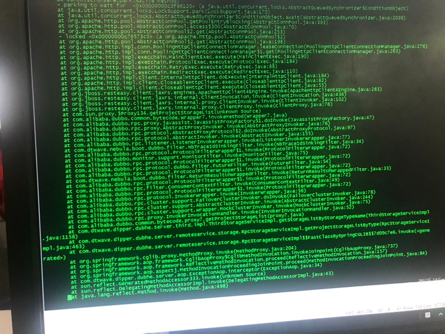

# 问题背景

最初的应用场景：

客户人群100+下面挂接了很多服务100+，双层循环，每次都会调用数据源详情（一次差不多300ms左右）接口

# 第一次排查

### 1.排查系统参数

查看ulimit -n

大小为10240。从这个参数结合大并发的请求量，可能会造成fd不够用的情况。

**netstat查看close_wait状态及计数**

```shell
netstat -tnp | grep 8671 | grep <status> | wc -l
netstat -tnp | grep 8701 | grep <status> | wc -l
```

batch-server有接近2w的计数；resource-server刚开始有2w左右，后面回落到1w+ close_wait。

**查看远端进程**

```shell
lsof -i:8701
lsof -i:8671
```

取连接resource-server（8671端口）前100个close_wait随机选择其中几个端口，通过lsof -i查看远程端口，发现服务未batch-server，且recv-Q有几百个待接收数据;

取连接batch-server（8701端口）前100个close_wait随机选择其中几个端口，通过lsof -i查看远程端口，
发现服务为resource-server，且recv-Q有几百个待接收数据;

**jstack异常线程栈**

jstack查看资源管理无异常，只有taskQueue.take的多个线程被阻塞，等待唤醒，说明tomcat本身已没有任何资源可以使用。

查看batch-server堆栈，有大量等待数据源详情的线程。



**查看tcp_keepalive_time**

```shell
cat /proc/sys/net/ipv4/tcp_keepalive_time
```

150s。从这里看tcp连接的清理时间也不算太长。

### 2.排查基础服务是否正常

排查project和uac基础服务未发现full gc和日志，未发现异常；netstat -ant | grep 3306 | grep CLOSE_WAIT未发现相关的mysql连接异常

### 初步结论

由于上万次的并发请求（数据源详情）导致两台资源管理的socket fd迅速打满加上每天的调度任务导致close_wait关闭的数量小于增加的数量。从而造成资源管理假死的状态。而且从两台资源管理的close_wait不均衡的情况来看更容易导致某一台服务先挂掉。

### 初步策略

1.从兴业银行的定制化开发中优化数据源详情接口调用次数。采用缓存一次获取。

2.修改bds用户fd大小，避免fd不够的情况

3.修改dubbo默认负载均衡策略random为leastactive，避免极端情况下的负载

```properties
dubbo.provider.loadbalance=leastactive
```

# 第二次排查

**重启了线上有问题的环境后**进行close_wait排查：

1.查询close_wait

查询两台服务器的close_wait无报错异常

2.查询线程占用率

top -H -p <pid>

资源管理和离线无明显消耗cpu任务

# 问题记录

Q1:测试环境压测导致频繁full gc

测试环境ab压测数据源详情接口，会导致资源管理不停full gc，查看jstat -gcutil内存占用，老年代100%，且full gc后没有得到有效释放，怀疑是内存泄漏，但是测试环境的堆转储文件无法导出，可以在开发环境复现。

Q2: 资源管理进程假死复现

假死复现思路：fd数量调整默认，大量压测数据源详情接口

# 策略及方案

## 应用层

针对数据源详情服务进行缓存。缓存可采用dubbo提供的方式或者自己实现相应的缓存机制。

## 框架层

dubbo服务限流、均衡策略

https://www.cnblogs.com/edda/p/13260260.html

dubbo运维：

https://dubbo.apache.org/zh/docs/v2.7/admin/ops/

# 命令行参考

## Fd查看

```shell
# 查看文件的打开数量
# 切换到指定执行用户查询，否则ulimit
$ ulimit -Hn
# 查看某进程fd limit
$ cat /proc/<pid>/limits
# 查看系统级别
$ sysctl -a | grep fs.file-max

# 查看已经打开的fd
$ lsof -n |awk '{print $2}'|sort|uniq -c |sort -nr|more

```

## 线程CPU占用率

```shell
# jstack
$ jstack -l <pid>
# 实时查看当前进行线程占用率，结合jtack查找线程堆栈
$ top -H -p <pid> 
```

## 网络异常排查

```shell
# 查看TCP连接：某服务端口的CLOSE_WAIT状态、队列堆积情况
$ netstat -tnp | grep <port> | grep <status> | wc -l
# 查看tcp_keep_alive
$ cat /proc/sys/net/ipv4/tcp_keepalive_time
 
```

