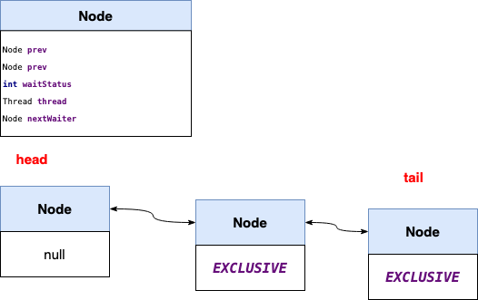

[toc]


# Java数据结构


### HashMap结构，什么对象能做key?

hashmap是数组+单链表/红黑树的形式，key可以为空

具体实现原理参考数据结构章节


### Unsafe用途？


参考文档：

https://www.jianshu.com/p/db8dce09232d


# 数据结构

### HashMap

hashmap是数组+单链表/红黑树的形式

map节点数据结构：

```java
static class Node<K,V> implements Map.Entry<K,V> {
    final int hash;
    final K key;
    V value;
    Node<K,V> next;
  Node(int hash, K key, V value, Node<K,V> next) {
    this.hash = hash;
    this.key = key;
    this.value = value;
    this.next = next;
  }
  ...
}  
  
```

红黑树节点数据结构

```java
static final class TreeNode<K,V> extends LinkedHashMap.Entry<K,V> {
    TreeNode<K,V> parent;  // red-black tree links
    TreeNode<K,V> left;
    TreeNode<K,V> right;
    TreeNode<K,V> prev;    // needed to unlink next upon deletion
    boolean red;
    TreeNode(int hash, K key, V val, Node<K,V> next) {
        super(hash, key, val, next);
    }
  ...
}    
```

#### put/putVal

```java
public V put(K key, V value) {
  
	return putVal(hash(key), key, value, false, true);
}

final V putVal(int hash, K key, V value, boolean onlyIfAbsent,
               boolean evict) {
    Node<K,V>[] tab;  // 当前map数组
  	Node<K,V> p; 			// 当前key所在的槽位
  	int n, i;
  	// map为空进行第一次拓容
    if ((tab = table) == null || (n = tab.length) == 0)
        n = (tab = resize()).length;
  	// 取模后如果为空则生成一个新的节点
    if ((p = tab[i = (n - 1) & hash]) == null)
        tab[i] = newNode(hash, key, value, null);
    else {
        Node<K,V> e; K k;
      	// 如果hash并且key相同则覆盖
        if (p.hash == hash &&
            ((k = p.key) == key || (key != null && key.equals(k))))
            e = p;
      	// 如果是红黑树则往树中插入子节点
        else if (p instanceof TreeNode)
            e = ((TreeNode<K,V>)p).putTreeVal(this, tab, hash, key, value);
        else {
          	// 当前hash槽小于7时进行链表操作，大于等于7时进行红黑树化
            for (int binCount = 0; ; ++binCount) {
                if ((e = p.next) == null) {
                    p.next = newNode(hash, key, value, null);
                  	// 槽位节点数大于等于7时进行红黑树化
                    if (binCount >= TREEIFY_THRESHOLD - 1) // -1 for 1st
                        treeifyBin(tab, hash);
                    break;
                }
                if (e.hash == hash &&
                    ((k = e.key) == key || (key != null && key.equals(k))))
                    break;
                p = e;
            }
        }
        if (e != null) { // existing mapping for key
            V oldValue = e.value;
            if (!onlyIfAbsent || oldValue == null)
                e.value = value;
            afterNodeAccess(e);
            return oldValue;
        }
    }
  	// 修改次数
    ++modCount;
    // 当map的大小大于指定阈值则进行拓容；map拓容以指数的形式拓展
    if (++size > threshold)
        resize();
    afterNodeInsertion(evict);
    return null;
}
```


#### resize

拓容分以下几种情况：

1.初始化拓容

2.node容量达到阈值需要拓容

```java
final Node<K,V>[] resize() {
    Node<K,V>[] oldTab = table;
    int oldCap = (oldTab == null) ? 0 : oldTab.length;
    int oldThr = threshold;
    int newCap, newThr = 0;
  	/*
  	 * a.如果老的数组大小大于0则进行2*oldCap指数拓容
  	 * b.否则存在oldThr大于0则新的数据大小设为oldThr
  	 * c.最后取初始化大小16，阈值为16*0.75
  	 *
  	**/
    if (oldCap > 0) {
        if (oldCap >= MAXIMUM_CAPACITY) {
            threshold = Integer.MAX_VALUE;
            return oldTab;
        }
        else if ((newCap = oldCap << 1) < MAXIMUM_CAPACITY &&
                 oldCap >= DEFAULT_INITIAL_CAPACITY)
            newThr = oldThr << 1; // double threshold
    }
    else if (oldThr > 0) // initial capacity was placed in threshold
        newCap = oldThr;
    else {               // zero initial threshold signifies using defaults
        newCap = DEFAULT_INITIAL_CAPACITY;
        newThr = (int)(DEFAULT_LOAD_FACTOR * DEFAULT_INITIAL_CAPACITY);
    }
  
    if (newThr == 0) {
        float ft = (float)newCap * loadFactor;
        newThr = (newCap < MAXIMUM_CAPACITY && ft < (float)MAXIMUM_CAPACITY ?
                  (int)ft : Integer.MAX_VALUE);
    }
    threshold = newThr;
    @SuppressWarnings({"rawtypes","unchecked"})
  	// 生成新的数组
    Node<K,V>[] newTab = (Node<K,V>[])new Node[newCap];
    table = newTab;
    if (oldTab != null) {
      	// 遍历老数组进行取新的数组大小进行重hash
        for (int j = 0; j < oldCap; ++j) {
            Node<K,V> e;
            if ((e = oldTab[j]) != null) {
                oldTab[j] = null;
                if (e.next == null)
                    newTab[e.hash & (newCap - 1)] = e;
                else if (e instanceof TreeNode)
                    ((TreeNode<K,V>)e).split(this, newTab, j, oldCap);
                else { // preserve order
                    Node<K,V> loHead = null, loTail = null;
                    Node<K,V> hiHead = null, hiTail = null;
                    Node<K,V> next;
                    do {
                        next = e.next;
                        if ((e.hash & oldCap) == 0) {
                            if (loTail == null)
                                loHead = e;
                            else
                                loTail.next = e;
                            loTail = e;
                        }
                        else {
                            if (hiTail == null)
                                hiHead = e;
                            else
                                hiTail.next = e;
                            hiTail = e;
                        }
                    } while ((e = next) != null);
                    if (loTail != null) {
                        loTail.next = null;
                        newTab[j] = loHead;
                    }
                    if (hiTail != null) {
                        hiTail.next = null;
                        newTab[j + oldCap] = hiHead;
                    }
                }
            }
        }
    }
    return newTab;
}
```

### ConcurrentHashMap


```java
final V putVal(K key, V value, boolean onlyIfAbsent) {
    if (key == null || value == null) throw new NullPointerException();
    int hash = spread(key.hashCode());
    int binCount = 0;
    for (Node<K,V>[] tab = table;;) {
        Node<K,V> f; int n, i, fh;
        if (tab == null || (n = tab.length) == 0)
            tab = initTable();
        else if ((f = tabAt(tab, i = (n - 1) & hash)) == null) {
            if (casTabAt(tab, i, null,
                         new Node<K,V>(hash, key, value, null)))
                break;                   // no lock when adding to empty bin
        }
        else if ((fh = f.hash) == MOVED)
            tab = helpTransfer(tab, f);
        else {
            V oldVal = null;
            synchronized (f) {
                if (tabAt(tab, i) == f) {
                    if (fh >= 0) {
                        binCount = 1;
                        for (Node<K,V> e = f;; ++binCount) {
                            K ek;
                            if (e.hash == hash &&
                                ((ek = e.key) == key ||
                                 (ek != null && key.equals(ek)))) {
                                oldVal = e.val;
                                if (!onlyIfAbsent)
                                    e.val = value;
                                break;
                            }
                            Node<K,V> pred = e;
                            if ((e = e.next) == null) {
                                pred.next = new Node<K,V>(hash, key,
                                                          value, null);
                                break;
                            }
                        }
                    }
                    else if (f instanceof TreeBin) {
                        Node<K,V> p;
                        binCount = 2;
                        if ((p = ((TreeBin<K,V>)f).putTreeVal(hash, key,
                                                       value)) != null) {
                            oldVal = p.val;
                            if (!onlyIfAbsent)
                                p.val = value;
                        }
                    }
                }
            }
            if (binCount != 0) {
                if (binCount >= TREEIFY_THRESHOLD)
                    treeifyBin(tab, i);
                if (oldVal != null)
                    return oldVal;
                break;
            }
        }
    }
    addCount(1L, binCount);
    return null;
}
```

# Java同步机制

## 概述

可以分为内置锁、显示锁（lock）、volatile及原子变量
同步的重点在于保证共享对象的内存可见性、对共享操作的原子性及有序性

## volatile

用来确保变量的更新操作及时通知到其他线程


## Synchronized

### 作用

实现并发场景下的内码块和方法同步。

可以修改函数（静态及实例方法）及代码块

### 原理


监视器锁的本质是通过监视器对象完成。

### 锁的类型和等级


| 锁类型 | 定义                                    | 使用                                                         |
| ------ | --------------------------------------- | ------------------------------------------------------------ |
| 对象锁 | 含synchronized方法/代码库的类的实例对象 |                                                              |
| 方法锁 | 使用synchronized修饰的方法              |                                                              |
| 类锁   | 类锁实际锁的是class对象                 | 一个静态方法被synchronized修饰。此类所有的实例化对象在调用此方法时，共用同一把锁 |


### 使用场景


### 参考


https://blog.csdn.net/carson_ho/article/details/82992269


## AQS


AQS锁是Java同步机制的基石，很多同步类都使用了AQS的同步机制。下面分几种应用场景来分析AQS的实现原理，AQS的实现场景可分为互斥锁、共享锁、条件锁三种情况


### 互斥机制

互斥锁的情况的场景，比如ReentrantLock，

实现这需要继承AbstractQueuedSynchronizer抽象类，并实现两个方法：tryAcquire和tryRelease。

accquire和release是实现互斥机制的主体逻辑，下面将逐个分析：

```java
    public final void acquire(int arg) {
        if (!tryAcquire(arg) &&
            acquireQueued(addWaiter(Node.EXCLUSIVE), arg))
            selfInterrupt();
    }

    public final boolean release(int arg) {
        if (tryRelease(arg)) {
            Node h = head;
            if (h != null && h.waitStatus != 0)
                unparkSuccessor(h);
            return true;
        }
        return false;
    }
```

#### acquire

```java
public final void acquire(int arg) {
  	// 获取state资源，
    if (!tryAcquire(arg) &&
        acquireQueued(addWaiter(Node.EXCLUSIVE), arg))
        selfInterrupt();
}
```
##### tryAcquire

```java
protected final boolean tryAcquire(int acquires) {
    final Thread current = Thread.currentThread();
    int c = getState();
    if (c == 0) {
        if (!hasQueuedPredecessors() &&
            compareAndSetState(0, acquires)) {
            setExclusiveOwnerThread(current);
            return true;
        }
    }
    else if (current == getExclusiveOwnerThread()) {
        int nextc = c + acquires;
        if (nextc < 0)
            throw new Error("Maximum lock count exceeded");
        setState(nextc);
        return true;
    }
    return false;
}
```


#### addWaiter





```java
private Node addWaiter(Node mode) {
    Node node = new Node(Thread.currentThread(), mode);
    // 首先会直接进行一次CAS操作，如果失败（考虑共享锁等情况），则进行enq的自旋操作
    Node pred = tail;
    if (pred != null) {
        node.prev = pred;
        if (compareAndSetTail(pred, node)) {
            pred.next = node;
            return node;
        }
    }
    enq(node);
    return node;
}
```

##### enq

将无法获取到锁的线程入队

```java
private Node enq(final Node node) {
    for (;;) {
        Node t = tail;
      	// 如果列表为空则初始化首节点，否则进行一次CAS操作，失败后重试
      	// 首节点的waitStatus=0
        if (t == null) { // Must initialize
            if (compareAndSetHead(new Node()))
                tail = head;
        } else {
            node.prev = t;
            if (compareAndSetTail(t, node)) {
                t.next = node;
                return t;
            }
        }
    }
}
```


#### release

```java
public final boolean release(int arg) {
  	// tryRelease的操作一般是进行state的设置
    if (tryRelease(arg)) {
      	// 从CLH队列的头部开始唤醒后继等待节点
        Node h = head;
        if (h != null && h.waitStatus != 0)
            unparkSuccessor(h);
        return true;
    }
    return false;
}
```


##### tryRelease

以ReentrantLock为例。这里有个疑问：state的操作是不是原子的？

A:是，因为在accquire的时候state是volatile的，而且是CAS操作的，再加上线程内部的多次调用必然是异步的过程所以不会出现state多加或者多减的现象。

```java
protected final boolean tryRelease(int releases) {
    int c = getState() - releases;
    // 只有当前线程才可以进行释放锁的操作
    if (Thread.currentThread() != getExclusiveOwnerThread())
        throw new IllegalMonitorStateException();
    boolean free = false;
  	// 如果为0则进行释放锁的操作，否则只是更新state的状态
    if (c == 0) {
        free = true;
        setExclusiveOwnerThread(null);
    }
    setState(c);
    return free;
}
```

##### unparkSuccessor

唤醒后续节点

```java
private void unparkSuccessor(Node node) {
    /*
     * If status is negative (i.e., possibly needing signal) try
     * to clear in anticipation of signalling.  It is OK if this
     * fails or if status is changed by waiting thread.
     */
    int ws = node.waitStatus;
    if (ws < 0)
        compareAndSetWaitStatus(node, ws, 0);

    /*
     * Thread to unpark is held in successor, which is normally
     * just the next node.  But if cancelled or apparently null,
     * traverse backwards from tail to find the actual
     * non-cancelled successor.
     */
  	// 注意这里用next的原因是因为CLH队列在初始化的时候设置队列头部为空节点
    // 如果第一个等待节点被取消掉，那么从尾部进行遍历查找到最前的第一个有效节点
    Node s = node.next;
    if (s == null || s.waitStatus > 0) {
        s = null;
        for (Node t = tail; t != null && t != node; t = t.prev)
            if (t.waitStatus <= 0)
                s = t;
    }
    if (s != null)
        LockSupport.unpark(s.thread);
}
```


### 共享机制

AQS的共享锁机制主要由两个接口实现，继承者需要适量两个抽象接口:tryAcquireShared和tryReleaseShared


```java
public final void acquireShared(int arg) {
    if (tryAcquireShared(arg) < 0)
        doAcquireShared(arg);
}

public final boolean releaseShared(int arg) {
    if (tryReleaseShared(arg)) {
        doReleaseShared();
        return true;
    }
    return false;
}
```


##### 读写锁

以读写锁为例分析

读写锁巧妙设计了state，高16bit用于读锁，低16bit用于写锁。


##### tryAcquireShared

```java
protected final int tryAcquireShared(int unused) {
    /*
     * Walkthrough:
     * 1. If write lock held by another thread, fail.
     * 2. Otherwise, this thread is eligible for
     *    lock wrt state, so ask if it should block
     *    because of queue policy. If not, try
     *    to grant by CASing state and updating count.
     *    Note that step does not check for reentrant
     *    acquires, which is postponed to full version
     *    to avoid having to check hold count in
     *    the more typical non-reentrant case.
     * 3. If step 2 fails either because thread
     *    apparently not eligible or CAS fails or count
     *    saturated, chain to version with full retry loop.
     */
    Thread current = Thread.currentThread();
    int c = getState();
  	// 如果有写锁或者不是独占线程不是当前线程则返回-1
    if (exclusiveCount(c) != 0 &&
        getExclusiveOwnerThread() != current)
        return -1;
    int r = sharedCount(c);
    if (!readerShouldBlock() &&
        r < MAX_COUNT &&
        compareAndSetState(c, c + SHARED_UNIT)) {
        if (r == 0) {
            firstReader = current;
            firstReaderHoldCount = 1;
        } else if (firstReader == current) {
            firstReaderHoldCount++;
        } else {
            HoldCounter rh = cachedHoldCounter;
            if (rh == null || rh.tid != getThreadId(current))
                cachedHoldCounter = rh = readHolds.get();
            else if (rh.count == 0)
                readHolds.set(rh);
            rh.count++;
        }
        return 1;
    }
    return fullTryAcquireShared(current);
}
```

##### doAcquireShared

这里是获取不到锁，进行入队的流程。

```java
private void doAcquireShared(int arg) {
  	// 注意：与互斥锁不同的是这里node的nextWaiter字段为SHARED
    final Node node = addWaiter(Node.SHARED);
    boolean failed = true;
    try {
        boolean interrupted = false;
        for (;;) {
            final Node p = node.predecessor();
          	// 第一次或者被unpark之后检查前置节点是否为head
            if (p == head) {
              	// 如果获取到锁，则r>=0，否则进行park操作
                // 读写锁返回1表示需要广播
                int r = tryAcquireShared(arg);
                if (r >= 0) {
                  	// 注意这里也会通知互斥节点，但是互斥节点拿不到锁会继续加入队列
                    setHeadAndPropagate(node, r);
                    p.next = null; // help GC
                    if (interrupted)
                        selfInterrupt();
                    failed = false;
                    return;
                }
            }
          	// 设置前驱节点状态为signal，成功后Park否则自旋操作
            if (shouldParkAfterFailedAcquire(p, node) &&
                parkAndCheckInterrupt())
                interrupted = true;
        }
    } finally {
        if (failed)
            cancelAcquire(node);
    }
}
```


###### shouldParkAfterFailedAcquire

检查前驱节点的节点状态，如果不是signal置为signal

```java
private static boolean shouldParkAfterFailedAcquire(Node pred, Node node) {
    int ws = pred.waitStatus;
    if (ws == Node.SIGNAL)
        /*
         * This node has already set status asking a release
         * to signal it, so it can safely park.
         */
        return true;
    if (ws > 0) {
        /*
         * Predecessor was cancelled. Skip over predecessors and
         * indicate retry.
         */
        do {
            node.prev = pred = pred.prev;
        } while (pred.waitStatus > 0);
        pred.next = node;
    } else {
        /*
         * waitStatus must be 0 or PROPAGATE.  Indicate that we
         * need a signal, but don't park yet.  Caller will need to
         * retry to make sure it cannot acquire before parking.
         */
        compareAndSetWaitStatus(pred, ws, Node.SIGNAL);
    }
    return false;
}
```

setHeadAndPropagate

```java
private void setHeadAndPropagate(Node node, int propagate) {
    Node h = head; // Record old head for check below
    setHead(node);
    /*
     * Try to signal next queued node if:
     *   Propagation was indicated by caller,
     *     or was recorded (as h.waitStatus either before
     *     or after setHead) by a previous operation
     *     (note: this uses sign-check of waitStatus because
     *      PROPAGATE status may transition to SIGNAL.)
     * and
     *   The next node is waiting in shared mode,
     *     or we don't know, because it appears null
     *
     * The conservatism in both of these checks may cause
     * unnecessary wake-ups, but only when there are multiple
     * racing acquires/releases, so most need signals now or soon
     * anyway.
     */
    if (propagate > 0 || h == null || h.waitStatus < 0 ||
        (h = head) == null || h.waitStatus < 0) {
        Node s = node.next;
        // 这里判断s是否是共享的node节点，区分互斥节点
        if (s == null || s.isShared())
            doReleaseShared();
    }
}
```


### 互质机制


### 公平与非公平


