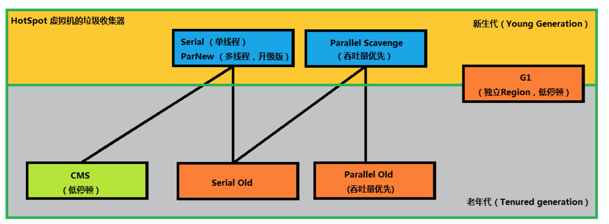
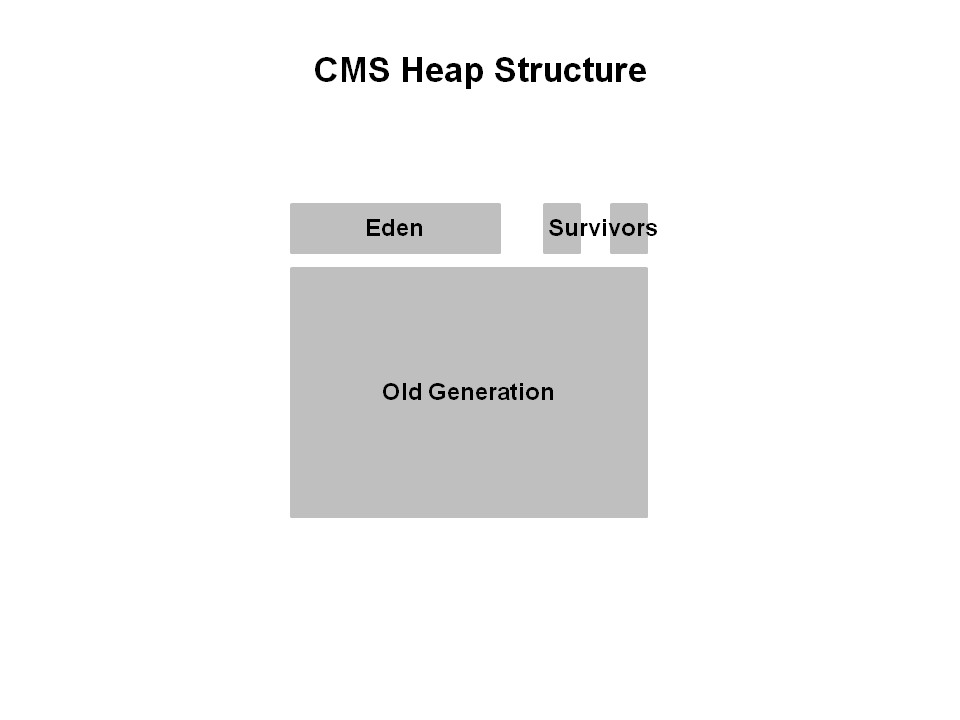
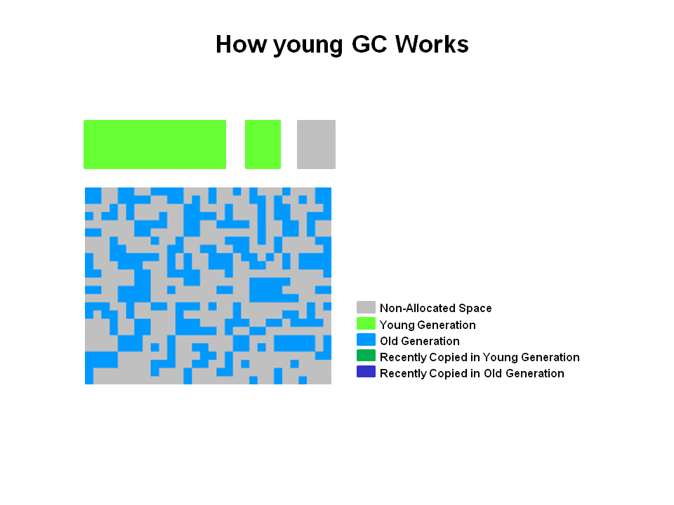
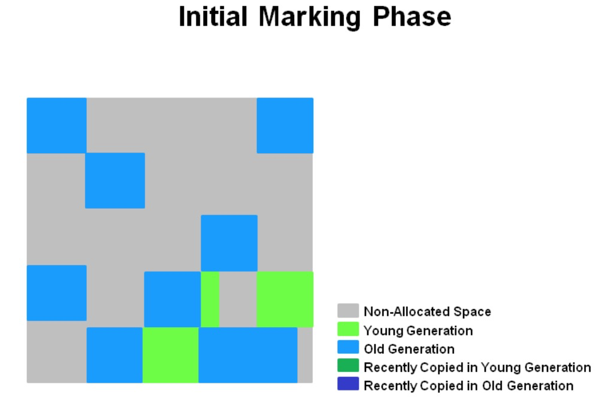
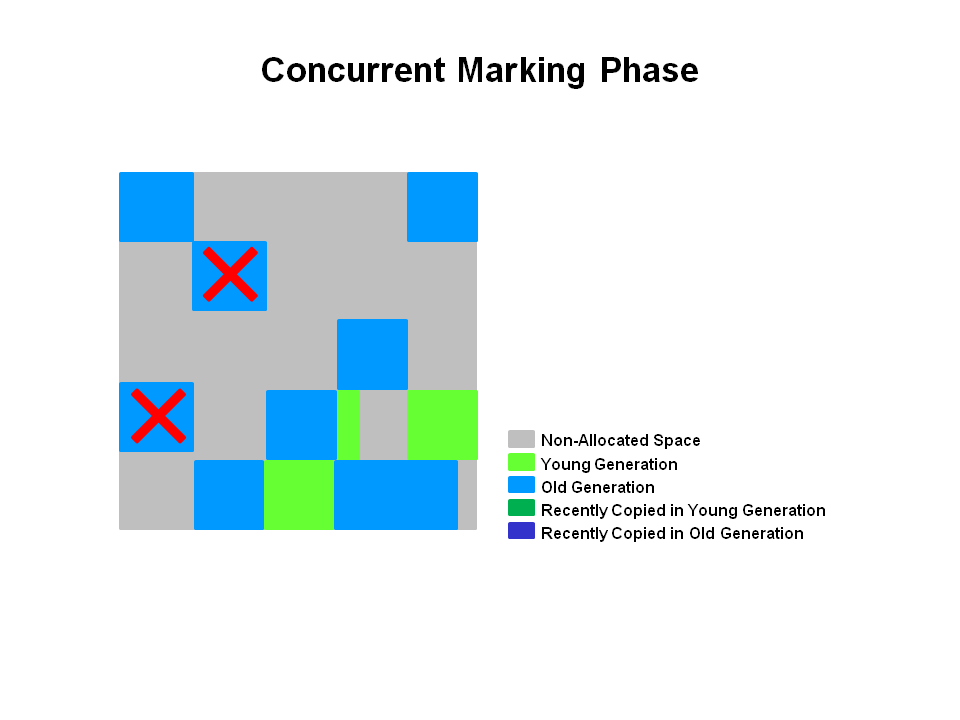
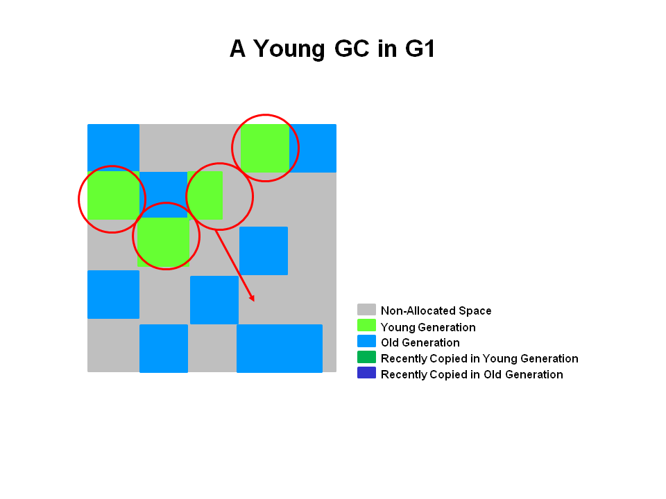

[TOC]

# JVM调优


jvm调优主要关注响应时间和吞吐量两个方便。


- 响应时间

Responsiveness refers to how quickly an application or system responds with a requested piece of data. Examples include:

  ```
  - How quickly a desktop UI responds to an event
  - How fast a website returns a page
  - How fast a database query is returned
  ```

  

- 吞吐量

吞吐量关注的是应用程序一段时间内完成的最大工作量，比如：

	1.给定时间内完成事务的数量
	2.一个小时内批处理程序完成的作业数
	3.一个小时内数据完成的查询数量

jvm调优的关键组件


# Java内存区域


## 概述


jdk8之后的内存区域划分为如下所示。其中栈和程序计数器是线程私有的，其他则为共享内存区域。


## 虚拟机栈

虚拟机栈记录的是线程的现场信息，只不过这部分现场信息是java的。现场保存的是线程执行栈的**栈帧**，每一个方法对应一个栈帧，每个栈帧记录了局部变量表、操作数栈、动态链接和返回地址等信息。

- 局部变量表

保存了方法体内的局部变量的值，这部分是线程安全的。

- 返回地址

当被调用的方法返回后，从栈帧中的返回地址指示虚拟机从哪里继续执行代码。

## 本地方法栈

类似虚拟机栈。不过是native方法的部分的描述。

## 程序计数器

这个计数器可以理解为指针，在内存中记录了当前线程执行字节码的位置；在线程被唤醒后恢复继续执行工作。

## 堆

**堆是垃圾收集器管理的内存区域。**这部分使我们java程序员关注的重点部分，因为我们要定位一些内存问题并对此进行调优。

堆的划分，要根据JVM选择的收集器来决定如何划分。所以这部分的划分可以留到收集器部分来具体说明。


## 方法区

在JDK1.8之前，hotspot虚拟机设计团队把方法区设计为永久代的一部分，便于统一进行内存管理。1.8之后方法区的由直接内存进行管理，方法区用于存储被虚拟机加载的类型信息、常量、静态变量、即时编译器编译后的代码缓存等数据。

### 运行时常量池

存放编译器生成的各种字母变量和符号引用。注意这里和文件常量的区别，其本省具有动态性，比如String.intern()  


## 直接内存

可以使用DirectByteBuffer等类进行直接内存的分配，如果直接内存使用不当，也会出现内存溢出的情况。


## 对象是如何在内存中分配的（todo）


1. 检测类有没有被加载到内存中，如果没有则加载

2. 分配内存。由于类加载后虚拟机便能确定对象需要的内存大小，这里有两种内存分配方式：

   a.指针碰撞

   b.空闲列表(CMS)

   分配内存会出现竞争问题，一种是采用同步机制，一种采用TLAB的方式；TLAB可以通过-XX:+/-UseTLAB参数设定

3. 初始化内存空间的数据区为0。这里就会涉及到一个问题，比如我们设计一个业务bean对象的字段，是使用Integer好还是int好，如果是Integer那么字段值为null，如果Int因为对象的初始化机制都会设为0，有些情况下会出现歧义。

4. **对象头**的初始化

5. 执行构造函数。初始化对象的字段等信息

## 参考文档


https://www.cnblogs.com/czwbig/p/11127124.html


# 收集器

### GC root

1. 虚拟机栈(栈桢中的本地变量表)中的引用的对象 ；
2. 方法区中的类静态属性引用的对象 ；
3. 方法区中的常量引用的对象 ；
4. 本地方法栈中JNI的引用的对象；

### 概述

几种常见回收器，红色表示标记整理算法；蓝色表示复制-整理，绿色表示标记清除




| **收集器**            | **串行、并行or**并发 | **新生代/**老年代 | **算法**           | **目标**     | **适用场景**                              |
| --------------------- | -------------------- | ----------------- | ------------------ | ------------ | ----------------------------------------- |
| **Serial**            | 串行                 | 新生代            | 复制算法           | 响应速度优先 | 单CPU环境下的Client模式                   |
| **Serial Old**        | 串行                 | 老年代            | 标记-整理          | 响应速度优先 | 单CPU环境下的Client模式、CMS的后备预案    |
| **ParNew**            | 并行                 | 新生代            | 复制算法           | 响应速度优先 | 多CPU环境时在Server模式下与CMS配合        |
| **Parallel Scavenge** | 并行                 | 新生代            | 复制算法           | 吞吐量优先   | 在后台运算而不需要太多交互的任务          |
| **Parallel Old**      | 并行                 | 老年代            | 标记-整理          | 吞吐量优先   | 在后台运算而不需要太多交互的任务          |
| **CMS**               | 并发                 | 老年代            | 标记-清除          | 响应速度优先 | 集中在互联网站或B/S系统服务端上的Java应用 |
| **G1**                | 并发                 | both              | 标记-整理+复制算法 | 响应速度优先 | 面向服务端应用，将来替换CMS               |

 																							

引自：https://blog.csdn.net/CrankZ/article/details/86009279

### CMS


#### 介绍

cms收集器内存被分为三块：




#### 收集算法

##### Young GC回收流程


young gc的回收流程是年轻代的收集算法而定，基本使用复制算法。

The young generation is colored light green and the old generation in blue. This is what the CMS might look like if your application has been running for a while. Objects are scattered around the old generation area.

With CMS, old generation objects are deallocated in place. They are not moved around. The space is not compacted unless there is a full GC.



Live objects are copied from the Eden space and survivor space to the other survivor space. Any older objects that have reached their aging threshold are promoted to old generation.


After a young GC, the Eden space is cleared and one of the survivor spaces is cleared.


##### 老年代回收流程

CMS Major gc会有两次stop the world行为：初始化标记和重标记。

| Phase                                     | Description                                                  |
| ----------------------------------------- | ------------------------------------------------------------ |
| (1) Initial Mark *(Stop the World Event)* | Objects in old generation are “marked” as reachable including those objects which may be reachable from young generation. Pause times are typically short in duration relative to minor collection pause times. |
| (2) Concurrent Marking                    | Traverse the tenured generation object graph for reachable objects concurrently while Java application threads are executing. Starts scanning from marked objects and transitively marks all objects reachable from the roots. The mutators are executing during the concurrent phases 2, 3, and 5 and any objects allocated in the CMS generation during these phases (including promoted objects) are immediately marked as live. |
| (3) Remark *(Stop the World Event)*       | Finds objects that were missed by the concurrent mark phase due to updates by Java application threads to objects after the concurrent collector had finished tracing that object. |
| (4) Concurrent Sweep                      | Collects the objects identified as unreachable during marking phases. The collection of a dead object adds the space for the object to a free list for later allocation. Coalescing of dead objects may occur at this point. Note that live objects are not moved. |
| (5) Resetting                             | Prepare for next concurrent collection by clearing data structures. |


#### 使用场景


#### 常见参数


### G1


#### 介绍

G1收集器是服务端的收集器算法，目的在于


G1之前的回收器（）的内存模型如下所示：


G1收集器的算法内存模型如下：G1可分为eden、survivor、old


The heap is partitioned into a set of **equal-sized** heap regions, each a contiguous range of virtual memory. Certain region sets are assigned the same roles (eden, survivor, old) as in the older collectors, **but there is not a fixed size for them**. This provides greater flexibility in memory usage.

#### 与CMS的区别

G1是用来替换CMS收集器的，主要有两点不同：

1.采用**区域**区分内存区域。可以动态计算区域大小，能够有效避免内存碎片问题

2.可以由用户自定义gc的停顿时间

#### 收集算法


##### 老年代gc

| Phase                                               | Description                                                  |
| --------------------------------------------------- | ------------------------------------------------------------ |
| (1) Initial Mark *(Stop the World Event)*           | This is a stop the world event. With G1, it is piggybacked on **a normal young GC**. Mark survivor regions (root regions) which may have references to objects in old generation.<br/>初始化标记至少伴随一次yong gc；标记被老年代引用的区域（即根区域） |
| (2) Root Region Scanning                            | Scan survivor regions for references into the old generation. This happens while the application continues to run. The phase must be completed before a young GC can occur. |
| (3) Concurrent Marking                              | Find live objects over the entire heap. This happens while the application is running. This phase can be interrupted by young generation garbage collections.<br>在整个堆空间中找出存活的对象。如果有空闲区域则直接回收。 |
| (4) Remark *(Stop the World Event)*                 | Completes the marking of live object in the heap. Uses an algorithm called snapshot-at-the-beginning (SATB) which is much faster than what was used in the CMS collector.<br> |
| (5) Cleanup *(Stop the World Event and Concurrent)* | Performs accounting on live objects and completely free regions. (Stop the world)Scrubs the Remembered Sets. (Stop the world)Reset the empty regions and return them to the free list. (Concurrent) |
| (*) Copying *(Stop the World Event)*                | These are the stop the world pauses to evacuate or copy live objects to new unused regions. This can be done with young generation regions which are logged as `[GC pause (young)]`. Or both young and old generation regions which are logged as `[GC Pause (mixed)]`. |

###### 初始化标记

初始化标记阶段会伴随一次yong gc，在gc日志中打印“GC pause (young)(inital-mark)”信息。



###### 2.并发标记

如果空闲区域被发现，图中**X**表示，则区域将会在重标记阶段被移除和回收。




###### 3.重标记

计算存活区域年龄，移除并回收空区域。

Uses the Snapshot-at-the-Beginning (SATB) algorithm which is much faster then what was used with CMS


###### 4.拷贝清除阶段

此阶段会选择优先级最低的对象进行回收，可以同时发生yong gc和old gc。在gc日志显示为`[GC pause (mixed)]`.


##### 年轻代gc

初始化标记（会发生STW）的阶段，eden和survivor大小会被重新计算并在下一次yong gc时使用。存活的区域会被拷贝到一个或者多个幸存者区域中去，或者达到年龄阈值后晋升为老年代。统计信息和中断时间都会影响新生代大小。



#### 使用场景


#### 常见参数


This is the complete list of G1 GC switches. Remember to use the best practices outlined above.

| Option and Default Value             | Description                                                  |
| ------------------------------------ | ------------------------------------------------------------ |
| -XX:+UseG1GC                         | Use the Garbage First (G1) Collector                         |
| -XX:MaxGCPauseMillis=n               | Sets a target for the maximum GC pause time. This is a soft goal, and the JVM will make its best effort to achieve it. |
| -XX:InitiatingHeapOccupancyPercent=n | Percentage of the (entire) heap occupancy to start a concurrent GC cycle. It is used by GCs that trigger a concurrent GC cycle based on the occupancy of the entire heap, not just one of the generations (e.g., G1). A value of 0 denotes 'do constant GC cycles'. The default value is 45. |
| -XX:NewRatio=n                       | Ratio of new/old generation sizes. The default value is 2.   |
| -XX:SurvivorRatio=n                  | Ratio of eden/survivor space size. The default value is 8.   |
| -XX:MaxTenuringThreshold=n           | Maximum value for tenuring threshold. The default value is 15. |
| -XX:ParallelGCThreads=n              | Sets the number of threads used during parallel phases of the garbage collectors. The default value varies with the platform on which the JVM is running. |
| -XX:ConcGCThreads=n                  | Number of threads concurrent garbage collectors will use. The default value varies with the platform on which the JVM is running. |
| -XX:G1ReservePercent=n               | Sets the amount of heap that is reserved as a false ceiling to reduce the possibility of promotion failure. The default value is 10. |
| -XX:G1HeapRegionSize=n               | With G1 the Java heap is subdivided into uniformly sized regions. This sets the size of the individual sub-divisions. The default value of this parameter is determined ergonomically based upon heap size. The minimum value is 1Mb and the maximum value is 32Mb. |


#### 参考文档

https://www.oracle.com/technetwork/tutorials/tutorials-1876574.html


# 常见问题定位


常见命令行：


```shell
# 存活对象排行榜
$ jmap -histo:live 4762 | head -20
# 对象转储文件
$ jmap -dump:format=b,file=476220190829.bin 4762

```


## CPU飙升


Jstack -l pid

 

查看堆栈信息，此堆栈信息中会有线程id,16进制

 

根据top -H -p pid查看各个线程cpu时间占比，接着查看占用线程cpu时间高的线程堆栈信息，查看线程状态，堆栈日志可参看：

 

https://www.cnblogs.com/kabi/p/5169383.html

 

gc评率太高结合jps -v查看jvm的内存回收机制。如果内存确实满了，那么可以查看是哪些对象占用了大量的内存导致gc频繁？可以通过jmap -histo pid查看哪些java对象占用了较大内存？

 

Iftop

 

ipstat

## 内存溢出及泄露

定位文档：

https://blog.csdn.net/cn_honor/article/details/100143214