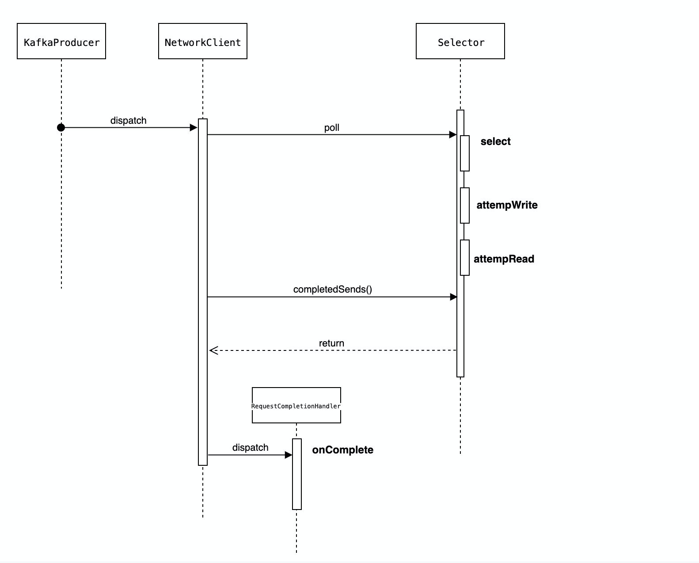

## 生产者启动流程


## 生产者IO流程图



## 网络收发流程


### 网络收发包整体流程


此章节从Kafka的网络模型、网络的连接等整体流程进行源码的解析。

#### Selector

org.apache.kafka.common.network.Selector

Selector是网络模型，包括**客户端、服务端**用的主流网络模型。Kafka对原生的kafka selector进行了封装。注意这里并没有使用netty模型。

```java
public Selector(int maxReceiveSize,
        long connectionMaxIdleMs,
        int failedAuthenticationDelayMs,
        Metrics metrics,
        Time time,
        String metricGrpPrefix,
        Map<String, String> metricTags,
        boolean metricsPerConnection,
        boolean recordTimePerConnection,
        ChannelBuilder channelBuilder,
        MemoryPool memoryPool,
        LogContext logContext) {
    try {
      	// 获取nio selector实现
        this.nioSelector = java.nio.channels.Selector.open();
    } catch (IOException e) {
        throw new KafkaException(e);
    }
  	// 能接受的报文大小，默认是没有限制的。
    this.maxReceiveSize = maxReceiveSize;
  	// kafka的时间工具
    this.time = time;
  	// kafka的客户端channel，nodeId->KafkaChannel
    this.channels = new HashMap<>();
    this.explicitlyMutedChannels = new HashSet<>();
    this.outOfMemory = false;
  	// 已经完成的发送消息和接收完毕的消息，便于后续处理
    this.completedSends = new ArrayList<>();
    this.completedReceives = new LinkedHashMap<>();
    this.immediatelyConnectedKeys = new HashSet<>();
    this.closingChannels = new HashMap<>();
    this.keysWithBufferedRead = new HashSet<>();
  	// 已经建立连接的nodeId,指的是broker的id
    this.connected = new ArrayList<>();
    this.disconnected = new HashMap<>();
  	// 通道关闭后发送失败的目的节点列表
    this.failedSends = new ArrayList<>();
    this.log = logContext.logger(Selector.class);
    this.sensors = new SelectorMetrics(metrics, metricGrpPrefix, metricTags, metricsPerConnection);
  	// KafkaChanne的构建工具
    this.channelBuilder = channelBuilder;
    this.recordTimePerConnection = recordTimePerConnection;
  	// 对于空闲连接的管理器，selector会在Poll是定时处理失效连接，超过指定时间connectionMaxIdleMs会关闭此连接
  	// 对于空闲连接的处理使用了LinkedHashmap的lru实现。
    this.idleExpiryManager = connectionMaxIdleMs < 0 ? null : new IdleExpiryManager(time, connectionMaxIdleMs);
    this.memoryPool = memoryPool;
    this.lowMemThreshold = (long) (0.1 * this.memoryPool.size());
    this.failedAuthenticationDelayMs = failedAuthenticationDelayMs;
    this.delayedClosingChannels = (failedAuthenticationDelayMs > NO_FAILED_AUTHENTICATION_DELAY) ? new LinkedHashMap<String, DelayedAuthenticationFailureClose>() : null;
}
```


##### poll

poll是网络io的主流程，包括连接的处理、数据的读写流程。

```java
public void poll(long timeout) throws IOException {
    if (timeout < 0)
        throw new IllegalArgumentException("timeout should be >= 0");

    boolean madeReadProgressLastCall = madeReadProgressLastPoll;
    clear();

    boolean dataInBuffers = !keysWithBufferedRead.isEmpty();
		// 对于某些特定的连接，不设置select超时时间
    if (!immediatelyConnectedKeys.isEmpty() || (madeReadProgressLastCall && dataInBuffers))
        timeout = 0;
		// 处理之前由于内存不足导致饱和状态的channel，将其设置为未饱和状态
    if (!memoryPool.isOutOfMemory() && outOfMemory) {
        //we have recovered from memory pressure. unmute any channel not explicitly muted for other reasons
        log.trace("Broker no longer low on memory - unmuting incoming sockets");
        for (KafkaChannel channel : channels.values()) {
            if (channel.isInMutableState() && !explicitlyMutedChannels.contains(channel)) {
                channel.maybeUnmute();
            }
        }
        outOfMemory = false;
    }

    /* check ready keys */
  	/* 调用原生的select并将其记录到传感器中 */
    long startSelect = time.nanoseconds();
    int numReadyKeys = select(timeout);
    long endSelect = time.nanoseconds();
    this.sensors.selectTime.record(endSelect - startSelect, time.milliseconds());

  	/* 处理已经ready的网络事件 */
    if (numReadyKeys > 0 || !immediatelyConnectedKeys.isEmpty() || dataInBuffers) {
      	// 获取所有的select keys
        Set<SelectionKey> readyKeys = this.nioSelector.selectedKeys();

        // Poll from channels that have buffered data (but nothing more from the underlying socket)
        if (dataInBuffers) {
            keysWithBufferedRead.removeAll(readyKeys); //so no channel gets polled twice
            Set<SelectionKey> toPoll = keysWithBufferedRead;
            keysWithBufferedRead = new HashSet<>(); //poll() calls will repopulate if needed
            pollSelectionKeys(toPoll, false, endSelect);
        }

        // Poll from channels where the underlying socket has more data
        pollSelectionKeys(readyKeys, false, endSelect);
        // Clear all selected keys so that they are included in the ready count for the next select
        readyKeys.clear();

        pollSelectionKeys(immediatelyConnectedKeys, true, endSelect);
        immediatelyConnectedKeys.clear();
    } else {
        madeReadProgressLastPoll = true; //no work is also "progress"
    }

    long endIo = time.nanoseconds();
    this.sensors.ioTime.record(endIo - endSelect, time.milliseconds());

    // Close channels that were delayed and are now ready to be closed
    completeDelayedChannelClose(endIo);

    // we use the time at the end of select to ensure that we don't close any connections that
    // have just been processed in pollSelectionKeys
  	// 处理过期的连接-超出了空闲时间的连接
    maybeCloseOldestConnection(endSelect);
}
```


##### pollSelectionKeys

```java
void pollSelectionKeys(Set<SelectionKey> selectionKeys,
                       boolean isImmediatelyConnected,
                       long currentTimeNanos) {
    for (SelectionKey key : determineHandlingOrder(selectionKeys)) {
      	// kafkaChannel在Key的attachment中
        KafkaChannel channel = channel(key);
        long channelStartTimeNanos = recordTimePerConnection ? time.nanoseconds() : 0;
        boolean sendFailed = false;
        String nodeId = channel.id();

        // register all per-connection metrics at once
        sensors.maybeRegisterConnectionMetrics(nodeId);
      	// 更新对端节点的失效时间：凡是有key事件的channel说明其在使用中
        if (idleExpiryManager != null)
            idleExpiryManager.update(nodeId, currentTimeNanos);

        try {
            /* complete any connections that have finished their handshake (either normally or immediately) */
          	// channel是否处于可连接住在状态，如果已经完成了连接需要注册读事件到selector中
            if (isImmediatelyConnected || key.isConnectable()) {
              	// 如果已经完成了连接需要注册读事件到selector中，并更新kafkaChannel的状态
                if (channel.finishConnect()) {
                    this.connected.add(nodeId);
                    this.sensors.connectionCreated.record();

                    SocketChannel socketChannel = (SocketChannel) key.channel();
                    log.debug("Created socket with SO_RCVBUF = {}, SO_SNDBUF = {}, SO_TIMEOUT = {} to node {}",
                            socketChannel.socket().getReceiveBufferSize(),
                            socketChannel.socket().getSendBufferSize(),
                            socketChannel.socket().getSoTimeout(),
                            nodeId);
                } else {
                    continue;
                }
            }

            /* if channel is not ready finish prepare */
            if (channel.isConnected() && !channel.ready()) {
                channel.prepare();
                if (channel.ready()) {
                    long readyTimeMs = time.milliseconds();
                    boolean isReauthentication = channel.successfulAuthentications() > 1;
                    if (isReauthentication) {
                        sensors.successfulReauthentication.record(1.0, readyTimeMs);
                        if (channel.reauthenticationLatencyMs() == null)
                            log.warn(
                                "Should never happen: re-authentication latency for a re-authenticated channel was null; continuing...");
                        else
                            sensors.reauthenticationLatency
                                .record(channel.reauthenticationLatencyMs().doubleValue(), readyTimeMs);
                    } else {
                        sensors.successfulAuthentication.record(1.0, readyTimeMs);
                        if (!channel.connectedClientSupportsReauthentication())
                            sensors.successfulAuthenticationNoReauth.record(1.0, readyTimeMs);
                    }
                    log.debug("Successfully {}authenticated with {}", isReauthentication ?
                        "re-" : "", channel.socketDescription());
                }
            }
          
            if (channel.ready() && channel.state() == ChannelState.NOT_CONNECTED)
                channel.state(ChannelState.READY);
            Optional<NetworkReceive> responseReceivedDuringReauthentication = channel.pollResponseReceivedDuringReauthentication();
            responseReceivedDuringReauthentication.ifPresent(receive -> {
                long currentTimeMs = time.milliseconds();
                addToCompletedReceives(channel, receive, currentTimeMs);
            });

            //if channel is ready and has bytes to read from socket or buffer, and has no
            //previous completed receive then read from it
          	// 核心流程：处理读请求
            if (channel.ready() && (key.isReadable() || channel.hasBytesBuffered()) && !hasCompletedReceive(channel)
                    && !explicitlyMutedChannels.contains(channel)) {
                attemptRead(channel);
            }

            if (channel.hasBytesBuffered()) {
                //this channel has bytes enqueued in intermediary buffers that we could not read
                //(possibly because no memory). it may be the case that the underlying socket will
                //not come up in the next poll() and so we need to remember this channel for the
                //next poll call otherwise data may be stuck in said buffers forever. If we attempt
                //to process buffered data and no progress is made, the channel buffered status is
                //cleared to avoid the overhead of checking every time.
                keysWithBufferedRead.add(key);
            }

            /* if channel is ready write to any sockets that have space in their buffer and for which we have data */

          	// 核心流程：处理写请求
            long nowNanos = channelStartTimeNanos != 0 ? channelStartTimeNanos : currentTimeNanos;
            try {
                attemptWrite(key, channel, nowNanos);
            } catch (Exception e) {
                sendFailed = true;
                throw e;
            }

            /* cancel any defunct sockets */
            if (!key.isValid())
                close(channel, CloseMode.GRACEFUL);

        } catch (Exception e) {
            String desc = channel.socketDescription();
            if (e instanceof IOException) {
                log.debug("Connection with {} disconnected", desc, e);
            } else if (e instanceof AuthenticationException) {
                boolean isReauthentication = channel.successfulAuthentications() > 0;
                if (isReauthentication)
                    sensors.failedReauthentication.record();
                else
                    sensors.failedAuthentication.record();
                String exceptionMessage = e.getMessage();
                if (e instanceof DelayedResponseAuthenticationException)
                    exceptionMessage = e.getCause().getMessage();
                log.info("Failed {}authentication with {} ({})", isReauthentication ? "re-" : "",
                    desc, exceptionMessage);
            } else {
                log.warn("Unexpected error from {}; closing connection", desc, e);
            }

            if (e instanceof DelayedResponseAuthenticationException)
                maybeDelayCloseOnAuthenticationFailure(channel);
            else
                close(channel, sendFailed ? CloseMode.NOTIFY_ONLY : CloseMode.GRACEFUL);
        } finally {
            maybeRecordTimePerConnection(channel, channelStartTimeNanos);
        }
    }
}
```


#### 报文处理

前面的selector流程讲解了报文如何在底层接收、发送的；而对于报文发送、接收后的处理在kafka的客户端和服务端的处理流程是不一样的。

客户端的处理实现在NetworkClient的poll流程中，server端在SocketServer的run流程中

##### 客户端

org.apache.kafka.clients.NetworkClient#poll

```java
public List<ClientResponse> poll(long timeout, long now) {
    ensureActive();

    if (!abortedSends.isEmpty()) {
        // If there are aborted sends because of unsupported version exceptions or disconnects,
        // handle them immediately without waiting for Selector#poll.
        List<ClientResponse> responses = new ArrayList<>();
        handleAbortedSends(responses);
        completeResponses(responses);
        return responses;
    }

    long metadataTimeout = metadataUpdater.maybeUpdate(now);
    try {
        this.selector.poll(Utils.min(timeout, metadataTimeout, defaultRequestTimeoutMs));
    } catch (IOException e) {
        log.error("Unexpected error during I/O", e);
    }

    // process completed actions
    long updatedNow = this.time.milliseconds();
    List<ClientResponse> responses = new ArrayList<>();
  	// 处理完成的发送请求
    handleCompletedSends(responses, updatedNow);
  	// 处理完成的接收请求
    handleCompletedReceives(responses, updatedNow);
    handleDisconnections(responses, updatedNow);
    handleConnections();
    handleInitiateApiVersionRequests(updatedNow);
    handleTimedOutRequests(responses, updatedNow);
    completeResponses(responses);

    return responses;
}
```


处理接收完的消息

```java
private void handleCompletedReceives(List<ClientResponse> responses, long now) {
    for (NetworkReceive receive : this.selector.completedReceives()) {
        String source = receive.source();
      	// inFlightRequest记录了当前发送的请求的元数据信息：包括消息的版本、请求结构、返回结构等及回调处理。
      	// 具体见InFlightRequest的讲解
      	// 目的是为了能将消息回应者返回的数据正确反序列化
        InFlightRequest req = inFlightRequests.completeNext(source);
      	// 反序列化返回数据，这里用到的关键元数据是ApiKeys
        Struct responseStruct = parseStructMaybeUpdateThrottleTimeMetrics(receive.payload(), req.header,
            throttleTimeSensor, now);
        if (log.isTraceEnabled()) {
            log.trace("Completed receive from node {} for {} with correlation id {}, received {}", req.destination,
                req.header.apiKey(), req.header.correlationId(), responseStruct);
        }
        // If the received response includes a throttle delay, throttle the connection.
        AbstractResponse body = AbstractResponse.
                parseResponse(req.header.apiKey(), responseStruct, req.header.apiVersion());
        maybeThrottle(body, req.header.apiVersion(), req.destination, now);
        if (req.isInternalRequest && body instanceof MetadataResponse)
            metadataUpdater.handleSuccessfulResponse(req.header, now, (MetadataResponse) body);
        else if (req.isInternalRequest && body instanceof ApiVersionsResponse)
            handleApiVersionsResponse(responses, req, now, (ApiVersionsResponse) body);
        else
            responses.add(req.completed(body, now));
    }
}
```


InFlightRequest


##### 服务端

kafka.network.Processor#run

```scala
override def run(): Unit = {
  startupComplete()
  try {
    while (isRunning) {
      try {
        // setup any new connections that have been queued up
        configureNewConnections()
        // register any new responses for writing
        processNewResponses()
        poll()
        processCompletedReceives()
        processCompletedSends()
        processDisconnected()
        closeExcessConnections()
      } catch {
        // We catch all the throwables here to prevent the processor thread from exiting. We do this because
        // letting a processor exit might cause a bigger impact on the broker. This behavior might need to be
        // reviewed if we see an exception that needs the entire broker to stop. Usually the exceptions thrown would
        // be either associated with a specific socket channel or a bad request. These exceptions are caught and
        // processed by the individual methods above which close the failing channel and continue processing other
        // channels. So this catch block should only ever see ControlThrowables.
        case e: Throwable => processException("Processor got uncaught exception.", e)
      }
    }
  } finally {
    debug(s"Closing selector - processor $id")
    CoreUtils.swallow(closeAll(), this, Level.ERROR)
    shutdownComplete()
  }
}
```


### 报文发送流程

#### attemptWrite

org.apache.kafka.common.network.Selector#attemptWrite

```java
private void attemptWrite(SelectionKey key, KafkaChannel channel, long nowNanos) throws IOException {
    if (channel.hasSend()
            && channel.ready()
            && key.isWritable()
            && !channel.maybeBeginClientReauthentication(() -> nowNanos)) {
        write(channel);
    }
}
```

org.apache.kafka.common.network.Selector#write


```java

void write(KafkaChannel channel) throws IOException {
    String nodeId = channel.id();
  	// 数据写入
    long bytesSent = channel.write();
 		// 将完成的发送请求加入到completedSends中
    Send send = channel.maybeCompleteSend();
    // We may complete the send with bytesSent < 1 if `TransportLayer.hasPendingWrites` was true and `channel.write()`
    // caused the pending writes to be written to the socket channel buffer
    if (bytesSent > 0 || send != null) {
        long currentTimeMs = time.milliseconds();
        if (bytesSent > 0)
            this.sensors.recordBytesSent(nodeId, bytesSent, currentTimeMs);
        if (send != null) {
            this.completedSends.add(send);
            this.sensors.recordCompletedSend(nodeId, send.size(), currentTimeMs);
        }
    }
}
```

#### NetworkSend

NetworkSend表示需要发送的消息的记录，包括发送消息的内容、目的地、发送消息的大小，还有多少消息没有发送，与之对应的是NetworkReceive。每次发包前先发送固定字节长度表示需要消息的大小是解决粘包问题的一种方案。

```java
public class NetworkSend extends ByteBufferSend {

    public NetworkSend(String destination, ByteBuffer buffer) {
        super(destination, sizeBuffer(buffer.remaining()), buffer);
    }

    private static ByteBuffer sizeBuffer(int size) {
        ByteBuffer sizeBuffer = ByteBuffer.allocate(4);
      	// 注意这里所有的报文都是以4字节的int类型开始，表示消息的长度
        sizeBuffer.putInt(size);
        sizeBuffer.rewind();
        return sizeBuffer;
    }

}
```


```
public class ByteBufferSend implements Send {

    private final String destination;
    private final int size;
    protected final ByteBuffer[] buffers;
    private int remaining;
    private boolean pending = false;

    public ByteBufferSend(String destination, ByteBuffer... buffers) {
        this.destination = destination;
        this.buffers = buffers;
        for (ByteBuffer buffer : buffers)
            remaining += buffer.remaining();
        this.size = remaining;
    }

    @Override
    public String destination() {
        return destination;
    }

    @Override
    public boolean completed() {
        return remaining <= 0 && !pending;
    }

    @Override
    public long size() {
        return this.size;
    }

    @Override
    public long writeTo(GatheringByteChannel channel) throws IOException {
        long written = channel.write(buffers);
        if (written < 0)
            throw new EOFException("Wrote negative bytes to channel. This shouldn't happen.");
        remaining -= written;
        pending = TransportLayers.hasPendingWrites(channel);
        return written;
    }

    public long remaining() {
        return remaining;
    }
}
```

### 报文接收流程


#### selector-attemptRead

```java
private void attemptRead(KafkaChannel channel) throws IOException {
    String nodeId = channel.id();
		// 从网络底层读取字节流并生成NetworkReceive
    long bytesReceived = channel.read();
    if (bytesReceived != 0) {
        long currentTimeMs = time.milliseconds();
        sensors.recordBytesReceived(nodeId, bytesReceived, currentTimeMs);
        madeReadProgressLastPoll = true;
				
      	// 获取封装后的消息数据并将其放入到selector的字段completedReceives中便于后续对
      	// 完成的消息进行解析并回调处理
        NetworkReceive receive = channel.maybeCompleteReceive();
        if (receive != null) {
            addToCompletedReceives(channel, receive, currentTimeMs);
        }
    }
    if (channel.isMuted()) {
        outOfMemory = true; //channel has muted itself due to memory pressure.
    } else {
        madeReadProgressLastPoll = true;
    }
}
```


org.apache.kafka.common.network.KafkaChannel#read

```java
public long read() throws IOException {
    if (receive == null) {
        receive = new NetworkReceive(maxReceiveSize, id, memoryPool);
    }
		// 读取数据流
    long bytesReceived = receive(this.receive);

  	// 如果内存不足则设置channel的状态为Mute
    if (this.receive.requiredMemoryAmountKnown() && !this.receive.memoryAllocated() && isInMutableState()) {
        //pool must be out of memory, mute ourselves.
        mute();
    }
  
    return bytesReceived;
}
```


#### NetworkReceive


首先看下构造函数，

```java
public NetworkReceive(int maxSize, String source) {
    this.source = source; /* 发送消息的源端 */
    this.size = ByteBuffer.allocate(4); /* 报文的前四个字节 */
    this.buffer = null;					/* 接收消息的buffer */
    this.maxSize = maxSize;			/* 最大的消息大小 */
    this.memoryPool = MemoryPool.NONE;	/* 内存分配池 */
}
```

读取流程：

```java
public long readFrom(ScatteringByteChannel channel) throws IOException {
    int read = 0;
  	// 如果size还没有读入，则读入
    if (size.hasRemaining()) {
      	// 读取4个字节的size消息属性
        int bytesRead = channel.read(size);
        if (bytesRead < 0)
            throw new EOFException();
        read += bytesRead;
      	// 如果size读取结束则将bytebuffer的posion rewind便于读取实际的消息大小
        if (!size.hasRemaining()) {
            size.rewind();
          	// 实际的消息大小
            int receiveSize = size.getInt();
            if (receiveSize < 0)
                throw new InvalidReceiveException("Invalid receive (size = " + receiveSize + ")");
            if (maxSize != UNLIMITED && receiveSize > maxSize)
                throw new InvalidReceiveException("Invalid receive (size = " + receiveSize + " larger than " + maxSize + ")");
            requestedBufferSize = receiveSize; //may be 0 for some payloads (SASL)
            if (receiveSize == 0) {
                buffer = EMPTY_BUFFER;
            }
        }
    }
  	// 分配内存空间
    if (buffer == null && requestedBufferSize != -1) { //we know the size we want but havent been able to allocate it yet
        buffer = memoryPool.tryAllocate(requestedBufferSize);
        if (buffer == null)
            log.trace("Broker low on memory - could not allocate buffer of size {} for source {}", requestedBufferSize, source);
    }
  	// 读取消息内容
    if (buffer != null) {
        int bytesRead = channel.read(buffer);
        if (bytesRead < 0)
            throw new EOFException();
        read += bytesRead;
    }

    return read;
}
```


## Kafka服务端


## 启动流程


Kafka server端的启动流程主要逻辑在KafkaServer.scala类中。

kafka.server.KafkaServer#startup

```scala
def startup(): Unit = {
  try {
    info("starting")

    if (isShuttingDown.get)
      throw new IllegalStateException("Kafka server is still shutting down, cannot re-start!")

    if (startupComplete.get)
      return

    val canStartup = isStartingUp.compareAndSet(false, true)
    if (canStartup) {
      brokerState.newState(Starting)

      /* setup zookeeper */
      initZkClient(time)

      /* Get or create cluster_id */
      _clusterId = getOrGenerateClusterId(zkClient)
      info(s"Cluster ID = $clusterId")

      /* load metadata */
      val (preloadedBrokerMetadataCheckpoint, initialOfflineDirs) = getBrokerMetadataAndOfflineDirs

      /* check cluster id */
      if (preloadedBrokerMetadataCheckpoint.clusterId.isDefined && preloadedBrokerMetadataCheckpoint.clusterId.get != clusterId)
        throw new InconsistentClusterIdException(
          s"The Cluster ID ${clusterId} doesn't match stored clusterId ${preloadedBrokerMetadataCheckpoint.clusterId} in meta.properties. " +
          s"The broker is trying to join the wrong cluster. Configured zookeeper.connect may be wrong.")

      /* generate brokerId */
      config.brokerId = getOrGenerateBrokerId(preloadedBrokerMetadataCheckpoint)
      logContext = new LogContext(s"[KafkaServer id=${config.brokerId}] ")
      this.logIdent = logContext.logPrefix

      // initialize dynamic broker configs from ZooKeeper. Any updates made after this will be
      // applied after DynamicConfigManager starts.
      config.dynamicConfig.initialize(zkClient)

      /* start scheduler */
      kafkaScheduler = new KafkaScheduler(config.backgroundThreads)
      kafkaScheduler.startup()

      /* create and configure metrics */
      val reporters = new util.ArrayList[MetricsReporter]
      reporters.add(new JmxReporter(jmxPrefix))
      val metricConfig = KafkaServer.metricConfig(config)
      metrics = new Metrics(metricConfig, reporters, time, true)

      /* register broker metrics */
      _brokerTopicStats = new BrokerTopicStats

      quotaManagers = QuotaFactory.instantiate(config, metrics, time, threadNamePrefix.getOrElse(""))
      notifyClusterListeners(kafkaMetricsReporters ++ metrics.reporters.asScala)

      logDirFailureChannel = new LogDirFailureChannel(config.logDirs.size)

      /* start log manager */
      logManager = LogManager(config, initialOfflineDirs, zkClient, brokerState, kafkaScheduler, time, brokerTopicStats, logDirFailureChannel)
      logManager.startup()

      metadataCache = new MetadataCache(config.brokerId)
      // Enable delegation token cache for all SCRAM mechanisms to simplify dynamic update.
      // This keeps the cache up-to-date if new SCRAM mechanisms are enabled dynamically.
      tokenCache = new DelegationTokenCache(ScramMechanism.mechanismNames)
      credentialProvider = new CredentialProvider(ScramMechanism.mechanismNames, tokenCache)

      // Create and start the socket server acceptor threads so that the bound port is known.
      // Delay starting processors until the end of the initialization sequence to ensure
      // that credentials have been loaded before processing authentications.
      // 启动数据面和控制面处理线程，其网络模型复用selector逻辑
      socketServer = new SocketServer(config, metrics, time, credentialProvider)
      socketServer.startup(startupProcessors = false)

      /* start replica manager */
      // kafa副本管理器，使用scheduler进行定时同步
      replicaManager = createReplicaManager(isShuttingDown)
      replicaManager.startup()

      val brokerInfo = createBrokerInfo
      val brokerEpoch = zkClient.registerBroker(brokerInfo)

      // Now that the broker is successfully registered, checkpoint its metadata
      checkpointBrokerMetadata(BrokerMetadata(config.brokerId, Some(clusterId)))

      /* start token manager */
      tokenManager = new DelegationTokenManager(config, tokenCache, time , zkClient)
      tokenManager.startup()

      /* start kafka controller */
      kafkaController = new KafkaController(config, zkClient, time, metrics, brokerInfo, brokerEpoch, tokenManager, threadNamePrefix)
      kafkaController.startup()

      adminManager = new AdminManager(config, metrics, metadataCache, zkClient)

      /* start group coordinator */
      // Hardcode Time.SYSTEM for now as some Streams tests fail otherwise, it would be good to fix the underlying issue
      // 启动组协调器
      groupCoordinator = GroupCoordinator(config, zkClient, replicaManager, Time.SYSTEM, metrics)
      groupCoordinator.startup()

      /* start transaction coordinator, with a separate background thread scheduler for transaction expiration and log loading */
      // Hardcode Time.SYSTEM for now as some Streams tests fail otherwise, it would be good to fix the underlying issue
      // 启动事务协调器
      transactionCoordinator = TransactionCoordinator(config, replicaManager, new KafkaScheduler(threads = 1, threadNamePrefix = "transaction-log-manager-"), zkClient, metrics, metadataCache, Time.SYSTEM)
      transactionCoordinator.startup()

      /* Get the authorizer and initialize it if one is specified.*/
      authorizer = config.authorizer
      authorizer.foreach(_.configure(config.originals))
      val authorizerFutures: Map[Endpoint, CompletableFuture[Void]] = authorizer match {
        case Some(authZ) =>
          authZ.start(brokerInfo.broker.toServerInfo(clusterId, config)).asScala.mapValues(_.toCompletableFuture).toMap
        case None =>
          brokerInfo.broker.endPoints.map { ep => ep.toJava -> CompletableFuture.completedFuture[Void](null) }.toMap
      }

      val fetchManager = new FetchManager(Time.SYSTEM,
        new FetchSessionCache(config.maxIncrementalFetchSessionCacheSlots,
          KafkaServer.MIN_INCREMENTAL_FETCH_SESSION_EVICTION_MS))

      /* start processing requests */
      dataPlaneRequestProcessor = new KafkaApis(socketServer.dataPlaneRequestChannel, replicaManager, adminManager, groupCoordinator, transactionCoordinator,
        kafkaController, zkClient, config.brokerId, config, metadataCache, metrics, authorizer, quotaManagers,
        fetchManager, brokerTopicStats, clusterId, time, tokenManager)

      dataPlaneRequestHandlerPool = new KafkaRequestHandlerPool(config.brokerId, socketServer.dataPlaneRequestChannel, dataPlaneRequestProcessor, time,
        config.numIoThreads, s"${SocketServer.DataPlaneMetricPrefix}RequestHandlerAvgIdlePercent", SocketServer.DataPlaneThreadPrefix)

      socketServer.controlPlaneRequestChannelOpt.foreach { controlPlaneRequestChannel =>
        controlPlaneRequestProcessor = new KafkaApis(controlPlaneRequestChannel, replicaManager, adminManager, groupCoordinator, transactionCoordinator,
          kafkaController, zkClient, config.brokerId, config, metadataCache, metrics, authorizer, quotaManagers,
          fetchManager, brokerTopicStats, clusterId, time, tokenManager)

        controlPlaneRequestHandlerPool = new KafkaRequestHandlerPool(config.brokerId, socketServer.controlPlaneRequestChannelOpt.get, controlPlaneRequestProcessor, time,
          1, s"${SocketServer.ControlPlaneMetricPrefix}RequestHandlerAvgIdlePercent", SocketServer.ControlPlaneThreadPrefix)
      }

      Mx4jLoader.maybeLoad()

      /* Add all reconfigurables for config change notification before starting config handlers */
      config.dynamicConfig.addReconfigurables(this)

      /* start dynamic config manager */
      dynamicConfigHandlers = Map[String, ConfigHandler](ConfigType.Topic -> new TopicConfigHandler(logManager, config, quotaManagers, kafkaController),
                                                         ConfigType.Client -> new ClientIdConfigHandler(quotaManagers),
                                                         ConfigType.User -> new UserConfigHandler(quotaManagers, credentialProvider),
                                                         ConfigType.Broker -> new BrokerConfigHandler(config, quotaManagers))

      // Create the config manager. start listening to notifications
      dynamicConfigManager = new DynamicConfigManager(zkClient, dynamicConfigHandlers)
      dynamicConfigManager.startup()

      socketServer.startControlPlaneProcessor(authorizerFutures)
      socketServer.startDataPlaneProcessors(authorizerFutures)
      brokerState.newState(RunningAsBroker)
      shutdownLatch = new CountDownLatch(1)
      startupComplete.set(true)
      isStartingUp.set(false)
      AppInfoParser.registerAppInfo(jmxPrefix, config.brokerId.toString, metrics, time.milliseconds())
      info("started")
    }
  }
  catch {
    case e: Throwable =>
      fatal("Fatal error during KafkaServer startup. Prepare to shutdown", e)
      isStartingUp.set(false)
      shutdown()
      throw e
  }
}
```


## 生产者事务机制


## 消费者启动流程

KafkaConsumer

kafka在初始化过程中有几个比较重要的初始化过程，以下代码做了精简，突出了重点内容。总结下来，主要做以下几件事情：

1.

2.生成subscriptions。也就是订阅者的信息追踪类

3.assignors。主要用来消费者的分区划分策略

4.coordinator。组协调器，负责和server端进行心跳信息交互，完成消费者组的选主、分区划分、元数据更新等任务

5.fetcher

```java
private KafkaConsumer(ConsumerConfig config,
                      Deserializer<K> keyDeserializer,
                      Deserializer<V> valueDeserializer) {
    try {
		......
      
        this.metadata = new Metadata(retryBackoffMs, config.getLong(ConsumerConfig.METADATA_MAX_AGE_CONFIG),
                true, false, clusterResourceListeners);
		......

        NetworkClient netClient = new NetworkClient(
                new Selector(config.getLong(ConsumerConfig.CONNECTIONS_MAX_IDLE_MS_CONFIG), metrics, time, metricGrpPrefix, channelBuilder, logContext),
                this.metadata,
                clientId,
                100, // a fixed large enough value will suffice for max in-flight requests
                config.getLong(ConsumerConfig.RECONNECT_BACKOFF_MS_CONFIG),
                config.getLong(ConsumerConfig.RECONNECT_BACKOFF_MAX_MS_CONFIG),
                config.getInt(ConsumerConfig.SEND_BUFFER_CONFIG),
                config.getInt(ConsumerConfig.RECEIVE_BUFFER_CONFIG),
                config.getInt(ConsumerConfig.REQUEST_TIMEOUT_MS_CONFIG),
                time,
                true,
                new ApiVersions(),
                throttleTimeSensor,
                logContext);
        this.client = new ConsumerNetworkClient(
                logContext,
                netClient,
                metadata,
                time,
                retryBackoffMs,
                config.getInt(ConsumerConfig.REQUEST_TIMEOUT_MS_CONFIG),
                heartbeatIntervalMs); //Will avoid blocking an extended period of time to prevent heartbeat thread starvation
        OffsetResetStrategy offsetResetStrategy = OffsetResetStrategy.valueOf(config.getString(ConsumerConfig.AUTO_OFFSET_RESET_CONFIG).toUpperCase(Locale.ROOT));
        this.subscriptions = new SubscriptionState(offsetResetStrategy);
        this.assignors = config.getConfiguredInstances(
                ConsumerConfig.PARTITION_ASSIGNMENT_STRATEGY_CONFIG,
                PartitionAssignor.class);

        int maxPollIntervalMs = config.getInt(ConsumerConfig.MAX_POLL_INTERVAL_MS_CONFIG);
        int sessionTimeoutMs = config.getInt(ConsumerConfig.SESSION_TIMEOUT_MS_CONFIG);
        this.coordinator = new ConsumerCoordinator(logContext,
                this.client,
                groupId,
                maxPollIntervalMs,
                sessionTimeoutMs,
                new Heartbeat(sessionTimeoutMs, heartbeatIntervalMs, maxPollIntervalMs, retryBackoffMs),
                assignors,
                this.metadata,
                this.subscriptions,
                metrics,
                metricGrpPrefix,
                this.time,
                retryBackoffMs,
                config.getBoolean(ConsumerConfig.ENABLE_AUTO_COMMIT_CONFIG),
                config.getInt(ConsumerConfig.AUTO_COMMIT_INTERVAL_MS_CONFIG),
                this.interceptors,
                config.getBoolean(ConsumerConfig.EXCLUDE_INTERNAL_TOPICS_CONFIG),
                config.getBoolean(ConsumerConfig.LEAVE_GROUP_ON_CLOSE_CONFIG));
        this.fetcher = new Fetcher<>(
                logContext,
                this.client,
                config.getInt(ConsumerConfig.FETCH_MIN_BYTES_CONFIG),
                config.getInt(ConsumerConfig.FETCH_MAX_BYTES_CONFIG),
                config.getInt(ConsumerConfig.FETCH_MAX_WAIT_MS_CONFIG),
                config.getInt(ConsumerConfig.MAX_PARTITION_FETCH_BYTES_CONFIG),
                config.getInt(ConsumerConfig.MAX_POLL_RECORDS_CONFIG),
                config.getBoolean(ConsumerConfig.CHECK_CRCS_CONFIG),
                this.keyDeserializer,
                this.valueDeserializer,
                this.metadata,
                this.subscriptions,
                metrics,
                metricsRegistry.fetcherMetrics,
                this.time,
                this.retryBackoffMs,
                this.requestTimeoutMs,
                isolationLevel);

        config.logUnused();
        AppInfoParser.registerAppInfo(JMX_PREFIX, clientId, metrics);

        log.debug("Kafka consumer initialized");
    } catch (Throwable t) {
        // call close methods if internal objects are already constructed
        // this is to prevent resource leak. see KAFKA-2121
        close(0, true);
        // now propagate the exception
        throw new KafkaException("Failed to construct kafka consumer", t);
    }
}
```


## 工具类


### ConsumerConfig

这个类的主要作用是用来解析、配置、校验获取消费者端所支持的所有配置项。配置项可以用来根据配置参数的类型来解析成具体的java类型，比如list,class等，并且还会做参数的校验。

```java
static {
    // ConsumerConfig中的配置项定义
    CONFIG = new ConfigDef().define(BOOTSTRAP_SERVERS_CONFIG,
                                    Type.LIST,
                                    Collections.emptyList(),
                                    new ConfigDef.NonNullValidator(),
                                    Importance.HIGH,
                                    CommonClientConfigs.BOOTSTRAP_SERVERS_DOC)
        ......
}
```

有几个重要的类介绍一下：

**ConfigDef**

org.apache.kafka.common.config.ConfigDef

从这个类的初始化就可以看出，此类用来表示某一类的配置集合

```java

private final Map<String, ConfigKey> configKeys;
private final List<String> groups;
private Set<String> configsWithNoParent;

public ConfigDef() {
    configKeys = new LinkedHashMap<>();
    groups = new LinkedList<>();
    configsWithNoParent = null;
}
```

**Configkey**

configkey表示一个配置项的抽象，是配置工具类的最小功能单元。

```java
public static class ConfigKey {
    public final String name;
    public final Type type;
    public final String documentation;
    public final Object defaultValue;
    public final Validator validator;
    public final Importance importance;
    public final String group;
    public final int orderInGroup;
    public final Width width;
    public final String displayName;
    public final List<String> dependents;
    public final Recommender recommender;
    public final boolean internalConfig;

    public ConfigKey(String name, Type type, Object defaultValue, Validator validator,
                     Importance importance, String documentation, String group,
                     int orderInGroup, Width width, String displayName,
                     List<String> dependents, Recommender recommender,
                     boolean internalConfig) {
        this.name = name;
        this.type = type;
        this.defaultValue = NO_DEFAULT_VALUE.equals(defaultValue) ? NO_DEFAULT_VALUE : parseType(name, defaultValue, type);
        this.validator = validator;
        this.importance = importance;
        if (this.validator != null && hasDefault())
            this.validator.ensureValid(name, this.defaultValue);
        this.documentation = documentation;
        this.dependents = dependents;
        this.group = group;
        this.orderInGroup = orderInGroup;
        this.width = width;
        this.displayName = displayName;
        this.recommender = recommender;
        this.internalConfig = internalConfig;
    }

    public boolean hasDefault() {
        return !NO_DEFAULT_VALUE.equals(this.defaultValue);
    }
}
```


