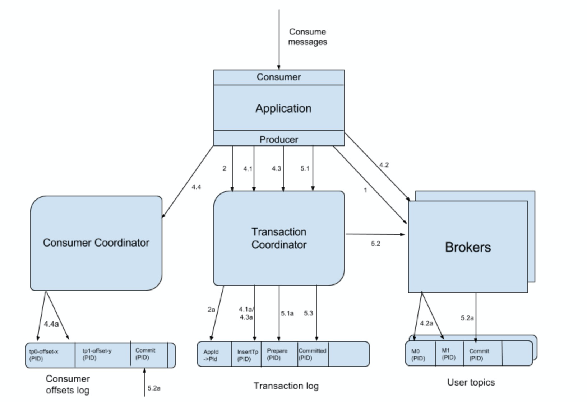

# 介绍

kafka是一个流处理（实时和离线）平台。所以从kafka的使命来看其核心功能都是围绕打造流处理平台来服务，包括它的发布订阅模式、存储、连接器等。

# 基本概念

## 主题-Topic

## 分区

一个Topic可以有多个分区，发送到topic上的消息根据某种策略发到对应的分区，每个分区都有一个leader。

## 副本

一个分区可以有多个副本，这样设计主要是做到Ha，防止单点故障。

## 消费者组

一个topic可以有多个分区，一个消费者组是一个逻辑订阅者，每一个消费者都对应于topic中的一个或者多个分区。

比如一个topic有6个分区（P0,P1,P2,P3,P4,P5,P6），消费者组有3个（C1,C2,C3），那么可能的对应关系为：

{C1->[P0,P1]},{C2->[P2,P3]},{C3->[P4,P5]}。消费者组的设计是为了客户端负载均衡使用的。

## 核心概念之间的关系

借上面的图来解释下kafka的设计思路：

## Topic-patition-replica

​	

一个topic可以有多个Partition（提高并发性能，如何选择哪个Partition?）；一个partition可以有多个replica，其中一个主replica，其余为follower。

副本之间是如何做到一致性的？考虑了CAP中的CP?

## 事务

https://cwiki.apache.org/confluence/display/KAFKA/KIP-98+-+Exactly+Once+Delivery+and+Transactional+Messaging#KIP98ExactlyOnceDeliveryandTransactionalMessaging-DataFlow

# FAQ

### GroupCoordinator机制

### Kafka为什么那么快？

- Cache Filesystem Cache PageCache缓存
- 顺序写 由于现代的操作系统提供了预读和写技术，磁盘的顺序写大多数情况下比随机写内存还要快。
- Zero-copy 零拷技术减少拷贝次数
- Batching of Messages 批量量处理。合并小的请求，然后以流的方式进行交互，直顶网络上限。
- Pull 拉模式 使用拉模式进行消息的获取消费，与消费端处理能力相符。

### **Kafka中的事务是怎么实现的？**

https://honeypps.com/mq/kafka-basic-knowledge-of-transaction/

#### kafka事务的基本流程？

kafka如何保证事务的一致性？

### **Kafka中的消息是否会丢失和重复消费？**

### **kafka producer如何优化打入速度**

### Kafka中有那些地方需要选举？这些地方的选举策略又有哪些？

### **kafka如何实现延迟队列？**

### **为什么Kafka不支持读写分离？**

# 应用场景

## 核心功能

